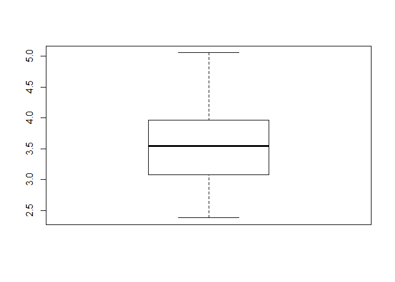
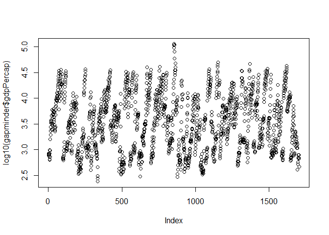
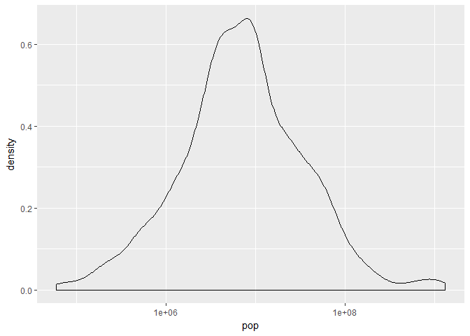
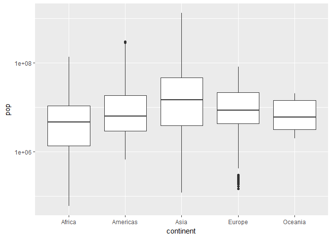

hw02\_gapminder.Rmd
================

First install and load the package gapminder

``` r
#install.packages("tidyverse")
library(gapminder)
```

Lets install and load dplyr via the tidyverse meta-package.

``` r
#install.packages("gapminder")
library(tidyverse)
```

    ## Loading tidyverse: ggplot2
    ## Loading tidyverse: tibble
    ## Loading tidyverse: tidyr
    ## Loading tidyverse: readr
    ## Loading tidyverse: purrr
    ## Loading tidyverse: dplyr

    ## Conflicts with tidy packages ----------------------------------------------

    ## filter(): dplyr, stats
    ## lag():    dplyr, stats

Also lets install and load ggplot2 for graphs

``` r
#install.packages("ggplot2")
library(ggplot2)
```

Lets install kableExtra and load knitr,kableExtra for piping kable to create nice tables

``` r
#install.packages("kableExtra")
library(knitr)
library(kableExtra)
options(knitr.table.format = "html")
```

Lets explore the gapminder dataset...

``` r
class(gapminder)
```

    ## [1] "tbl_df"     "tbl"        "data.frame"

``` r
str(gapminder)
```

    ## Classes 'tbl_df', 'tbl' and 'data.frame':    1704 obs. of  6 variables:
    ##  $ country  : Factor w/ 142 levels "Afghanistan",..: 1 1 1 1 1 1 1 1 1 1 ...
    ##  $ continent: Factor w/ 5 levels "Africa","Americas",..: 3 3 3 3 3 3 3 3 3 3 ...
    ##  $ year     : int  1952 1957 1962 1967 1972 1977 1982 1987 1992 1997 ...
    ##  $ lifeExp  : num  28.8 30.3 32 34 36.1 ...
    ##  $ pop      : int  8425333 9240934 10267083 11537966 13079460 14880372 12881816 13867957 16317921 22227415 ...
    ##  $ gdpPercap: num  779 821 853 836 740 ...

This shows that gapminder dataset is data.frame, specifically its class is tibble.

Lets check for the number of variables/columns using ncol() function and number of rows/observations using nrow() function.

``` r
nrow(gapminder)
```

    ## [1] 1704

``` r
ncol(gapminder)
```

    ## [1] 6

This shows that gapminder dataset has 1704 rows/observations and 6 columns/variables. This can also be obtained using dim() function as below.

``` r
dim(gapminder)
```

    ## [1] 1704    6

Some functions for size or extent of the data.

1.  dim() - Retrieves all the dimensions of an R object such as array,matrix or a data frame. It returns null for a vector.

``` r
# Matrix
m <- matrix(1:15, 3, 5)
dim(m)
```

    ## [1] 3 5

``` r
# Array
a <- array(1:12, dim = 2:4)
dim(a) 
```

    ## [1] 2 3 4

``` r
#data frame
dim(gapminder)
```

    ## [1] 1704    6

``` r
# Vector
v <- 1:9
dim(v)
```

    ## NULL

2)nrow() and ncol() returns the number of rows and columns of an array or data frame. NROW() and NCOL() does the same thing by treating the vector as a 1 column matrix.

``` r
#Matrix
nrow(m)
```

    ## [1] 3

``` r
ncol(m)
```

    ## [1] 5

``` r
#Vector
NCOL(v)
```

    ## [1] 1

``` r
NROW(v)
```

    ## [1] 9

3)The length() function can be used to get length of a list or vector. For matrix or dataframe it returns the number of variables.

``` r
#Vector
length(v)
```

    ## [1] 9

``` r
#Matrix
length(m)
```

    ## [1] 15

``` r
#Data frame
length(gapminder)
```

    ## [1] 6

4)summary() function can also be used to understand the extent and size of a variable.

``` r
kable(summary(gapminder))
```

<table>
<thead>
<tr>
<th style="text-align:left;">
</th>
<th style="text-align:left;">
        country </th>

<th style="text-align:left;">
    continent </th>

<th style="text-align:left;">
      year </th>

<th style="text-align:left;">
    lifeExp </th>

<th style="text-align:left;">
      pop </th>

<th style="text-align:left;">
gdpPercap
</th>
</tr>
</thead>
<tbody>
<tr>
<td style="text-align:left;">
</td>
<td style="text-align:left;">
Afghanistan: 12
</td>
<td style="text-align:left;">
Africa :624
</td>
<td style="text-align:left;">
Min. :1952
</td>
<td style="text-align:left;">
Min. :23.60
</td>
<td style="text-align:left;">
Min. :6.001e+04
</td>
<td style="text-align:left;">
Min. : 241.2
</td>
</tr>
<tr>
<td style="text-align:left;">
</td>
<td style="text-align:left;">
Albania : 12
</td>
<td style="text-align:left;">
Americas:300
</td>
<td style="text-align:left;">
1st Qu.:1966
</td>
<td style="text-align:left;">
1st Qu.:48.20
</td>
<td style="text-align:left;">
1st Qu.:2.794e+06
</td>
<td style="text-align:left;">
1st Qu.: 1202.1
</td>
</tr>
<tr>
<td style="text-align:left;">
</td>
<td style="text-align:left;">
Algeria : 12
</td>
<td style="text-align:left;">
Asia :396
</td>
<td style="text-align:left;">
Median :1980
</td>
<td style="text-align:left;">
Median :60.71
</td>
<td style="text-align:left;">
Median :7.024e+06
</td>
<td style="text-align:left;">
Median : 3531.8
</td>
</tr>
<tr>
<td style="text-align:left;">
</td>
<td style="text-align:left;">
Angola : 12
</td>
<td style="text-align:left;">
Europe :360
</td>
<td style="text-align:left;">
Mean :1980
</td>
<td style="text-align:left;">
Mean :59.47
</td>
<td style="text-align:left;">
Mean :2.960e+07
</td>
<td style="text-align:left;">
Mean : 7215.3
</td>
</tr>
<tr>
<td style="text-align:left;">
</td>
<td style="text-align:left;">
Argentina : 12
</td>
<td style="text-align:left;">
Oceania : 24
</td>
<td style="text-align:left;">
3rd Qu.:1993
</td>
<td style="text-align:left;">
3rd Qu.:70.85
</td>
<td style="text-align:left;">
3rd Qu.:1.959e+07
</td>
<td style="text-align:left;">
3rd Qu.: 9325.5
</td>
</tr>
<tr>
<td style="text-align:left;">
</td>
<td style="text-align:left;">
Australia : 12
</td>
<td style="text-align:left;">
NA
</td>
<td style="text-align:left;">
Max. :2007
</td>
<td style="text-align:left;">
Max. :82.60
</td>
<td style="text-align:left;">
Max. :1.319e+09
</td>
<td style="text-align:left;">
Max. :113523.1
</td>
</tr>
<tr>
<td style="text-align:left;">
</td>
<td style="text-align:left;">
(Other) :1632
</td>
<td style="text-align:left;">
NA
</td>
<td style="text-align:left;">
NA
</td>
<td style="text-align:left;">
NA
</td>
<td style="text-align:left;">
NA
</td>
<td style="text-align:left;">
NA
</td>
</tr>
</tbody>
</table>
5)range() function can be used to get the range(minimum and maximum value) of continuous variables.

``` r
range(gapminder$gdpPercap)
```

    ## [1]    241.1659 113523.1329

``` r
range(gapminder$lifeExp)
```

    ## [1] 23.599 82.603

Lets find the Data type of each variable/column in gapminder dataset

``` r
kable(sapply(gapminder, class))
```

<table>
<tbody>
<tr>
<td style="text-align:left;">
country
</td>
<td style="text-align:left;">
factor
</td>
</tr>
<tr>
<td style="text-align:left;">
continent
</td>
<td style="text-align:left;">
factor
</td>
</tr>
<tr>
<td style="text-align:left;">
year
</td>
<td style="text-align:left;">
integer
</td>
</tr>
<tr>
<td style="text-align:left;">
lifeExp
</td>
<td style="text-align:left;">
numeric
</td>
</tr>
<tr>
<td style="text-align:left;">
pop
</td>
<td style="text-align:left;">
integer
</td>
</tr>
<tr>
<td style="text-align:left;">
gdpPercap
</td>
<td style="text-align:left;">
numeric
</td>
</tr>
</tbody>
</table>
### Lets take a factor variable, say continent.

FInd the levels and the names of each level

``` r
nlevels(gapminder$continent) # to get the number of different levels/values
```

    ## [1] 5

``` r
levels(gapminder$continent) # to get the possible values
```

    ## [1] "Africa"   "Americas" "Asia"     "Europe"   "Oceania"

SOme plots to analyze the continent variable

``` r
summary(gapminder$continent)
```

    ##   Africa Americas     Asia   Europe  Oceania 
    ##      624      300      396      360       24

``` r
# table(gapminder$continent) does the same thing.
plot(gapminder$continent)
```


``` r
counts = table(gapminder$continent)  ## get counts
labs=levels(gapminder$continent)
pct <- round(counts/sum(counts)*100)
labs <- paste(labs, pct) # add percents to labels 
labs <- paste(labs,"%",sep="") # ad % to labels 
pie(counts, labels = labs,col=rainbow(length(labs)),
    main="Pie Chart of Continents")  ## plot
```


This shows that Africa is the typical value since it is observed maximum number of times. This also shows that there is very less data for Oceania.

Lets look at another factor variable say country. Take a subset of data for this plot.

``` r
a<-subset(gapminder,gapminder$country %in% c("Afghanistan","Bangladesh","China","Sri Lanka","Indonesia","Pakistan"))
plot(a$country)
```


### Lets take a continous variable, say population.

Analyze range and summary. Also plot few graphs to know the distribution.

``` r
range(gapminder$pop) # to get the range of the values for population
```

    ## [1]      60011 1318683096

``` r
summary(gapminder$pop) # to get the summary of the values.
```

    ##      Min.   1st Qu.    Median      Mean   3rd Qu.      Max. 
    ## 6.001e+04 2.794e+06 7.024e+06 2.960e+07 1.959e+07 1.319e+09

``` r
#table(gapminder$pop)

plot(density(gapminder$pop))   # density plot
```


``` r
plot(density(log10(gapminder$pop)))  # transformed density plot
```


The range of the population shows the minimum and maximum value. The summary function gives the mean,median and other details. The transformed density graph show the Gaussian distribution present in the population variable.

Lets explore another continuous variable, say lifeExp by plotting histogram.

``` r
hist(gapminder$lifeExp)   # histogram plot
```


``` r
hist(log10(gapminder$lifeExp))   #transformed histogram plot
```


Lets explore another continuous variable, say gdpPercap by plotting box plot and scatter plot.

``` r
boxplot(log10(gapminder$gdpPercap)) # Box plot
```



``` r
plot(type='p',gapminder$gdpPercap)   # scatter plot
```


``` r
plot(type='p',log10(gapminder$gdpPercap))  # transformed scatter plot
```



### Lets explore various plot types.

Plot between year and pop (two quantitative variables )

``` r
ggplot(gapminder,aes(year,pop))+
  geom_point()
```


Different Plots of pop variable

``` r
m<-ggplot(gapminder,aes(pop))
m + geom_histogram(binwdith=0.5) + scale_x_log10() #histogram plot
```

    ## Warning: Ignoring unknown parameters: binwdith

    ## `stat_bin()` using `bins = 30`. Pick better value with `binwidth`.


``` r
m + scale_x_log10() + geom_density(kernel="gaussian") #density plot
```



``` r
m + scale_x_log10() + geom_freqpoly() #freq poly plot
```

    ## `stat_bin()` using `bins = 30`. Pick better value with `binwidth`.


Plot between continent and pop (one factor variable and one quantitative variable)

``` r
n<-ggplot(gapminder,aes(continent,pop))
n+geom_boxplot() +scale_y_log10() # box plot
```



Some plots using filter() function

``` r
m<- gapminder %>%
    filter(continent=="Oceania")%>%
    ggplot(aes(country,pop))

m + geom_boxplot() + scale_y_log10()
```


``` r
country_list<- c("Afghanistan","Bangladesh","China","Sri Lanka","Indonesia","Pakistan","Nepal","Mauritius")
m<- gapminder %>%
    filter(continent=="Asia" & 
          country %in% country_list)%>%
    ggplot(aes(country,pop))

m + geom_boxplot() + scale_y_log10()
```


Some commands using filter(),select() and arrange() function

``` r
gapminder %>%
    filter(continent=="Oceania" & year %in% c(1973:1979))%>%
    select(-lifeExp) %>%
    arrange(year,desc(pop))
```

    ## # A tibble: 2 × 5
    ##       country continent  year      pop gdpPercap
    ##        <fctr>    <fctr> <int>    <int>     <dbl>
    ## 1   Australia   Oceania  1977 14074100  18334.20
    ## 2 New Zealand   Oceania  1977  3164900  16233.72

``` r
gapminder %>%
        filter(country %in% country_list & gdpPercap <=600)%>%
        select(country,year,gdpPercap) %>%
        arrange(year,desc(gdpPercap))%>%
        kable("html") %>%
        kable_styling()
```

<table class="table" style="margin-left: auto; margin-right: auto;">
<thead>
<tr>
<th style="text-align:left;">
country
</th>
<th style="text-align:right;">
year
</th>
<th style="text-align:right;">
gdpPercap
</th>
</tr>
</thead>
<tbody>
<tr>
<td style="text-align:left;">
Nepal
</td>
<td style="text-align:right;">
1952
</td>
<td style="text-align:right;">
545.8657
</td>
</tr>
<tr>
<td style="text-align:left;">
China
</td>
<td style="text-align:right;">
1952
</td>
<td style="text-align:right;">
400.4486
</td>
</tr>
<tr>
<td style="text-align:left;">
Nepal
</td>
<td style="text-align:right;">
1957
</td>
<td style="text-align:right;">
597.9364
</td>
</tr>
<tr>
<td style="text-align:left;">
China
</td>
<td style="text-align:right;">
1957
</td>
<td style="text-align:right;">
575.9870
</td>
</tr>
<tr>
<td style="text-align:left;">
China
</td>
<td style="text-align:right;">
1962
</td>
<td style="text-align:right;">
487.6740
</td>
</tr>
</tbody>
</table>
``` r
m <- gapminder %>%
        filter(country %in% country_list & lifeExp>45)%>%
        select(year,lifeExp) %>%
        arrange(year,desc(lifeExp))%>%
     ggplot(aes(year,lifeExp))
m + geom_point()  
```


Some commands using summarize() and group\_by()

``` r
gapminder %>%
    filter(country %in% country_list & pop>1000) %>%
    summarize(meanLifeExp=mean(lifeExp), sdLifeExp=sd(lifeExp))%>%
    kable("html") %>%
    kable_styling()
```

<table class="table" style="margin-left: auto; margin-right: auto;">
<thead>
<tr>
<th style="text-align:right;">
meanLifeExp
</th>
<th style="text-align:right;">
sdLifeExp
</th>
</tr>
</thead>
<tbody>
<tr>
<td style="text-align:right;">
54.84772
</td>
<td style="text-align:right;">
12.07434
</td>
</tr>
</tbody>
</table>
``` r
gapminder %>% 
  filter(country %in% country_list) %>%
  group_by(country,continent,lifeExp>40) %>%
  summarize(meanGdpPercap =mean(gdpPercap),sdGdpPercap =sd(gdpPercap)) %>%
  select(country,continent,meanGdpPercap,sdGdpPercap)%>%
  kable("html") %>%
  kable_styling()
```

<table class="table" style="margin-left: auto; margin-right: auto;">
<thead>
<tr>
<th style="text-align:left;">
country
</th>
<th style="text-align:left;">
continent
</th>
<th style="text-align:right;">
meanGdpPercap
</th>
<th style="text-align:right;">
sdGdpPercap
</th>
</tr>
</thead>
<tbody>
<tr>
<td style="text-align:left;">
Afghanistan
</td>
<td style="text-align:left;">
Asia
</td>
<td style="text-align:right;">
827.6717
</td>
<td style="text-align:right;">
76.49659
</td>
</tr>
<tr>
<td style="text-align:left;">
Afghanistan
</td>
<td style="text-align:left;">
Asia
</td>
<td style="text-align:right;">
767.6786
</td>
<td style="text-align:right;">
144.20355
</td>
</tr>
<tr>
<td style="text-align:left;">
Bangladesh
</td>
<td style="text-align:left;">
Asia
</td>
<td style="text-align:right;">
672.9408
</td>
<td style="text-align:right;">
15.98536
</td>
</tr>
<tr>
<td style="text-align:left;">
Bangladesh
</td>
<td style="text-align:left;">
Asia
</td>
<td style="text-align:right;">
846.4824
</td>
<td style="text-align:right;">
248.87231
</td>
</tr>
<tr>
<td style="text-align:left;">
China
</td>
<td style="text-align:left;">
Asia
</td>
<td style="text-align:right;">
1488.3077
</td>
<td style="text-align:right;">
1370.62833
</td>
</tr>
<tr>
<td style="text-align:left;">
Indonesia
</td>
<td style="text-align:left;">
Asia
</td>
<td style="text-align:right;">
804.2910
</td>
<td style="text-align:right;">
77.22922
</td>
</tr>
<tr>
<td style="text-align:left;">
Indonesia
</td>
<td style="text-align:left;">
Asia
</td>
<td style="text-align:right;">
1928.7802
</td>
<td style="text-align:right;">
989.38525
</td>
</tr>
<tr>
<td style="text-align:left;">
Mauritius
</td>
<td style="text-align:left;">
Africa
</td>
<td style="text-align:right;">
4768.9422
</td>
<td style="text-align:right;">
2981.78351
</td>
</tr>
<tr>
<td style="text-align:left;">
Nepal
</td>
<td style="text-align:left;">
Asia
</td>
<td style="text-align:right;">
598.7330
</td>
<td style="text-align:right;">
53.27004
</td>
</tr>
<tr>
<td style="text-align:left;">
Nepal
</td>
<td style="text-align:left;">
Asia
</td>
<td style="text-align:right;">
844.0608
</td>
<td style="text-align:right;">
172.12479
</td>
</tr>
<tr>
<td style="text-align:left;">
Pakistan
</td>
<td style="text-align:left;">
Asia
</td>
<td style="text-align:right;">
1439.2707
</td>
<td style="text-align:right;">
634.98491
</td>
</tr>
<tr>
<td style="text-align:left;">
Sri Lanka
</td>
<td style="text-align:left;">
Asia
</td>
<td style="text-align:right;">
1854.7311
</td>
<td style="text-align:right;">
934.68975
</td>
</tr>
</tbody>
</table>
Command using mutate() function

``` r
gapminder %>%
  filter(country %in% country_list& year<=1965) %>%
  mutate(gdp = pop * gdpPercap)%>%
  select(country,year,gdp)%>%
  kable("html") %>%
  kable_styling()
```

<table class="table" style="margin-left: auto; margin-right: auto;">
<thead>
<tr>
<th style="text-align:left;">
country
</th>
<th style="text-align:right;">
year
</th>
<th style="text-align:right;">
gdp
</th>
</tr>
</thead>
<tbody>
<tr>
<td style="text-align:left;">
Afghanistan
</td>
<td style="text-align:right;">
1952
</td>
<td style="text-align:right;">
6567086330
</td>
</tr>
<tr>
<td style="text-align:left;">
Afghanistan
</td>
<td style="text-align:right;">
1957
</td>
<td style="text-align:right;">
7585448670
</td>
</tr>
<tr>
<td style="text-align:left;">
Afghanistan
</td>
<td style="text-align:right;">
1962
</td>
<td style="text-align:right;">
8758855797
</td>
</tr>
<tr>
<td style="text-align:left;">
Bangladesh
</td>
<td style="text-align:right;">
1952
</td>
<td style="text-align:right;">
32082059995
</td>
</tr>
<tr>
<td style="text-align:left;">
Bangladesh
</td>
<td style="text-align:right;">
1957
</td>
<td style="text-align:right;">
33985317661
</td>
</tr>
<tr>
<td style="text-align:left;">
Bangladesh
</td>
<td style="text-align:right;">
1962
</td>
<td style="text-align:right;">
39011165929
</td>
</tr>
<tr>
<td style="text-align:left;">
China
</td>
<td style="text-align:right;">
1952
</td>
<td style="text-align:right;">
222754956737
</td>
</tr>
<tr>
<td style="text-align:left;">
China
</td>
<td style="text-align:right;">
1957
</td>
<td style="text-align:right;">
367138722270
</td>
</tr>
<tr>
<td style="text-align:left;">
China
</td>
<td style="text-align:right;">
1962
</td>
<td style="text-align:right;">
324678731164
</td>
</tr>
<tr>
<td style="text-align:left;">
Indonesia
</td>
<td style="text-align:right;">
1952
</td>
<td style="text-align:right;">
61512879123
</td>
</tr>
<tr>
<td style="text-align:left;">
Indonesia
</td>
<td style="text-align:right;">
1957
</td>
<td style="text-align:right;">
77407527997
</td>
</tr>
<tr>
<td style="text-align:left;">
Indonesia
</td>
<td style="text-align:right;">
1962
</td>
<td style="text-align:right;">
84103467353
</td>
</tr>
<tr>
<td style="text-align:left;">
Mauritius
</td>
<td style="text-align:right;">
1952
</td>
<td style="text-align:right;">
1016559328
</td>
</tr>
<tr>
<td style="text-align:left;">
Mauritius
</td>
<td style="text-align:right;">
1957
</td>
<td style="text-align:right;">
1240388905
</td>
</tr>
<tr>
<td style="text-align:left;">
Mauritius
</td>
<td style="text-align:right;">
1962
</td>
<td style="text-align:right;">
1772916773
</td>
</tr>
<tr>
<td style="text-align:left;">
Nepal
</td>
<td style="text-align:right;">
1952
</td>
<td style="text-align:right;">
5012431652
</td>
</tr>
<tr>
<td style="text-align:left;">
Nepal
</td>
<td style="text-align:right;">
1957
</td>
<td style="text-align:right;">
5789421899
</td>
</tr>
<tr>
<td style="text-align:left;">
Nepal
</td>
<td style="text-align:right;">
1962
</td>
<td style="text-align:right;">
6740601537
</td>
</tr>
<tr>
<td style="text-align:left;">
Pakistan
</td>
<td style="text-align:right;">
1952
</td>
<td style="text-align:right;">
28305736882
</td>
</tr>
<tr>
<td style="text-align:left;">
Pakistan
</td>
<td style="text-align:right;">
1957
</td>
<td style="text-align:right;">
34873817306
</td>
</tr>
<tr>
<td style="text-align:left;">
Pakistan
</td>
<td style="text-align:right;">
1962
</td>
<td style="text-align:right;">
42658038633
</td>
</tr>
<tr>
<td style="text-align:left;">
Sri Lanka
</td>
<td style="text-align:right;">
1952
</td>
<td style="text-align:right;">
8649123231
</td>
</tr>
<tr>
<td style="text-align:left;">
Sri Lanka
</td>
<td style="text-align:right;">
1957
</td>
<td style="text-align:right;">
9790790994
</td>
</tr>
<tr>
<td style="text-align:left;">
Sri Lanka
</td>
<td style="text-align:right;">
1962
</td>
<td style="text-align:right;">
11198078001
</td>
</tr>
</tbody>
</table>
Command using rename() function

``` r
gapminder %>%
  filter(country %in% country_list & lifeExp<=45) %>%
  mutate(gdpPercapRel = gdpPercap/max(gapminder$gdpPercap))%>%
  rename(gdpRel = gdpPercapRel)%>%
  select(country,gdpRel)%>%
  kable("html") %>%
  kable_styling()
```

<table class="table" style="margin-left: auto; margin-right: auto;">
<thead>
<tr>
<th style="text-align:left;">
country
</th>
<th style="text-align:right;">
gdpRel
</th>
</tr>
</thead>
<tbody>
<tr>
<td style="text-align:left;">
Afghanistan
</td>
<td style="text-align:right;">
0.0068660
</td>
</tr>
<tr>
<td style="text-align:left;">
Afghanistan
</td>
<td style="text-align:right;">
0.0072307
</td>
</tr>
<tr>
<td style="text-align:left;">
Afghanistan
</td>
<td style="text-align:right;">
0.0075148
</td>
</tr>
<tr>
<td style="text-align:left;">
Afghanistan
</td>
<td style="text-align:right;">
0.0073659
</td>
</tr>
<tr>
<td style="text-align:left;">
Afghanistan
</td>
<td style="text-align:right;">
0.0065183
</td>
</tr>
<tr>
<td style="text-align:left;">
Afghanistan
</td>
<td style="text-align:right;">
0.0069247
</td>
</tr>
<tr>
<td style="text-align:left;">
Afghanistan
</td>
<td style="text-align:right;">
0.0086151
</td>
</tr>
<tr>
<td style="text-align:left;">
Afghanistan
</td>
<td style="text-align:right;">
0.0075086
</td>
</tr>
<tr>
<td style="text-align:left;">
Afghanistan
</td>
<td style="text-align:right;">
0.0057199
</td>
</tr>
<tr>
<td style="text-align:left;">
Afghanistan
</td>
<td style="text-align:right;">
0.0055966
</td>
</tr>
<tr>
<td style="text-align:left;">
Afghanistan
</td>
<td style="text-align:right;">
0.0064016
</td>
</tr>
<tr>
<td style="text-align:left;">
Afghanistan
</td>
<td style="text-align:right;">
0.0085849
</td>
</tr>
<tr>
<td style="text-align:left;">
Bangladesh
</td>
<td style="text-align:right;">
0.0060274
</td>
</tr>
<tr>
<td style="text-align:left;">
Bangladesh
</td>
<td style="text-align:right;">
0.0058282
</td>
</tr>
<tr>
<td style="text-align:left;">
Bangladesh
</td>
<td style="text-align:right;">
0.0060458
</td>
</tr>
<tr>
<td style="text-align:left;">
Bangladesh
</td>
<td style="text-align:right;">
0.0063528
</td>
</tr>
<tr>
<td style="text-align:left;">
China
</td>
<td style="text-align:right;">
0.0035275
</td>
</tr>
<tr>
<td style="text-align:left;">
China
</td>
<td style="text-align:right;">
0.0042958
</td>
</tr>
<tr>
<td style="text-align:left;">
Indonesia
</td>
<td style="text-align:right;">
0.0066038
</td>
</tr>
<tr>
<td style="text-align:left;">
Indonesia
</td>
<td style="text-align:right;">
0.0075659
</td>
</tr>
<tr>
<td style="text-align:left;">
Indonesia
</td>
<td style="text-align:right;">
0.0074812
</td>
</tr>
<tr>
<td style="text-align:left;">
Nepal
</td>
<td style="text-align:right;">
0.0048084
</td>
</tr>
<tr>
<td style="text-align:left;">
Nepal
</td>
<td style="text-align:right;">
0.0052671
</td>
</tr>
<tr>
<td style="text-align:left;">
Nepal
</td>
<td style="text-align:right;">
0.0057468
</td>
</tr>
<tr>
<td style="text-align:left;">
Nepal
</td>
<td style="text-align:right;">
0.0059586
</td>
</tr>
<tr>
<td style="text-align:left;">
Nepal
</td>
<td style="text-align:right;">
0.0059441
</td>
</tr>
<tr>
<td style="text-align:left;">
Pakistan
</td>
<td style="text-align:right;">
0.0060305
</td>
</tr>
</tbody>
</table>
### Want To Do More Part

``` r
filter(gapminder, country == c("Rwanda", "Afghanistan"))%>%
  kable("html") %>%
  kable_styling()
```

<table class="table" style="margin-left: auto; margin-right: auto;">
<thead>
<tr>
<th style="text-align:left;">
country
</th>
<th style="text-align:left;">
continent
</th>
<th style="text-align:right;">
year
</th>
<th style="text-align:right;">
lifeExp
</th>
<th style="text-align:right;">
pop
</th>
<th style="text-align:right;">
gdpPercap
</th>
</tr>
</thead>
<tbody>
<tr>
<td style="text-align:left;">
Afghanistan
</td>
<td style="text-align:left;">
Asia
</td>
<td style="text-align:right;">
1957
</td>
<td style="text-align:right;">
30.332
</td>
<td style="text-align:right;">
9240934
</td>
<td style="text-align:right;">
820.8530
</td>
</tr>
<tr>
<td style="text-align:left;">
Afghanistan
</td>
<td style="text-align:left;">
Asia
</td>
<td style="text-align:right;">
1967
</td>
<td style="text-align:right;">
34.020
</td>
<td style="text-align:right;">
11537966
</td>
<td style="text-align:right;">
836.1971
</td>
</tr>
<tr>
<td style="text-align:left;">
Afghanistan
</td>
<td style="text-align:left;">
Asia
</td>
<td style="text-align:right;">
1977
</td>
<td style="text-align:right;">
38.438
</td>
<td style="text-align:right;">
14880372
</td>
<td style="text-align:right;">
786.1134
</td>
</tr>
<tr>
<td style="text-align:left;">
Afghanistan
</td>
<td style="text-align:left;">
Asia
</td>
<td style="text-align:right;">
1987
</td>
<td style="text-align:right;">
40.822
</td>
<td style="text-align:right;">
13867957
</td>
<td style="text-align:right;">
852.3959
</td>
</tr>
<tr>
<td style="text-align:left;">
Afghanistan
</td>
<td style="text-align:left;">
Asia
</td>
<td style="text-align:right;">
1997
</td>
<td style="text-align:right;">
41.763
</td>
<td style="text-align:right;">
22227415
</td>
<td style="text-align:right;">
635.3414
</td>
</tr>
<tr>
<td style="text-align:left;">
Afghanistan
</td>
<td style="text-align:left;">
Asia
</td>
<td style="text-align:right;">
2007
</td>
<td style="text-align:right;">
43.828
</td>
<td style="text-align:right;">
31889923
</td>
<td style="text-align:right;">
974.5803
</td>
</tr>
<tr>
<td style="text-align:left;">
Rwanda
</td>
<td style="text-align:left;">
Africa
</td>
<td style="text-align:right;">
1952
</td>
<td style="text-align:right;">
40.000
</td>
<td style="text-align:right;">
2534927
</td>
<td style="text-align:right;">
493.3239
</td>
</tr>
<tr>
<td style="text-align:left;">
Rwanda
</td>
<td style="text-align:left;">
Africa
</td>
<td style="text-align:right;">
1962
</td>
<td style="text-align:right;">
43.000
</td>
<td style="text-align:right;">
3051242
</td>
<td style="text-align:right;">
597.4731
</td>
</tr>
<tr>
<td style="text-align:left;">
Rwanda
</td>
<td style="text-align:left;">
Africa
</td>
<td style="text-align:right;">
1972
</td>
<td style="text-align:right;">
44.600
</td>
<td style="text-align:right;">
3992121
</td>
<td style="text-align:right;">
590.5807
</td>
</tr>
<tr>
<td style="text-align:left;">
Rwanda
</td>
<td style="text-align:left;">
Africa
</td>
<td style="text-align:right;">
1982
</td>
<td style="text-align:right;">
46.218
</td>
<td style="text-align:right;">
5507565
</td>
<td style="text-align:right;">
881.5706
</td>
</tr>
<tr>
<td style="text-align:left;">
Rwanda
</td>
<td style="text-align:left;">
Africa
</td>
<td style="text-align:right;">
1992
</td>
<td style="text-align:right;">
23.599
</td>
<td style="text-align:right;">
7290203
</td>
<td style="text-align:right;">
737.0686
</td>
</tr>
<tr>
<td style="text-align:left;">
Rwanda
</td>
<td style="text-align:left;">
Africa
</td>
<td style="text-align:right;">
2002
</td>
<td style="text-align:right;">
43.413
</td>
<td style="text-align:right;">
7852401
</td>
<td style="text-align:right;">
785.6538
</td>
</tr>
</tbody>
</table>
The user doesnt succeed in getting all the entries of rwanda and afghanistan.The correct way to do this is as below using %in% operator.

``` r
filter(gapminder, country %in% c("Rwanda", "Afghanistan"))%>%
  kable("html") %>%
  kable_styling()
```

<table class="table" style="margin-left: auto; margin-right: auto;">
<thead>
<tr>
<th style="text-align:left;">
country
</th>
<th style="text-align:left;">
continent
</th>
<th style="text-align:right;">
year
</th>
<th style="text-align:right;">
lifeExp
</th>
<th style="text-align:right;">
pop
</th>
<th style="text-align:right;">
gdpPercap
</th>
</tr>
</thead>
<tbody>
<tr>
<td style="text-align:left;">
Afghanistan
</td>
<td style="text-align:left;">
Asia
</td>
<td style="text-align:right;">
1952
</td>
<td style="text-align:right;">
28.801
</td>
<td style="text-align:right;">
8425333
</td>
<td style="text-align:right;">
779.4453
</td>
</tr>
<tr>
<td style="text-align:left;">
Afghanistan
</td>
<td style="text-align:left;">
Asia
</td>
<td style="text-align:right;">
1957
</td>
<td style="text-align:right;">
30.332
</td>
<td style="text-align:right;">
9240934
</td>
<td style="text-align:right;">
820.8530
</td>
</tr>
<tr>
<td style="text-align:left;">
Afghanistan
</td>
<td style="text-align:left;">
Asia
</td>
<td style="text-align:right;">
1962
</td>
<td style="text-align:right;">
31.997
</td>
<td style="text-align:right;">
10267083
</td>
<td style="text-align:right;">
853.1007
</td>
</tr>
<tr>
<td style="text-align:left;">
Afghanistan
</td>
<td style="text-align:left;">
Asia
</td>
<td style="text-align:right;">
1967
</td>
<td style="text-align:right;">
34.020
</td>
<td style="text-align:right;">
11537966
</td>
<td style="text-align:right;">
836.1971
</td>
</tr>
<tr>
<td style="text-align:left;">
Afghanistan
</td>
<td style="text-align:left;">
Asia
</td>
<td style="text-align:right;">
1972
</td>
<td style="text-align:right;">
36.088
</td>
<td style="text-align:right;">
13079460
</td>
<td style="text-align:right;">
739.9811
</td>
</tr>
<tr>
<td style="text-align:left;">
Afghanistan
</td>
<td style="text-align:left;">
Asia
</td>
<td style="text-align:right;">
1977
</td>
<td style="text-align:right;">
38.438
</td>
<td style="text-align:right;">
14880372
</td>
<td style="text-align:right;">
786.1134
</td>
</tr>
<tr>
<td style="text-align:left;">
Afghanistan
</td>
<td style="text-align:left;">
Asia
</td>
<td style="text-align:right;">
1982
</td>
<td style="text-align:right;">
39.854
</td>
<td style="text-align:right;">
12881816
</td>
<td style="text-align:right;">
978.0114
</td>
</tr>
<tr>
<td style="text-align:left;">
Afghanistan
</td>
<td style="text-align:left;">
Asia
</td>
<td style="text-align:right;">
1987
</td>
<td style="text-align:right;">
40.822
</td>
<td style="text-align:right;">
13867957
</td>
<td style="text-align:right;">
852.3959
</td>
</tr>
<tr>
<td style="text-align:left;">
Afghanistan
</td>
<td style="text-align:left;">
Asia
</td>
<td style="text-align:right;">
1992
</td>
<td style="text-align:right;">
41.674
</td>
<td style="text-align:right;">
16317921
</td>
<td style="text-align:right;">
649.3414
</td>
</tr>
<tr>
<td style="text-align:left;">
Afghanistan
</td>
<td style="text-align:left;">
Asia
</td>
<td style="text-align:right;">
1997
</td>
<td style="text-align:right;">
41.763
</td>
<td style="text-align:right;">
22227415
</td>
<td style="text-align:right;">
635.3414
</td>
</tr>
<tr>
<td style="text-align:left;">
Afghanistan
</td>
<td style="text-align:left;">
Asia
</td>
<td style="text-align:right;">
2002
</td>
<td style="text-align:right;">
42.129
</td>
<td style="text-align:right;">
25268405
</td>
<td style="text-align:right;">
726.7341
</td>
</tr>
<tr>
<td style="text-align:left;">
Afghanistan
</td>
<td style="text-align:left;">
Asia
</td>
<td style="text-align:right;">
2007
</td>
<td style="text-align:right;">
43.828
</td>
<td style="text-align:right;">
31889923
</td>
<td style="text-align:right;">
974.5803
</td>
</tr>
<tr>
<td style="text-align:left;">
Rwanda
</td>
<td style="text-align:left;">
Africa
</td>
<td style="text-align:right;">
1952
</td>
<td style="text-align:right;">
40.000
</td>
<td style="text-align:right;">
2534927
</td>
<td style="text-align:right;">
493.3239
</td>
</tr>
<tr>
<td style="text-align:left;">
Rwanda
</td>
<td style="text-align:left;">
Africa
</td>
<td style="text-align:right;">
1957
</td>
<td style="text-align:right;">
41.500
</td>
<td style="text-align:right;">
2822082
</td>
<td style="text-align:right;">
540.2894
</td>
</tr>
<tr>
<td style="text-align:left;">
Rwanda
</td>
<td style="text-align:left;">
Africa
</td>
<td style="text-align:right;">
1962
</td>
<td style="text-align:right;">
43.000
</td>
<td style="text-align:right;">
3051242
</td>
<td style="text-align:right;">
597.4731
</td>
</tr>
<tr>
<td style="text-align:left;">
Rwanda
</td>
<td style="text-align:left;">
Africa
</td>
<td style="text-align:right;">
1967
</td>
<td style="text-align:right;">
44.100
</td>
<td style="text-align:right;">
3451079
</td>
<td style="text-align:right;">
510.9637
</td>
</tr>
<tr>
<td style="text-align:left;">
Rwanda
</td>
<td style="text-align:left;">
Africa
</td>
<td style="text-align:right;">
1972
</td>
<td style="text-align:right;">
44.600
</td>
<td style="text-align:right;">
3992121
</td>
<td style="text-align:right;">
590.5807
</td>
</tr>
<tr>
<td style="text-align:left;">
Rwanda
</td>
<td style="text-align:left;">
Africa
</td>
<td style="text-align:right;">
1977
</td>
<td style="text-align:right;">
45.000
</td>
<td style="text-align:right;">
4657072
</td>
<td style="text-align:right;">
670.0806
</td>
</tr>
<tr>
<td style="text-align:left;">
Rwanda
</td>
<td style="text-align:left;">
Africa
</td>
<td style="text-align:right;">
1982
</td>
<td style="text-align:right;">
46.218
</td>
<td style="text-align:right;">
5507565
</td>
<td style="text-align:right;">
881.5706
</td>
</tr>
<tr>
<td style="text-align:left;">
Rwanda
</td>
<td style="text-align:left;">
Africa
</td>
<td style="text-align:right;">
1987
</td>
<td style="text-align:right;">
44.020
</td>
<td style="text-align:right;">
6349365
</td>
<td style="text-align:right;">
847.9912
</td>
</tr>
<tr>
<td style="text-align:left;">
Rwanda
</td>
<td style="text-align:left;">
Africa
</td>
<td style="text-align:right;">
1992
</td>
<td style="text-align:right;">
23.599
</td>
<td style="text-align:right;">
7290203
</td>
<td style="text-align:right;">
737.0686
</td>
</tr>
<tr>
<td style="text-align:left;">
Rwanda
</td>
<td style="text-align:left;">
Africa
</td>
<td style="text-align:right;">
1997
</td>
<td style="text-align:right;">
36.087
</td>
<td style="text-align:right;">
7212583
</td>
<td style="text-align:right;">
589.9445
</td>
</tr>
<tr>
<td style="text-align:left;">
Rwanda
</td>
<td style="text-align:left;">
Africa
</td>
<td style="text-align:right;">
2002
</td>
<td style="text-align:right;">
43.413
</td>
<td style="text-align:right;">
7852401
</td>
<td style="text-align:right;">
785.6538
</td>
</tr>
<tr>
<td style="text-align:left;">
Rwanda
</td>
<td style="text-align:left;">
Africa
</td>
<td style="text-align:right;">
2007
</td>
<td style="text-align:right;">
46.242
</td>
<td style="text-align:right;">
8860588
</td>
<td style="text-align:right;">
863.0885
</td>
</tr>
</tbody>
</table>
The difference is %in% checks whether or not the object is contained in the other object. Whereas == is a logical operator that checks for identity properties.
