# hw03_gapminder.Rmd

First install and load the required packages tidyverse(for loading dplyr &its  functions),gapminder(dataset),ggplot2(for visualizations and plotting quality graphs), knitr and kableExtra (these two packages for styling tables) and pander for better looking tables.  

```r
suppressPackageStartupMessages(library(tidyverse))
suppressPackageStartupMessages(library(gapminder))
suppressPackageStartupMessages(library(ggplot2))
suppressPackageStartupMessages(library(knitr))
suppressPackageStartupMessages(library(kableExtra))
suppressPackageStartupMessages(library(pander))
options(knitr.table.format = "html")
```

Let us define a function for formatting the tables that can be used in this file. It is using kable function from knitr package and kable_styling() from kableExtra package for advanced formatting options.

```r
tableFormat<-function(table,title=""){
table %>%      
  kable("html",caption=title, align=c(rep('c', 5))) %>%
      kable_styling(bootstrap_options = 
                      c("striped", "hover", "condensed",  "responsive"),
                    position="center",font_size=14)
}
```


<h2>First Task</h2>
<h3>Get the maximum and minimum of GDP per capita for all continents.</h3>
<i>Let us find the min and max value and plot a box plot of GDP per capita for all continents.</i>

<div class="twoC">
<table class="table table-striped table-hover table-condensed table-responsive" style="font-size: 14px; margin-left: auto; margin-right: auto;">
<caption style="font-size: initial !important;"></caption>
 <thead><tr>
<th style="text-align:center;"> continent </th>
   <th style="text-align:center;"> min_gdpPercap </th>
   <th style="text-align:center;"> max_gdpPercap </th>
  </tr></thead>
<tbody>
<tr>
<td style="text-align:center;"> Africa </td>
   <td style="text-align:center;"> 241.1659 </td>
   <td style="text-align:center;"> 21951.21 </td>
  </tr>
<tr>
<td style="text-align:center;"> Americas </td>
   <td style="text-align:center;"> 1201.6372 </td>
   <td style="text-align:center;"> 42951.65 </td>
  </tr>
<tr>
<td style="text-align:center;"> Asia </td>
   <td style="text-align:center;"> 331.0000 </td>
   <td style="text-align:center;"> 113523.13 </td>
  </tr>
<tr>
<td style="text-align:center;"> Europe </td>
   <td style="text-align:center;"> 973.5332 </td>
   <td style="text-align:center;"> 49357.19 </td>
  </tr>
<tr>
<td style="text-align:center;"> Oceania </td>
   <td style="text-align:center;"> 10039.5956 </td>
   <td style="text-align:center;"> 34435.37 </td>
  </tr>
</tbody>
</table>

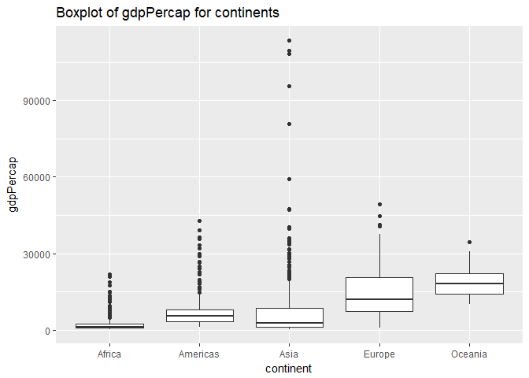<!-- -->
</div>
<div class="clearer"></div>

<i>Plot of minimum and maximum for each continent.</i>

```r
gdpPercapta_data%>%  
  ggplot(aes(continent,min_gdpPercap))+
  geom_col()+
  ggtitle("Minimum gdpPercap for each continent")
```

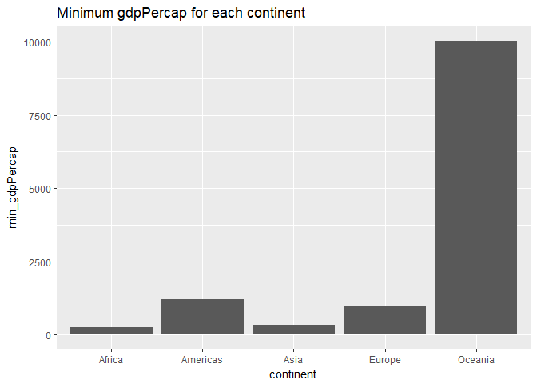<!-- -->

```r
gdpPercapta_data%>%  
  ggplot(aes(continent,max_gdpPercap))+
  geom_col()+
  ggtitle("Maximum gdpPercap for each continent")
```

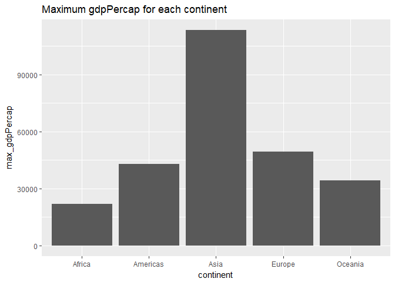<!-- -->

Insights from the plots and table:<br/>
- The plot and the table clearly indicate that the minimum gdpPercap is highest
for Oceania and lowest for Africa. Similarly, the maximum gdpPercap is highest for Asia and lowest for Africa.

<h2>Second Task</h2>

<h3>Spread of GDP per capita within the continents</h3>

```r
grouped<- gapminder%>%  
        group_by(continent)
spread1<- grouped%>%
        summarize(min=quantile(gdpPercap,0),
                  Q1=quantile(gdpPercap,0.25),      # First quartile
                  median=quantile(gdpPercap,0.50), 
                  Q3=quantile(gdpPercap,0.75),      # Third quartile
                  max=quantile(gdpPercap,1),
                  Interquartile=IQR(gdpPercap))
spread2<-grouped%>%
      summarize(variance=var(gdpPercap),
                  std_dev=sd(gdpPercap))

pandoc.table(spread1,style = "grid", caption = "Quantiles spread of GDP",justify="center", plain.ascii = TRUE, split.table = Inf)  #plain.ascii to keep output in plain ascii format
```

```
## 
## 
## +-------------+------------+-----------+-----------+-----------+-----------+-----------------+
## |  continent  |    min     |    Q1     |  median   |    Q3     |    max    |  Interquartile  |
## +=============+============+===========+===========+===========+===========+=================+
## |   Africa    |  241.1659  |  761.247  | 1192.138  | 2377.417  | 21951.21  |    1616.170     |
## +-------------+------------+-----------+-----------+-----------+-----------+-----------------+
## |  Americas   | 1201.6372  | 3427.779  | 5465.510  | 7830.210  | 42951.65  |    4402.431     |
## +-------------+------------+-----------+-----------+-----------+-----------+-----------------+
## |    Asia     |  331.0000  | 1056.993  | 2646.787  | 8549.256  | 113523.13 |    7492.262     |
## +-------------+------------+-----------+-----------+-----------+-----------+-----------------+
## |   Europe    |  973.5332  | 7213.085  | 12081.749 | 20461.386 | 49357.19  |    13248.301    |
## +-------------+------------+-----------+-----------+-----------+-----------+-----------------+
## |   Oceania   | 10039.5956 | 14141.859 | 17983.304 | 22214.117 | 34435.37  |    8072.258     |
## +-------------+------------+-----------+-----------+-----------+-----------+-----------------+
## 
## Table: Quantiles spread of GDP
```

```r
pandoc.table(spread2,style = "grid", caption = "Variance & Std Dev of GDP",justify="center", plain.ascii = TRUE, split.table = Inf)
```

```
## 
## 
## +-------------+------------+-----------+
## |  continent  |  variance  |  std_dev  |
## +=============+============+===========+
## |   Africa    |  7997187   | 2827.930  |
## +-------------+------------+-----------+
## |  Americas   |  40918591  | 6396.764  |
## +-------------+------------+-----------+
## |    Asia     | 197272506  | 14045.373 |
## +-------------+------------+-----------+
## |   Europe    |  87520020  | 9355.213  |
## +-------------+------------+-----------+
## |   Oceania   |  40436669  | 6358.983  |
## +-------------+------------+-----------+
## 
## Table: Variance & Std Dev of GDP
```

<h2>Third Task</h2>

<h3>Trimmed mean of life Expectancy</h3>
<div class="twoC">
<table class="table table-striped table-hover table-condensed table-responsive" style="font-size: 14px; margin-left: auto; margin-right: auto;">
<caption style="font-size: initial !important;"></caption>
 <thead><tr>
<th style="text-align:center;"> year </th>
   <th style="text-align:center;"> mean_life_exp </th>
  </tr></thead>
<tbody>
<tr>
<td style="text-align:center;"> 1952 </td>
   <td style="text-align:center;"> 48.57668 </td>
  </tr>
<tr>
<td style="text-align:center;"> 1957 </td>
   <td style="text-align:center;"> 51.26888 </td>
  </tr>
<tr>
<td style="text-align:center;"> 1962 </td>
   <td style="text-align:center;"> 53.58075 </td>
  </tr>
<tr>
<td style="text-align:center;"> 1967 </td>
   <td style="text-align:center;"> 55.86538 </td>
  </tr>
<tr>
<td style="text-align:center;"> 1972 </td>
   <td style="text-align:center;"> 58.01444 </td>
  </tr>
<tr>
<td style="text-align:center;"> 1977 </td>
   <td style="text-align:center;"> 60.10206 </td>
  </tr>
<tr>
<td style="text-align:center;"> 1982 </td>
   <td style="text-align:center;"> 62.11694 </td>
  </tr>
<tr>
<td style="text-align:center;"> 1987 </td>
   <td style="text-align:center;"> 63.92106 </td>
  </tr>
<tr>
<td style="text-align:center;"> 1992 </td>
   <td style="text-align:center;"> 65.18519 </td>
  </tr>
<tr>
<td style="text-align:center;"> 1997 </td>
   <td style="text-align:center;"> 66.01736 </td>
  </tr>
<tr>
<td style="text-align:center;"> 2002 </td>
   <td style="text-align:center;"> 66.71641 </td>
  </tr>
<tr>
<td style="text-align:center;"> 2007 </td>
   <td style="text-align:center;"> 68.11489 </td>
  </tr>
</tbody>
</table>

<i>Plot of the trimmed mean over the years.</i>
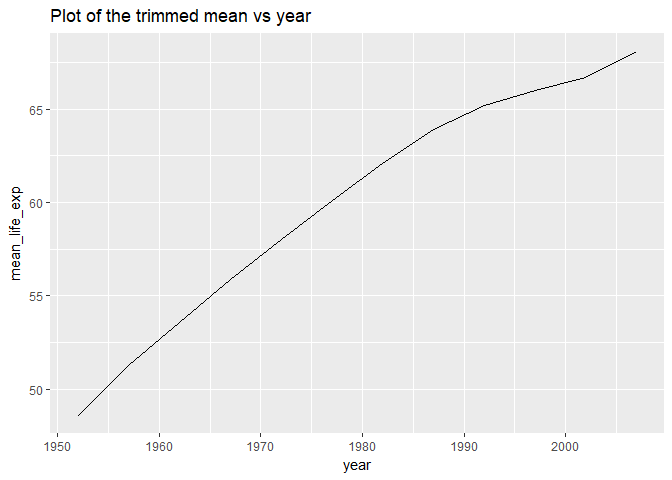<!-- -->
</div> 
<div class="clearer"></div>

<h3>Now weighted mean using population</h3>

<div class="twoC">
<table class="table table-striped table-hover table-condensed table-responsive" style="font-size: 14px; margin-left: auto; margin-right: auto;">
<caption style="font-size: initial !important;"></caption>
 <thead><tr>
<th style="text-align:center;"> year </th>
   <th style="text-align:center;"> mean_life_exp </th>
  </tr></thead>
<tbody>
<tr>
<td style="text-align:center;"> 1952 </td>
   <td style="text-align:center;"> 48.94424 </td>
  </tr>
<tr>
<td style="text-align:center;"> 1957 </td>
   <td style="text-align:center;"> 52.12189 </td>
  </tr>
<tr>
<td style="text-align:center;"> 1962 </td>
   <td style="text-align:center;"> 52.32438 </td>
  </tr>
<tr>
<td style="text-align:center;"> 1967 </td>
   <td style="text-align:center;"> 56.98431 </td>
  </tr>
<tr>
<td style="text-align:center;"> 1972 </td>
   <td style="text-align:center;"> 59.51478 </td>
  </tr>
<tr>
<td style="text-align:center;"> 1977 </td>
   <td style="text-align:center;"> 61.23726 </td>
  </tr>
<tr>
<td style="text-align:center;"> 1982 </td>
   <td style="text-align:center;"> 62.88176 </td>
  </tr>
<tr>
<td style="text-align:center;"> 1987 </td>
   <td style="text-align:center;"> 64.41635 </td>
  </tr>
<tr>
<td style="text-align:center;"> 1992 </td>
   <td style="text-align:center;"> 65.64590 </td>
  </tr>
<tr>
<td style="text-align:center;"> 1997 </td>
   <td style="text-align:center;"> 66.84934 </td>
  </tr>
<tr>
<td style="text-align:center;"> 2002 </td>
   <td style="text-align:center;"> 67.83904 </td>
  </tr>
<tr>
<td style="text-align:center;"> 2007 </td>
   <td style="text-align:center;"> 68.91909 </td>
  </tr>
</tbody>
</table>

<i>Plot of the weighted mean over the years.</i>
<!-- -->
</div> 
<div class="clearer"></div>

<h2>Fourth task</h2>

<h3>Life Expectancy changing over years for different continents</h3>
<div class="center">
<table class="table table-striped table-hover table-condensed table-responsive" style="font-size: 14px; margin-left: auto; margin-right: auto;">
<caption style="font-size: initial !important;"></caption>
 <thead><tr>
<th style="text-align:center;"> continent </th>
   <th style="text-align:center;"> year </th>
   <th style="text-align:center;"> mean_life_exp </th>
  </tr></thead>
<tbody>
<tr>
<td style="text-align:center;"> Africa </td>
   <td style="text-align:center;"> 1952 </td>
   <td style="text-align:center;"> 38.79973 </td>
  </tr>
<tr>
<td style="text-align:center;"> Africa </td>
   <td style="text-align:center;"> 1957 </td>
   <td style="text-align:center;"> 40.94031 </td>
  </tr>
<tr>
<td style="text-align:center;"> Africa </td>
   <td style="text-align:center;"> 1962 </td>
   <td style="text-align:center;"> 43.09925 </td>
  </tr>
<tr>
<td style="text-align:center;"> Africa </td>
   <td style="text-align:center;"> 1967 </td>
   <td style="text-align:center;"> 45.17721 </td>
  </tr>
<tr>
<td style="text-align:center;"> Africa </td>
   <td style="text-align:center;"> 1972 </td>
   <td style="text-align:center;"> 47.21229 </td>
  </tr>
<tr>
<td style="text-align:center;"> Africa </td>
   <td style="text-align:center;"> 1977 </td>
   <td style="text-align:center;"> 49.20883 </td>
  </tr>
<tr>
<td style="text-align:center;"> Africa </td>
   <td style="text-align:center;"> 1982 </td>
   <td style="text-align:center;"> 51.01744 </td>
  </tr>
<tr>
<td style="text-align:center;"> Africa </td>
   <td style="text-align:center;"> 1987 </td>
   <td style="text-align:center;"> 52.82479 </td>
  </tr>
<tr>
<td style="text-align:center;"> Africa </td>
   <td style="text-align:center;"> 1992 </td>
   <td style="text-align:center;"> 53.37292 </td>
  </tr>
<tr>
<td style="text-align:center;"> Africa </td>
   <td style="text-align:center;"> 1997 </td>
   <td style="text-align:center;"> 53.28327 </td>
  </tr>
<tr>
<td style="text-align:center;"> Africa </td>
   <td style="text-align:center;"> 2002 </td>
   <td style="text-align:center;"> 53.30314 </td>
  </tr>
<tr>
<td style="text-align:center;"> Africa </td>
   <td style="text-align:center;"> 2007 </td>
   <td style="text-align:center;"> 54.56441 </td>
  </tr>
<tr>
<td style="text-align:center;"> Americas </td>
   <td style="text-align:center;"> 1952 </td>
   <td style="text-align:center;"> 60.23599 </td>
  </tr>
<tr>
<td style="text-align:center;"> Americas </td>
   <td style="text-align:center;"> 1957 </td>
   <td style="text-align:center;"> 62.01806 </td>
  </tr>
<tr>
<td style="text-align:center;"> Americas </td>
   <td style="text-align:center;"> 1962 </td>
   <td style="text-align:center;"> 63.43706 </td>
  </tr>
<tr>
<td style="text-align:center;"> Americas </td>
   <td style="text-align:center;"> 1967 </td>
   <td style="text-align:center;"> 64.50630 </td>
  </tr>
<tr>
<td style="text-align:center;"> Americas </td>
   <td style="text-align:center;"> 1972 </td>
   <td style="text-align:center;"> 65.70490 </td>
  </tr>
<tr>
<td style="text-align:center;"> Americas </td>
   <td style="text-align:center;"> 1977 </td>
   <td style="text-align:center;"> 67.60591 </td>
  </tr>
<tr>
<td style="text-align:center;"> Americas </td>
   <td style="text-align:center;"> 1982 </td>
   <td style="text-align:center;"> 69.19264 </td>
  </tr>
<tr>
<td style="text-align:center;"> Americas </td>
   <td style="text-align:center;"> 1987 </td>
   <td style="text-align:center;"> 70.35814 </td>
  </tr>
<tr>
<td style="text-align:center;"> Americas </td>
   <td style="text-align:center;"> 1992 </td>
   <td style="text-align:center;"> 71.72177 </td>
  </tr>
<tr>
<td style="text-align:center;"> Americas </td>
   <td style="text-align:center;"> 1997 </td>
   <td style="text-align:center;"> 73.19154 </td>
  </tr>
<tr>
<td style="text-align:center;"> Americas </td>
   <td style="text-align:center;"> 2002 </td>
   <td style="text-align:center;"> 74.24736 </td>
  </tr>
<tr>
<td style="text-align:center;"> Americas </td>
   <td style="text-align:center;"> 2007 </td>
   <td style="text-align:center;"> 75.35668 </td>
  </tr>
<tr>
<td style="text-align:center;"> Asia </td>
   <td style="text-align:center;"> 1952 </td>
   <td style="text-align:center;"> 42.94114 </td>
  </tr>
<tr>
<td style="text-align:center;"> Asia </td>
   <td style="text-align:center;"> 1957 </td>
   <td style="text-align:center;"> 47.28835 </td>
  </tr>
<tr>
<td style="text-align:center;"> Asia </td>
   <td style="text-align:center;"> 1962 </td>
   <td style="text-align:center;"> 46.57369 </td>
  </tr>
<tr>
<td style="text-align:center;"> Asia </td>
   <td style="text-align:center;"> 1967 </td>
   <td style="text-align:center;"> 53.88261 </td>
  </tr>
<tr>
<td style="text-align:center;"> Asia </td>
   <td style="text-align:center;"> 1972 </td>
   <td style="text-align:center;"> 57.52159 </td>
  </tr>
<tr>
<td style="text-align:center;"> Asia </td>
   <td style="text-align:center;"> 1977 </td>
   <td style="text-align:center;"> 59.55648 </td>
  </tr>
<tr>
<td style="text-align:center;"> Asia </td>
   <td style="text-align:center;"> 1982 </td>
   <td style="text-align:center;"> 61.57472 </td>
  </tr>
<tr>
<td style="text-align:center;"> Asia </td>
   <td style="text-align:center;"> 1987 </td>
   <td style="text-align:center;"> 63.53710 </td>
  </tr>
<tr>
<td style="text-align:center;"> Asia </td>
   <td style="text-align:center;"> 1992 </td>
   <td style="text-align:center;"> 65.14874 </td>
  </tr>
<tr>
<td style="text-align:center;"> Asia </td>
   <td style="text-align:center;"> 1997 </td>
   <td style="text-align:center;"> 66.77092 </td>
  </tr>
<tr>
<td style="text-align:center;"> Asia </td>
   <td style="text-align:center;"> 2002 </td>
   <td style="text-align:center;"> 68.13732 </td>
  </tr>
<tr>
<td style="text-align:center;"> Asia </td>
   <td style="text-align:center;"> 2007 </td>
   <td style="text-align:center;"> 69.44386 </td>
  </tr>
<tr>
<td style="text-align:center;"> Europe </td>
   <td style="text-align:center;"> 1952 </td>
   <td style="text-align:center;"> 64.90540 </td>
  </tr>
<tr>
<td style="text-align:center;"> Europe </td>
   <td style="text-align:center;"> 1957 </td>
   <td style="text-align:center;"> 66.89364 </td>
  </tr>
<tr>
<td style="text-align:center;"> Europe </td>
   <td style="text-align:center;"> 1962 </td>
   <td style="text-align:center;"> 68.45957 </td>
  </tr>
<tr>
<td style="text-align:center;"> Europe </td>
   <td style="text-align:center;"> 1967 </td>
   <td style="text-align:center;"> 69.54963 </td>
  </tr>
<tr>
<td style="text-align:center;"> Europe </td>
   <td style="text-align:center;"> 1972 </td>
   <td style="text-align:center;"> 70.46884 </td>
  </tr>
<tr>
<td style="text-align:center;"> Europe </td>
   <td style="text-align:center;"> 1977 </td>
   <td style="text-align:center;"> 71.53989 </td>
  </tr>
<tr>
<td style="text-align:center;"> Europe </td>
   <td style="text-align:center;"> 1982 </td>
   <td style="text-align:center;"> 72.56247 </td>
  </tr>
<tr>
<td style="text-align:center;"> Europe </td>
   <td style="text-align:center;"> 1987 </td>
   <td style="text-align:center;"> 73.44717 </td>
  </tr>
<tr>
<td style="text-align:center;"> Europe </td>
   <td style="text-align:center;"> 1992 </td>
   <td style="text-align:center;"> 74.44273 </td>
  </tr>
<tr>
<td style="text-align:center;"> Europe </td>
   <td style="text-align:center;"> 1997 </td>
   <td style="text-align:center;"> 75.70849 </td>
  </tr>
<tr>
<td style="text-align:center;"> Europe </td>
   <td style="text-align:center;"> 2002 </td>
   <td style="text-align:center;"> 77.02232 </td>
  </tr>
<tr>
<td style="text-align:center;"> Europe </td>
   <td style="text-align:center;"> 2007 </td>
   <td style="text-align:center;"> 77.89057 </td>
  </tr>
<tr>
<td style="text-align:center;"> Oceania </td>
   <td style="text-align:center;"> 1952 </td>
   <td style="text-align:center;"> 69.17040 </td>
  </tr>
<tr>
<td style="text-align:center;"> Oceania </td>
   <td style="text-align:center;"> 1957 </td>
   <td style="text-align:center;"> 70.31693 </td>
  </tr>
<tr>
<td style="text-align:center;"> Oceania </td>
   <td style="text-align:center;"> 1962 </td>
   <td style="text-align:center;"> 70.98808 </td>
  </tr>
<tr>
<td style="text-align:center;"> Oceania </td>
   <td style="text-align:center;"> 1967 </td>
   <td style="text-align:center;"> 71.17848 </td>
  </tr>
<tr>
<td style="text-align:center;"> Oceania </td>
   <td style="text-align:center;"> 1972 </td>
   <td style="text-align:center;"> 71.92273 </td>
  </tr>
<tr>
<td style="text-align:center;"> Oceania </td>
   <td style="text-align:center;"> 1977 </td>
   <td style="text-align:center;"> 73.25684 </td>
  </tr>
<tr>
<td style="text-align:center;"> Oceania </td>
   <td style="text-align:center;"> 1982 </td>
   <td style="text-align:center;"> 74.58291 </td>
  </tr>
<tr>
<td style="text-align:center;"> Oceania </td>
   <td style="text-align:center;"> 1987 </td>
   <td style="text-align:center;"> 75.98107 </td>
  </tr>
<tr>
<td style="text-align:center;"> Oceania </td>
   <td style="text-align:center;"> 1992 </td>
   <td style="text-align:center;"> 77.35788 </td>
  </tr>
<tr>
<td style="text-align:center;"> Oceania </td>
   <td style="text-align:center;"> 1997 </td>
   <td style="text-align:center;"> 78.61843 </td>
  </tr>
<tr>
<td style="text-align:center;"> Oceania </td>
   <td style="text-align:center;"> 2002 </td>
   <td style="text-align:center;"> 80.16006 </td>
  </tr>
<tr>
<td style="text-align:center;"> Oceania </td>
   <td style="text-align:center;"> 2007 </td>
   <td style="text-align:center;"> 81.06215 </td>
  </tr>
</tbody>
</table>

<i>Plot of the mean lifeExp over the years for different continents.</i>
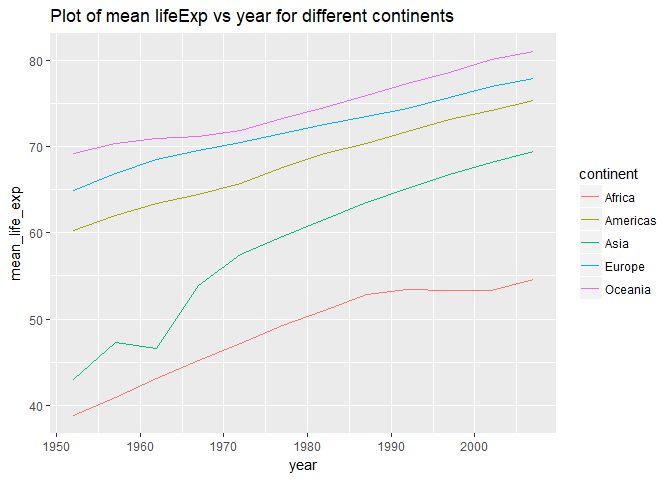<!-- -->

<h2>Fifth task</h2>

<h3>Countries with low life expectancy each year</h3>


```r
list_of_countries<- gapminder %>%
        group_by(year)%>%
        mutate(dev_lifeExp=lifeExp-weighted.mean(lifeExp,pop))%>%
        filter(dev_lifeExp<0)%>%
        group_by(continent,year)%>%
        summarize(no_of_countries=length(country))
tableFormat(list_of_countries)
```

<table class="table table-striped table-hover table-condensed table-responsive" style="font-size: 14px; margin-left: auto; margin-right: auto;">
<caption style="font-size: initial !important;"></caption>
 <thead><tr>
<th style="text-align:center;"> continent </th>
   <th style="text-align:center;"> year </th>
   <th style="text-align:center;"> no_of_countries </th>
  </tr></thead>
<tbody>
<tr>
<td style="text-align:center;"> Africa </td>
   <td style="text-align:center;"> 1952 </td>
   <td style="text-align:center;"> 50 </td>
  </tr>
<tr>
<td style="text-align:center;"> Africa </td>
   <td style="text-align:center;"> 1957 </td>
   <td style="text-align:center;"> 50 </td>
  </tr>
<tr>
<td style="text-align:center;"> Africa </td>
   <td style="text-align:center;"> 1962 </td>
   <td style="text-align:center;"> 49 </td>
  </tr>
<tr>
<td style="text-align:center;"> Africa </td>
   <td style="text-align:center;"> 1967 </td>
   <td style="text-align:center;"> 50 </td>
  </tr>
<tr>
<td style="text-align:center;"> Africa </td>
   <td style="text-align:center;"> 1972 </td>
   <td style="text-align:center;"> 50 </td>
  </tr>
<tr>
<td style="text-align:center;"> Africa </td>
   <td style="text-align:center;"> 1977 </td>
   <td style="text-align:center;"> 50 </td>
  </tr>
<tr>
<td style="text-align:center;"> Africa </td>
   <td style="text-align:center;"> 1982 </td>
   <td style="text-align:center;"> 49 </td>
  </tr>
<tr>
<td style="text-align:center;"> Africa </td>
   <td style="text-align:center;"> 1987 </td>
   <td style="text-align:center;"> 47 </td>
  </tr>
<tr>
<td style="text-align:center;"> Africa </td>
   <td style="text-align:center;"> 1992 </td>
   <td style="text-align:center;"> 47 </td>
  </tr>
<tr>
<td style="text-align:center;"> Africa </td>
   <td style="text-align:center;"> 1997 </td>
   <td style="text-align:center;"> 45 </td>
  </tr>
<tr>
<td style="text-align:center;"> Africa </td>
   <td style="text-align:center;"> 2002 </td>
   <td style="text-align:center;"> 45 </td>
  </tr>
<tr>
<td style="text-align:center;"> Africa </td>
   <td style="text-align:center;"> 2007 </td>
   <td style="text-align:center;"> 45 </td>
  </tr>
<tr>
<td style="text-align:center;"> Americas </td>
   <td style="text-align:center;"> 1952 </td>
   <td style="text-align:center;"> 9 </td>
  </tr>
<tr>
<td style="text-align:center;"> Americas </td>
   <td style="text-align:center;"> 1957 </td>
   <td style="text-align:center;"> 9 </td>
  </tr>
<tr>
<td style="text-align:center;"> Americas </td>
   <td style="text-align:center;"> 1962 </td>
   <td style="text-align:center;"> 7 </td>
  </tr>
<tr>
<td style="text-align:center;"> Americas </td>
   <td style="text-align:center;"> 1967 </td>
   <td style="text-align:center;"> 9 </td>
  </tr>
<tr>
<td style="text-align:center;"> Americas </td>
   <td style="text-align:center;"> 1972 </td>
   <td style="text-align:center;"> 9 </td>
  </tr>
<tr>
<td style="text-align:center;"> Americas </td>
   <td style="text-align:center;"> 1977 </td>
   <td style="text-align:center;"> 7 </td>
  </tr>
<tr>
<td style="text-align:center;"> Americas </td>
   <td style="text-align:center;"> 1982 </td>
   <td style="text-align:center;"> 7 </td>
  </tr>
<tr>
<td style="text-align:center;"> Americas </td>
   <td style="text-align:center;"> 1987 </td>
   <td style="text-align:center;"> 6 </td>
  </tr>
<tr>
<td style="text-align:center;"> Americas </td>
   <td style="text-align:center;"> 1992 </td>
   <td style="text-align:center;"> 3 </td>
  </tr>
<tr>
<td style="text-align:center;"> Americas </td>
   <td style="text-align:center;"> 1997 </td>
   <td style="text-align:center;"> 3 </td>
  </tr>
<tr>
<td style="text-align:center;"> Americas </td>
   <td style="text-align:center;"> 2002 </td>
   <td style="text-align:center;"> 2 </td>
  </tr>
<tr>
<td style="text-align:center;"> Americas </td>
   <td style="text-align:center;"> 2007 </td>
   <td style="text-align:center;"> 2 </td>
  </tr>
<tr>
<td style="text-align:center;"> Asia </td>
   <td style="text-align:center;"> 1952 </td>
   <td style="text-align:center;"> 22 </td>
  </tr>
<tr>
<td style="text-align:center;"> Asia </td>
   <td style="text-align:center;"> 1957 </td>
   <td style="text-align:center;"> 21 </td>
  </tr>
<tr>
<td style="text-align:center;"> Asia </td>
   <td style="text-align:center;"> 1962 </td>
   <td style="text-align:center;"> 19 </td>
  </tr>
<tr>
<td style="text-align:center;"> Asia </td>
   <td style="text-align:center;"> 1967 </td>
   <td style="text-align:center;"> 19 </td>
  </tr>
<tr>
<td style="text-align:center;"> Asia </td>
   <td style="text-align:center;"> 1972 </td>
   <td style="text-align:center;"> 19 </td>
  </tr>
<tr>
<td style="text-align:center;"> Asia </td>
   <td style="text-align:center;"> 1977 </td>
   <td style="text-align:center;"> 19 </td>
  </tr>
<tr>
<td style="text-align:center;"> Asia </td>
   <td style="text-align:center;"> 1982 </td>
   <td style="text-align:center;"> 15 </td>
  </tr>
<tr>
<td style="text-align:center;"> Asia </td>
   <td style="text-align:center;"> 1987 </td>
   <td style="text-align:center;"> 13 </td>
  </tr>
<tr>
<td style="text-align:center;"> Asia </td>
   <td style="text-align:center;"> 1992 </td>
   <td style="text-align:center;"> 11 </td>
  </tr>
<tr>
<td style="text-align:center;"> Asia </td>
   <td style="text-align:center;"> 1997 </td>
   <td style="text-align:center;"> 11 </td>
  </tr>
<tr>
<td style="text-align:center;"> Asia </td>
   <td style="text-align:center;"> 2002 </td>
   <td style="text-align:center;"> 11 </td>
  </tr>
<tr>
<td style="text-align:center;"> Asia </td>
   <td style="text-align:center;"> 2007 </td>
   <td style="text-align:center;"> 11 </td>
  </tr>
<tr>
<td style="text-align:center;"> Europe </td>
   <td style="text-align:center;"> 1952 </td>
   <td style="text-align:center;"> 1 </td>
  </tr>
<tr>
<td style="text-align:center;"> Europe </td>
   <td style="text-align:center;"> 1957 </td>
   <td style="text-align:center;"> 1 </td>
  </tr>
<tr>
<td style="text-align:center;"> Europe </td>
   <td style="text-align:center;"> 1962 </td>
   <td style="text-align:center;"> 1 </td>
  </tr>
<tr>
<td style="text-align:center;"> Europe </td>
   <td style="text-align:center;"> 1967 </td>
   <td style="text-align:center;"> 1 </td>
  </tr>
<tr>
<td style="text-align:center;"> Europe </td>
   <td style="text-align:center;"> 1972 </td>
   <td style="text-align:center;"> 1 </td>
  </tr>
<tr>
<td style="text-align:center;"> Europe </td>
   <td style="text-align:center;"> 1977 </td>
   <td style="text-align:center;"> 1 </td>
  </tr>
<tr>
<td style="text-align:center;"> Europe </td>
   <td style="text-align:center;"> 1982 </td>
   <td style="text-align:center;"> 1 </td>
  </tr>
<tr>
<td style="text-align:center;"> Europe </td>
   <td style="text-align:center;"> 1987 </td>
   <td style="text-align:center;"> 1 </td>
  </tr>
</tbody>
</table>

```r
list_of_countries%>%
  ggplot(aes(year,no_of_countries,color=continent))+
  geom_line()
```

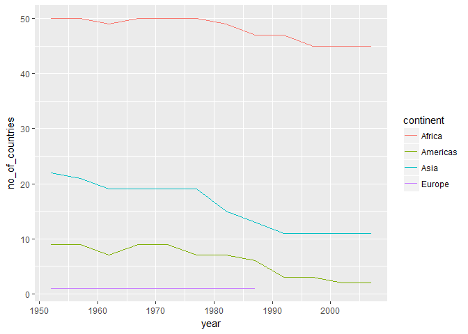<!-- -->

```r
europe_list<-gapminder %>%
        group_by(year)%>%
        mutate(dev_lifeExp=lifeExp-weighted.mean(lifeExp,pop))%>%
        filter(dev_lifeExp<0)%>%
        group_by(continent,year)%>%
        filter(continent=="Europe")%>%
        select(year,country,continent,lifeExp,dev_lifeExp)
tableFormat(europe_list)
```

<table class="table table-striped table-hover table-condensed table-responsive" style="font-size: 14px; margin-left: auto; margin-right: auto;">
<caption style="font-size: initial !important;"></caption>
 <thead><tr>
<th style="text-align:center;"> year </th>
   <th style="text-align:center;"> country </th>
   <th style="text-align:center;"> continent </th>
   <th style="text-align:center;"> lifeExp </th>
   <th style="text-align:center;"> dev_lifeExp </th>
  </tr></thead>
<tbody>
<tr>
<td style="text-align:center;"> 1952 </td>
   <td style="text-align:center;"> Turkey </td>
   <td style="text-align:center;"> Europe </td>
   <td style="text-align:center;"> 43.585 </td>
   <td style="text-align:center;"> -5.3592367 </td>
  </tr>
<tr>
<td style="text-align:center;"> 1957 </td>
   <td style="text-align:center;"> Turkey </td>
   <td style="text-align:center;"> Europe </td>
   <td style="text-align:center;"> 48.079 </td>
   <td style="text-align:center;"> -4.0428851 </td>
  </tr>
<tr>
<td style="text-align:center;"> 1962 </td>
   <td style="text-align:center;"> Turkey </td>
   <td style="text-align:center;"> Europe </td>
   <td style="text-align:center;"> 52.098 </td>
   <td style="text-align:center;"> -0.2263821 </td>
  </tr>
<tr>
<td style="text-align:center;"> 1967 </td>
   <td style="text-align:center;"> Turkey </td>
   <td style="text-align:center;"> Europe </td>
   <td style="text-align:center;"> 54.336 </td>
   <td style="text-align:center;"> -2.6483068 </td>
  </tr>
<tr>
<td style="text-align:center;"> 1972 </td>
   <td style="text-align:center;"> Turkey </td>
   <td style="text-align:center;"> Europe </td>
   <td style="text-align:center;"> 57.005 </td>
   <td style="text-align:center;"> -2.5097829 </td>
  </tr>
<tr>
<td style="text-align:center;"> 1977 </td>
   <td style="text-align:center;"> Turkey </td>
   <td style="text-align:center;"> Europe </td>
   <td style="text-align:center;"> 59.507 </td>
   <td style="text-align:center;"> -1.7302559 </td>
  </tr>
<tr>
<td style="text-align:center;"> 1982 </td>
   <td style="text-align:center;"> Turkey </td>
   <td style="text-align:center;"> Europe </td>
   <td style="text-align:center;"> 61.036 </td>
   <td style="text-align:center;"> -1.8457554 </td>
  </tr>
<tr>
<td style="text-align:center;"> 1987 </td>
   <td style="text-align:center;"> Turkey </td>
   <td style="text-align:center;"> Europe </td>
   <td style="text-align:center;"> 63.108 </td>
   <td style="text-align:center;"> -1.3083501 </td>
  </tr>
</tbody>
</table>

<i> The only country in Europe that has low life expectancy over the years is turkey. Lets take a look at the story of turkey.</i>

<h3>Story of Turkey</h3>

**Note**:
- aes_string() should be used inside function for ggplot and the column names should be passed as strings. 
- plots is user defined function() containing ggplot()


```r
turkey_data<-gapminder %>%
                  filter(country=="Turkey")
europe_country_list<-subset(gapminder,continent=="Europe")
              
plots<-function(dataset,x,y,dataset2,z){
  ggplot(data=dataset,aes_string(dataset[[x]],dataset[[y]]))+    
  geom_line(aes(color="red"))+
  geom_point()+ 
  geom_line(data=dataset2,aes_string(dataset2[[x]],dataset2[[y]],
                                     group=dataset2[[z]]),alpha=0.5)+  
  xlab(x)+
  ylab(y)
}

plots(turkey_data,"year","lifeExp",europe_country_list,"country")
```

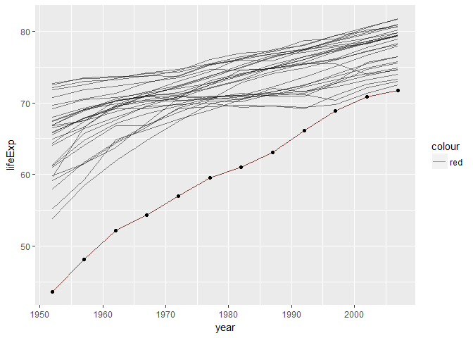<!-- -->

```r
plots(turkey_data,"year","gdpPercap",europe_country_list,"country")
```

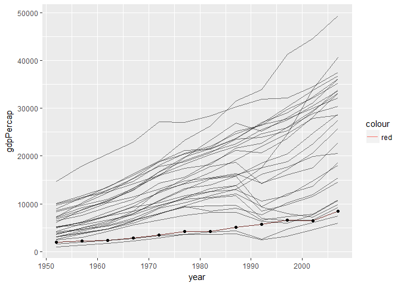<!-- -->

```r
plots(turkey_data,"year","pop",europe_country_list,"country")
```

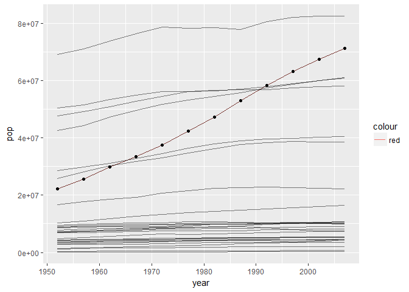<!-- -->

```r
gapminder %>%
  filter(continent=="Europe" & pop>60000000)%>%
  distinct(country)
```

```
## # A tibble: 4 × 1
##          country
##           <fctr>
## 1         France
## 2        Germany
## 3         Turkey
## 4 United Kingdom
```

```r
#distinct countries that have had lower gdpPercap than Turkey at some point of time
gapminder %>%
  group_by(year)%>%
  filter(continent=="Europe" & gdpPercap<gdpPercap[country=="Turkey"])%>%
  subset(!duplicated(country))%>%
  ungroup(year)%>%
  select(country)
```

```
## # A tibble: 4 × 1
##                  country
##                   <fctr>
## 1                Albania
## 2 Bosnia and Herzegovina
## 3               Bulgaria
## 4             Montenegro
```

```r
gapminder %>%
  group_by(year)%>%
  filter(continent=="Europe" & gdpPercap<gdpPercap[country=="Turkey"])%>%
  select(country,continent,year,gdpPercap)%>%
  arrange(desc(year))
```

```
## Source: local data frame [26 x 4]
## Groups: year [12]
## 
##                   country continent  year gdpPercap
##                    <fctr>    <fctr> <int>     <dbl>
## 1                 Albania    Europe  2007  5937.030
## 2  Bosnia and Herzegovina    Europe  2007  7446.299
## 3                 Albania    Europe  2002  4604.212
## 4  Bosnia and Herzegovina    Europe  2002  6018.975
## 5                 Albania    Europe  1997  3193.055
## 6  Bosnia and Herzegovina    Europe  1997  4766.356
## 7                Bulgaria    Europe  1997  5970.389
## 8              Montenegro    Europe  1997  6465.613
## 9                 Albania    Europe  1992  2497.438
## 10 Bosnia and Herzegovina    Europe  1992  2546.781
## # ... with 16 more rows
```

<h4>Observations:</h4>
1. The life expectancy of turkey is lowest in europe over all the years. <br/>
2. The population is increasing and is only second most to germany in Europe in the year 2007.<br/>
3. Only four countries have more than 60 million population in 2007 in Europe.<br/>
4. The gdpPercap is also low for turkey with just two countries(Albania,Bosnia and Herzegovina) having lower gdpPercap for all years. <br/>


<h3>Countries with interesting stories..</h3>

<i>Lets first look with respect to lifeExp</i>

```r
ggplot(gapminder,aes(year,lifeExp,group=country))+
  geom_line()+
  facet_wrap(~continent)
```

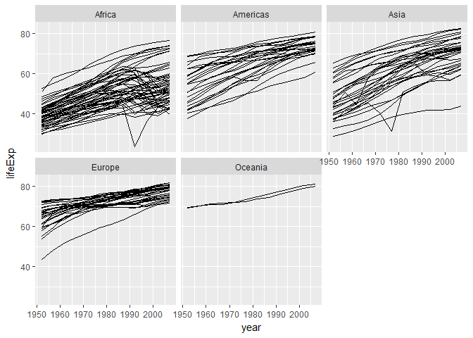<!-- -->

```r
gapminder%>%
  group_by(continent,country)%>%
  mutate(change = ifelse(year==1952,0,lifeExp-lag(lifeExp)))%>%
  select(country,continent,year,lifeExp,change)%>%
  filter(change< -5)%>%
  arrange(change)
```

```
## Source: local data frame [15 x 5]
## Groups: continent, country [12]
## 
##         country continent  year  lifeExp   change
##          <fctr>    <fctr> <int>    <dbl>    <dbl>
## 1        Rwanda    Africa  1992 23.59900 -20.4210
## 2      Zimbabwe    Africa  1997 46.80900 -13.5680
## 3       Lesotho    Africa  2002 44.59300 -10.9650
## 4     Swaziland    Africa  2002 43.86900 -10.4200
## 5      Botswana    Africa  1997 52.55600 -10.1890
## 6      Cambodia      Asia  1977 31.22000  -9.0970
## 7       Namibia    Africa  2002 51.47900  -7.4300
## 8  South Africa    Africa  2002 53.36500  -6.8710
## 9      Zimbabwe    Africa  2002 39.98900  -6.8200
## 10        China      Asia  1962 44.50136  -6.0476
## 11     Botswana    Africa  2002 46.63400  -5.9220
## 12       Zambia    Africa  1997 40.23800  -5.8620
## 13         Iraq      Asia  1992 59.46100  -5.5830
## 14      Liberia    Africa  1992 40.80200  -5.2250
## 15     Cambodia      Asia  1972 40.31700  -5.0980
```

<h4>Observations:</h4>
1. Rwanda has a huge drop from 44(in 1987) to 23(in 1992) and it again increased to 36(in 1997). This is due to the rwandan genocide that took place in 1990s.<br/>
2. Cambodia has a drop from 40(in 1972) to 31(in 1977) and it again increased to 50(in 1982). This is due to the Cambodian genocide that took place between 1975 to 1979.<br/>
3. China has a decrease in 1962 due to Sino Indian war.<br/>
4. Iraq has a decrease in 1992 due to Gulf war. <br/>
5. Liberia has a decrease in 1992 due to Liberian civil war(1989-1996).<br/>
6. HIV/AIDS epidemic caused the decrease of lifeExp in countries in Africa during late 1990s and early 2000s such as Botswana,zimbabwe,Swaziland,South Africa,Namibia and Lestho.<br/>

<i>Now lets look with respect to population</i>


```r
ggplot(gapminder,aes(year,pop,group=country))+
  geom_line()+
  facet_wrap(~continent)
```

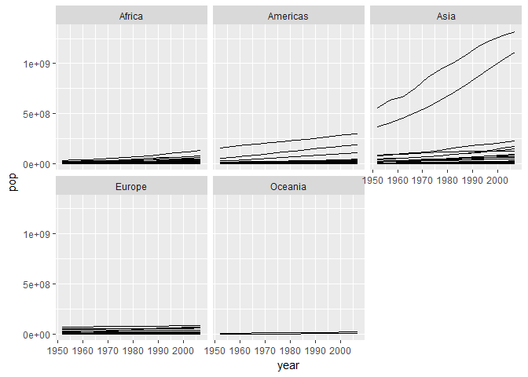<!-- -->

```r
gapminder%>%
  group_by(continent,country)%>%
  mutate(change = ifelse(year==1952,0,pop-lag(pop)))%>%
  select(country,continent,year,pop,change)%>%
  filter(change< -500000)%>%   # 500k chosen to look at major changes only. 
  arrange(change)
```

```
## Source: local data frame [6 x 5]
## Groups: continent, country [5]
## 
##                  country continent  year      pop   change
##                   <fctr>    <fctr> <int>    <int>    <dbl>
## 1            Afghanistan      Asia  1982 12881816 -1998556
## 2                Somalia    Africa  1992  6099799  -822059
## 3 Bosnia and Herzegovina    Europe  1997  3607000  -649013
## 4                Germany    Europe  1987 77718298  -616968
## 5               Bulgaria    Europe  1997  8066057  -592449
## 6                Germany    Europe  1977 78160773  -556315
```
<h4>Observations:</h4>
1. Afghanistan had a major decrease of population in 1982 due to Soviet-Afghan war(1979-1989)<br/>
2. Somalia had a major decrease of population in 1982 due to the Somali famine.<br/>
3. Germany has a decrease during 1970s and 1980s due to low birth rates,low fertility rates and higher deaths as compared to births.<br/>
4. Bulgaria has a decrease due to financial crisis in 1996-1997 which might have led to immigration.<br/>
5. Bosnia and Herzegovina has a decrease due to bosnian war(1997-1998).<br/>

<i>Next,lets look with respect to gdpPercap</i>

```r
ggplot(gapminder,aes(year,gdpPercap,group=country))+
  geom_line()+
  facet_wrap(~continent)
```

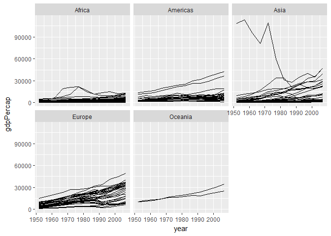<!-- -->

```r
gapminder%>%
  group_by(continent,country)%>%
  mutate(change = ifelse(year==1952,0,gdpPercap-lag(gdpPercap)))%>%
  select(country,continent,year,gdpPercap,change)%>%
  filter(change< -10000)%>%   # 10k chosen to look at major changes only. 
  arrange(year)
```

```
## Source: local data frame [5 x 5]
## Groups: continent, country [2]
## 
##        country continent  year gdpPercap    change
##         <fctr>    <fctr> <int>     <dbl>     <dbl>
## 1       Kuwait      Asia  1962  95458.11 -18065.02
## 2       Kuwait      Asia  1967  80894.88 -14563.23
## 3       Kuwait      Asia  1977  59265.48 -50082.39
## 4       Kuwait      Asia  1982  31354.04 -27911.44
## 5 Saudi Arabia      Asia  1987  21198.26 -12494.91
```
<h4>Observations:</h4>
- Kuwait and Saudi Arabia are economies heavily dependent on oil prices. Their gdpPercap fall can be attributed to fluctuating oil price per barrell and [1986 oil price collapse](https://www.brookings.edu/wp-content/uploads/1986/06/1986b_bpea_gately_adelman_griffin.pdf).<br/>
</div>
<div class="clearer"></div>

