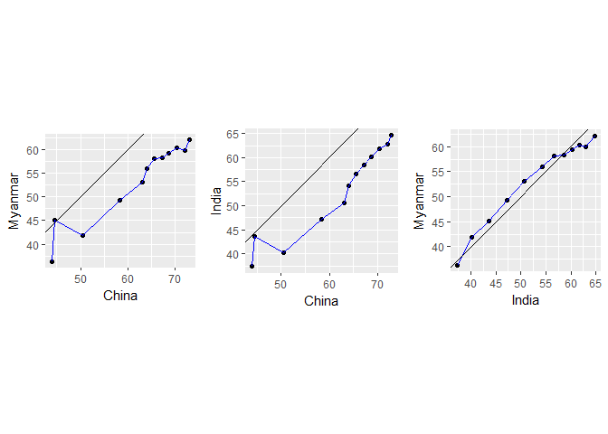
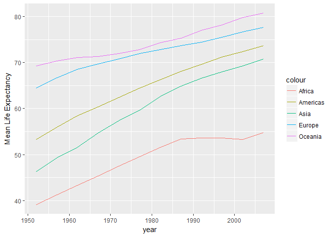

hw04\_gapminder.Rmd
================

### General data reshaping and relationship to aggregation

#### Activity \#1

The rendered markdown file of first activity can be found [here](https://github.com/abishekarun/STAT545-hw-rajendran-arun/blob/master/hw04/Reshaping_activities/activity1.md).

#### Activity \#2

``` r
reshaped_data <- gapminder%>%
                      filter(country %in% c("India","Myanmar","China"))%>%
                      select(country,lifeExp,year)%>%
                      group_by(year)%>%
                      spread(country,lifeExp)%>%
                      ungroup(year)%>%
                      select(-year)
tableFormat(reshaped_data)
```

<table class="table table-striped table-hover table-responsive" style="font-size: 14px; margin-left: auto; margin-right: auto;">
<caption style="font-size: initial !important;">
</caption>
<thead>
<tr>
<th style="text-align:center;">
China
</th>
<th style="text-align:center;">
India
</th>
<th style="text-align:center;">
Myanmar
</th>
</tr>
</thead>
<tbody>
<tr>
<td style="text-align:center;">
44.00000
</td>
<td style="text-align:center;">
37.373
</td>
<td style="text-align:center;">
36.319
</td>
</tr>
<tr>
<td style="text-align:center;">
50.54896
</td>
<td style="text-align:center;">
40.249
</td>
<td style="text-align:center;">
41.905
</td>
</tr>
<tr>
<td style="text-align:center;">
44.50136
</td>
<td style="text-align:center;">
43.605
</td>
<td style="text-align:center;">
45.108
</td>
</tr>
<tr>
<td style="text-align:center;">
58.38112
</td>
<td style="text-align:center;">
47.193
</td>
<td style="text-align:center;">
49.379
</td>
</tr>
<tr>
<td style="text-align:center;">
63.11888
</td>
<td style="text-align:center;">
50.651
</td>
<td style="text-align:center;">
53.070
</td>
</tr>
<tr>
<td style="text-align:center;">
63.96736
</td>
<td style="text-align:center;">
54.208
</td>
<td style="text-align:center;">
56.059
</td>
</tr>
<tr>
<td style="text-align:center;">
65.52500
</td>
<td style="text-align:center;">
56.596
</td>
<td style="text-align:center;">
58.056
</td>
</tr>
<tr>
<td style="text-align:center;">
67.27400
</td>
<td style="text-align:center;">
58.553
</td>
<td style="text-align:center;">
58.339
</td>
</tr>
<tr>
<td style="text-align:center;">
68.69000
</td>
<td style="text-align:center;">
60.223
</td>
<td style="text-align:center;">
59.320
</td>
</tr>
<tr>
<td style="text-align:center;">
70.42600
</td>
<td style="text-align:center;">
61.765
</td>
<td style="text-align:center;">
60.328
</td>
</tr>
<tr>
<td style="text-align:center;">
72.02800
</td>
<td style="text-align:center;">
62.879
</td>
<td style="text-align:center;">
59.908
</td>
</tr>
<tr>
<td style="text-align:center;">
72.96100
</td>
<td style="text-align:center;">
64.698
</td>
<td style="text-align:center;">
62.069
</td>
</tr>
</tbody>
</table>
Plots function

``` r
plots <- function(data,x,y){
  ggplot(data,aes_string(x,y))+
                  geom_point()+
                  geom_line(color="blue")+
                  geom_abline(intercept = 0, slope = 1)+
                  coord_fixed(ratio=1)
}
```

Plots for comparison using grid.arrange()

``` r
plot1 <- plots(reshaped_data,"China","Myanmar")
plot2 <- plots(reshaped_data,"China","India")
plot3 <- plots(reshaped_data,"India","Myanmar")

grid.arrange(plot1,plot2,plot3,ncol=3)
```



It clearly shows that lifeExp of china is higher than that of Myanmar almost all the years except only one year. Similarly, china has higher than India for all the years. Between India and Myanmar, Myanmar had higher values from 1957 to 1987 and India has had higher value since then.

#### Activity \#3

``` r
a<- gapminder%>%
          complete(nesting(continent,year))%>%
          group_by(continent,year)%>%
          summarize(mean_lifeExp=mean(lifeExp))%>%
          spread(continent,mean_lifeExp)
          #spread(year,mean_lifeExp)%>%
tableFormat(a)
```

<table class="table table-striped table-hover table-responsive" style="font-size: 14px; margin-left: auto; margin-right: auto;">
<caption style="font-size: initial !important;">
</caption>
<thead>
<tr>
<th style="text-align:center;">
year
</th>
<th style="text-align:center;">
Africa
</th>
<th style="text-align:center;">
Americas
</th>
<th style="text-align:center;">
Asia
</th>
<th style="text-align:center;">
Europe
</th>
<th style="text-align:center;">
Oceania
</th>
</tr>
</thead>
<tbody>
<tr>
<td style="text-align:center;">
1952
</td>
<td style="text-align:center;">
39.13550
</td>
<td style="text-align:center;">
53.27984
</td>
<td style="text-align:center;">
46.31439
</td>
<td style="text-align:center;">
64.40850
</td>
<td style="text-align:center;">
69.2550
</td>
</tr>
<tr>
<td style="text-align:center;">
1957
</td>
<td style="text-align:center;">
41.26635
</td>
<td style="text-align:center;">
55.96028
</td>
<td style="text-align:center;">
49.31854
</td>
<td style="text-align:center;">
66.70307
</td>
<td style="text-align:center;">
70.2950
</td>
</tr>
<tr>
<td style="text-align:center;">
1962
</td>
<td style="text-align:center;">
43.31944
</td>
<td style="text-align:center;">
58.39876
</td>
<td style="text-align:center;">
51.56322
</td>
<td style="text-align:center;">
68.53923
</td>
<td style="text-align:center;">
71.0850
</td>
</tr>
<tr>
<td style="text-align:center;">
1967
</td>
<td style="text-align:center;">
45.33454
</td>
<td style="text-align:center;">
60.41092
</td>
<td style="text-align:center;">
54.66364
</td>
<td style="text-align:center;">
69.73760
</td>
<td style="text-align:center;">
71.3100
</td>
</tr>
<tr>
<td style="text-align:center;">
1972
</td>
<td style="text-align:center;">
47.45094
</td>
<td style="text-align:center;">
62.39492
</td>
<td style="text-align:center;">
57.31927
</td>
<td style="text-align:center;">
70.77503
</td>
<td style="text-align:center;">
71.9100
</td>
</tr>
<tr>
<td style="text-align:center;">
1977
</td>
<td style="text-align:center;">
49.58042
</td>
<td style="text-align:center;">
64.39156
</td>
<td style="text-align:center;">
59.61056
</td>
<td style="text-align:center;">
71.93777
</td>
<td style="text-align:center;">
72.8550
</td>
</tr>
<tr>
<td style="text-align:center;">
1982
</td>
<td style="text-align:center;">
51.59287
</td>
<td style="text-align:center;">
66.22884
</td>
<td style="text-align:center;">
62.61794
</td>
<td style="text-align:center;">
72.80640
</td>
<td style="text-align:center;">
74.2900
</td>
</tr>
<tr>
<td style="text-align:center;">
1987
</td>
<td style="text-align:center;">
53.34479
</td>
<td style="text-align:center;">
68.09072
</td>
<td style="text-align:center;">
64.85118
</td>
<td style="text-align:center;">
73.64217
</td>
<td style="text-align:center;">
75.3200
</td>
</tr>
<tr>
<td style="text-align:center;">
1992
</td>
<td style="text-align:center;">
53.62958
</td>
<td style="text-align:center;">
69.56836
</td>
<td style="text-align:center;">
66.53721
</td>
<td style="text-align:center;">
74.44010
</td>
<td style="text-align:center;">
76.9450
</td>
</tr>
<tr>
<td style="text-align:center;">
1997
</td>
<td style="text-align:center;">
53.59827
</td>
<td style="text-align:center;">
71.15048
</td>
<td style="text-align:center;">
68.02052
</td>
<td style="text-align:center;">
75.50517
</td>
<td style="text-align:center;">
78.1900
</td>
</tr>
<tr>
<td style="text-align:center;">
2002
</td>
<td style="text-align:center;">
53.32523
</td>
<td style="text-align:center;">
72.42204
</td>
<td style="text-align:center;">
69.23388
</td>
<td style="text-align:center;">
76.70060
</td>
<td style="text-align:center;">
79.7400
</td>
</tr>
<tr>
<td style="text-align:center;">
2007
</td>
<td style="text-align:center;">
54.80604
</td>
<td style="text-align:center;">
73.60812
</td>
<td style="text-align:center;">
70.72848
</td>
<td style="text-align:center;">
77.64860
</td>
<td style="text-align:center;">
80.7195
</td>
</tr>
</tbody>
</table>
Plot of mean life expectancy for different continents

``` r
a%>%
  ggplot(aes(year))+
  geom_line(aes(y = Africa, colour = "Africa")) + 
  geom_line(aes(y = Americas, colour = "Americas"))+ 
  geom_line(aes(y = Asia, colour = "Asia"))+ 
  geom_line(aes(y = Europe, colour = "Europe"))+ 
  geom_line(aes(y = Oceania, colour = "Oceania"))+
  ylab("Mean Life Expectancy")
```



With this reshaping it is easier to plot and compare the mean life expectancy of different continents over the years than with the actual dataset and it can be seen in the above plot.

#### Activity \#4

``` r
final <- gapminder %>%
                select(year, country, lifeExp) %>%
                group_by(year) %>%
                filter(min_rank(desc(lifeExp)) < 2 | min_rank(lifeExp) < 2) %>% 
                arrange(year)%>%
                mutate(variable=ifelse(!duplicated(year),"min","max"))%>%
                unite(countryLifeExp,country,lifeExp,sep="_",remove = FALSE)%>%
                select(-country,-lifeExp)%>%
                spread(variable, value="countryLifeExp")%>%
                separate(min, c("minCountry", "minLifeExp"), "_")%>%
                separate(max, c("maxCountry", "maxLifeExp"), "_")
tableFormat(final)
```

<table class="table table-striped table-hover table-responsive" style="font-size: 14px; margin-left: auto; margin-right: auto;">
<caption style="font-size: initial !important;">
</caption>
<thead>
<tr>
<th style="text-align:center;">
year
</th>
<th style="text-align:center;">
maxCountry
</th>
<th style="text-align:center;">
maxLifeExp
</th>
<th style="text-align:center;">
minCountry
</th>
<th style="text-align:center;">
minLifeExp
</th>
</tr>
</thead>
<tbody>
<tr>
<td style="text-align:center;">
1952
</td>
<td style="text-align:center;">
Norway
</td>
<td style="text-align:center;">
72.67
</td>
<td style="text-align:center;">
Afghanistan
</td>
<td style="text-align:center;">
28.801
</td>
</tr>
<tr>
<td style="text-align:center;">
1957
</td>
<td style="text-align:center;">
Iceland
</td>
<td style="text-align:center;">
73.47
</td>
<td style="text-align:center;">
Afghanistan
</td>
<td style="text-align:center;">
30.332
</td>
</tr>
<tr>
<td style="text-align:center;">
1962
</td>
<td style="text-align:center;">
Iceland
</td>
<td style="text-align:center;">
73.68
</td>
<td style="text-align:center;">
Afghanistan
</td>
<td style="text-align:center;">
31.997
</td>
</tr>
<tr>
<td style="text-align:center;">
1967
</td>
<td style="text-align:center;">
Sweden
</td>
<td style="text-align:center;">
74.16
</td>
<td style="text-align:center;">
Afghanistan
</td>
<td style="text-align:center;">
34.02
</td>
</tr>
<tr>
<td style="text-align:center;">
1972
</td>
<td style="text-align:center;">
Sweden
</td>
<td style="text-align:center;">
74.72
</td>
<td style="text-align:center;">
Sierra Leone
</td>
<td style="text-align:center;">
35.4
</td>
</tr>
<tr>
<td style="text-align:center;">
1977
</td>
<td style="text-align:center;">
Iceland
</td>
<td style="text-align:center;">
76.11
</td>
<td style="text-align:center;">
Cambodia
</td>
<td style="text-align:center;">
31.22
</td>
</tr>
<tr>
<td style="text-align:center;">
1982
</td>
<td style="text-align:center;">
Sierra Leone
</td>
<td style="text-align:center;">
38.445
</td>
<td style="text-align:center;">
Japan
</td>
<td style="text-align:center;">
77.11
</td>
</tr>
<tr>
<td style="text-align:center;">
1987
</td>
<td style="text-align:center;">
Japan
</td>
<td style="text-align:center;">
78.67
</td>
<td style="text-align:center;">
Angola
</td>
<td style="text-align:center;">
39.906
</td>
</tr>
<tr>
<td style="text-align:center;">
1992
</td>
<td style="text-align:center;">
Rwanda
</td>
<td style="text-align:center;">
23.599
</td>
<td style="text-align:center;">
Japan
</td>
<td style="text-align:center;">
79.36
</td>
</tr>
<tr>
<td style="text-align:center;">
1997
</td>
<td style="text-align:center;">
Rwanda
</td>
<td style="text-align:center;">
36.087
</td>
<td style="text-align:center;">
Japan
</td>
<td style="text-align:center;">
80.69
</td>
</tr>
<tr>
<td style="text-align:center;">
2002
</td>
<td style="text-align:center;">
Zambia
</td>
<td style="text-align:center;">
39.193
</td>
<td style="text-align:center;">
Japan
</td>
<td style="text-align:center;">
82
</td>
</tr>
<tr>
<td style="text-align:center;">
2007
</td>
<td style="text-align:center;">
Swaziland
</td>
<td style="text-align:center;">
39.613
</td>
<td style="text-align:center;">
Japan
</td>
<td style="text-align:center;">
82.603
</td>
</tr>
</tbody>
</table>
From this table it is easier to find the max life exp and min life exp of all the years and the country that has them respectively.

#### Activity \#5

The rendered markdown file of fifth activity can be found [here](https://github.com/abishekarun/STAT545-hw-rajendran-arun/blob/master/hw04/Reshaping_activities/activity5.md).

### Join, merge, look up

#### Activity \#1

The rendered markdown file of first activity can be found [here](https://github.com/abishekarun/STAT545-hw-rajendran-arun/blob/master/hw04/join_activities/activity1.md).

#### Activity \#2

The rendered markdown file of second activity can be found [here](https://github.com/abishekarun/STAT545-hw-rajendran-arun/blob/master/hw04/join_activities/activity2.md).

#### Activity \#3

Creating datasets (movies and studios) for explaining the joins

``` r
names<-c("Iron Man","Thor","The Avengers","Ant Man","Doctor Strange","Man of steel","Dawn of Justice","Suicide squad","Wonder woman","Justice league","Force awakens")
release_year<-c("2008","2008","2011","2015","2016","2013","2016","2016","2017","2017","2015")
directors<-c("Jon Favreau","Kenneth Branagh","Joss Whedon","Peyton Reed","Scott Derrickson","Zack Snyder","Zack Snyder","David Ayer","Patty Jenkins","Zack Snyder","J.J. Abrams")
company<-c(rep("Marvel",5),rep("DC",5),"Star wars")
movies<-data.frame(names,release_year,directors,company)

company<-c("Marvel","DC","Star trek")
yrFounded<-c(1934,1939,1966)
studios<-data.frame(company,yrFounded)
```

Lets view the datasets movies

``` r
tableFormat(movies)
```

<table class="table table-striped table-hover table-responsive" style="font-size: 14px; margin-left: auto; margin-right: auto;">
<caption style="font-size: initial !important;">
</caption>
<thead>
<tr>
<th style="text-align:center;">
names
</th>
<th style="text-align:center;">
release\_year
</th>
<th style="text-align:center;">
directors
</th>
<th style="text-align:center;">
company
</th>
</tr>
</thead>
<tbody>
<tr>
<td style="text-align:center;">
Iron Man
</td>
<td style="text-align:center;">
2008
</td>
<td style="text-align:center;">
Jon Favreau
</td>
<td style="text-align:center;">
Marvel
</td>
</tr>
<tr>
<td style="text-align:center;">
Thor
</td>
<td style="text-align:center;">
2008
</td>
<td style="text-align:center;">
Kenneth Branagh
</td>
<td style="text-align:center;">
Marvel
</td>
</tr>
<tr>
<td style="text-align:center;">
The Avengers
</td>
<td style="text-align:center;">
2011
</td>
<td style="text-align:center;">
Joss Whedon
</td>
<td style="text-align:center;">
Marvel
</td>
</tr>
<tr>
<td style="text-align:center;">
Ant Man
</td>
<td style="text-align:center;">
2015
</td>
<td style="text-align:center;">
Peyton Reed
</td>
<td style="text-align:center;">
Marvel
</td>
</tr>
<tr>
<td style="text-align:center;">
Doctor Strange
</td>
<td style="text-align:center;">
2016
</td>
<td style="text-align:center;">
Scott Derrickson
</td>
<td style="text-align:center;">
Marvel
</td>
</tr>
<tr>
<td style="text-align:center;">
Man of steel
</td>
<td style="text-align:center;">
2013
</td>
<td style="text-align:center;">
Zack Snyder
</td>
<td style="text-align:center;">
DC
</td>
</tr>
<tr>
<td style="text-align:center;">
Dawn of Justice
</td>
<td style="text-align:center;">
2016
</td>
<td style="text-align:center;">
Zack Snyder
</td>
<td style="text-align:center;">
DC
</td>
</tr>
<tr>
<td style="text-align:center;">
Suicide squad
</td>
<td style="text-align:center;">
2016
</td>
<td style="text-align:center;">
David Ayer
</td>
<td style="text-align:center;">
DC
</td>
</tr>
<tr>
<td style="text-align:center;">
Wonder woman
</td>
<td style="text-align:center;">
2017
</td>
<td style="text-align:center;">
Patty Jenkins
</td>
<td style="text-align:center;">
DC
</td>
</tr>
<tr>
<td style="text-align:center;">
Justice league
</td>
<td style="text-align:center;">
2017
</td>
<td style="text-align:center;">
Zack Snyder
</td>
<td style="text-align:center;">
DC
</td>
</tr>
<tr>
<td style="text-align:center;">
Force awakens
</td>
<td style="text-align:center;">
2015
</td>
<td style="text-align:center;">
J.J. Abrams
</td>
<td style="text-align:center;">
Star wars
</td>
</tr>
</tbody>
</table>
Next the dataset studios

``` r
tableFormat(studios)
```

<table class="table table-striped table-hover table-responsive" style="font-size: 14px; margin-left: auto; margin-right: auto;">
<caption style="font-size: initial !important;">
</caption>
<thead>
<tr>
<th style="text-align:center;">
company
</th>
<th style="text-align:center;">
yrFounded
</th>
</tr>
</thead>
<tbody>
<tr>
<td style="text-align:center;">
Marvel
</td>
<td style="text-align:center;">
1934
</td>
</tr>
<tr>
<td style="text-align:center;">
DC
</td>
<td style="text-align:center;">
1939
</td>
</tr>
<tr>
<td style="text-align:center;">
Star trek
</td>
<td style="text-align:center;">
1966
</td>
</tr>
</tbody>
</table>
##### Merge function

> Merge two data frames by common columns or row names, or do other versions of database join operations.

Lets explore the joins that can be done using the basic merge() function

inner\_join using merge()

``` r
tableFormat(merge(movies,studios,by="company")) #similar to inner_join 
```

<table class="table table-striped table-hover table-responsive" style="font-size: 14px; margin-left: auto; margin-right: auto;">
<caption style="font-size: initial !important;">
</caption>
<thead>
<tr>
<th style="text-align:center;">
company
</th>
<th style="text-align:center;">
names
</th>
<th style="text-align:center;">
release\_year
</th>
<th style="text-align:center;">
directors
</th>
<th style="text-align:center;">
yrFounded
</th>
</tr>
</thead>
<tbody>
<tr>
<td style="text-align:center;">
DC
</td>
<td style="text-align:center;">
Man of steel
</td>
<td style="text-align:center;">
2013
</td>
<td style="text-align:center;">
Zack Snyder
</td>
<td style="text-align:center;">
1939
</td>
</tr>
<tr>
<td style="text-align:center;">
DC
</td>
<td style="text-align:center;">
Suicide squad
</td>
<td style="text-align:center;">
2016
</td>
<td style="text-align:center;">
David Ayer
</td>
<td style="text-align:center;">
1939
</td>
</tr>
<tr>
<td style="text-align:center;">
DC
</td>
<td style="text-align:center;">
Wonder woman
</td>
<td style="text-align:center;">
2017
</td>
<td style="text-align:center;">
Patty Jenkins
</td>
<td style="text-align:center;">
1939
</td>
</tr>
<tr>
<td style="text-align:center;">
DC
</td>
<td style="text-align:center;">
Justice league
</td>
<td style="text-align:center;">
2017
</td>
<td style="text-align:center;">
Zack Snyder
</td>
<td style="text-align:center;">
1939
</td>
</tr>
<tr>
<td style="text-align:center;">
DC
</td>
<td style="text-align:center;">
Dawn of Justice
</td>
<td style="text-align:center;">
2016
</td>
<td style="text-align:center;">
Zack Snyder
</td>
<td style="text-align:center;">
1939
</td>
</tr>
<tr>
<td style="text-align:center;">
Marvel
</td>
<td style="text-align:center;">
Iron Man
</td>
<td style="text-align:center;">
2008
</td>
<td style="text-align:center;">
Jon Favreau
</td>
<td style="text-align:center;">
1934
</td>
</tr>
<tr>
<td style="text-align:center;">
Marvel
</td>
<td style="text-align:center;">
Thor
</td>
<td style="text-align:center;">
2008
</td>
<td style="text-align:center;">
Kenneth Branagh
</td>
<td style="text-align:center;">
1934
</td>
</tr>
<tr>
<td style="text-align:center;">
Marvel
</td>
<td style="text-align:center;">
Ant Man
</td>
<td style="text-align:center;">
2015
</td>
<td style="text-align:center;">
Peyton Reed
</td>
<td style="text-align:center;">
1934
</td>
</tr>
<tr>
<td style="text-align:center;">
Marvel
</td>
<td style="text-align:center;">
Doctor Strange
</td>
<td style="text-align:center;">
2016
</td>
<td style="text-align:center;">
Scott Derrickson
</td>
<td style="text-align:center;">
1934
</td>
</tr>
<tr>
<td style="text-align:center;">
Marvel
</td>
<td style="text-align:center;">
The Avengers
</td>
<td style="text-align:center;">
2011
</td>
<td style="text-align:center;">
Joss Whedon
</td>
<td style="text-align:center;">
1934
</td>
</tr>
</tbody>
</table>
This returns similar to the inner\_join

left\_join using merge()

``` r
tableFormat(merge(movies,studios,by="company",all.x=TRUE)) #similar to left_join
```

<table class="table table-striped table-hover table-responsive" style="font-size: 14px; margin-left: auto; margin-right: auto;">
<caption style="font-size: initial !important;">
</caption>
<thead>
<tr>
<th style="text-align:center;">
company
</th>
<th style="text-align:center;">
names
</th>
<th style="text-align:center;">
release\_year
</th>
<th style="text-align:center;">
directors
</th>
<th style="text-align:center;">
yrFounded
</th>
</tr>
</thead>
<tbody>
<tr>
<td style="text-align:center;">
DC
</td>
<td style="text-align:center;">
Man of steel
</td>
<td style="text-align:center;">
2013
</td>
<td style="text-align:center;">
Zack Snyder
</td>
<td style="text-align:center;">
1939
</td>
</tr>
<tr>
<td style="text-align:center;">
DC
</td>
<td style="text-align:center;">
Suicide squad
</td>
<td style="text-align:center;">
2016
</td>
<td style="text-align:center;">
David Ayer
</td>
<td style="text-align:center;">
1939
</td>
</tr>
<tr>
<td style="text-align:center;">
DC
</td>
<td style="text-align:center;">
Wonder woman
</td>
<td style="text-align:center;">
2017
</td>
<td style="text-align:center;">
Patty Jenkins
</td>
<td style="text-align:center;">
1939
</td>
</tr>
<tr>
<td style="text-align:center;">
DC
</td>
<td style="text-align:center;">
Justice league
</td>
<td style="text-align:center;">
2017
</td>
<td style="text-align:center;">
Zack Snyder
</td>
<td style="text-align:center;">
1939
</td>
</tr>
<tr>
<td style="text-align:center;">
DC
</td>
<td style="text-align:center;">
Dawn of Justice
</td>
<td style="text-align:center;">
2016
</td>
<td style="text-align:center;">
Zack Snyder
</td>
<td style="text-align:center;">
1939
</td>
</tr>
<tr>
<td style="text-align:center;">
Marvel
</td>
<td style="text-align:center;">
Iron Man
</td>
<td style="text-align:center;">
2008
</td>
<td style="text-align:center;">
Jon Favreau
</td>
<td style="text-align:center;">
1934
</td>
</tr>
<tr>
<td style="text-align:center;">
Marvel
</td>
<td style="text-align:center;">
Thor
</td>
<td style="text-align:center;">
2008
</td>
<td style="text-align:center;">
Kenneth Branagh
</td>
<td style="text-align:center;">
1934
</td>
</tr>
<tr>
<td style="text-align:center;">
Marvel
</td>
<td style="text-align:center;">
Ant Man
</td>
<td style="text-align:center;">
2015
</td>
<td style="text-align:center;">
Peyton Reed
</td>
<td style="text-align:center;">
1934
</td>
</tr>
<tr>
<td style="text-align:center;">
Marvel
</td>
<td style="text-align:center;">
Doctor Strange
</td>
<td style="text-align:center;">
2016
</td>
<td style="text-align:center;">
Scott Derrickson
</td>
<td style="text-align:center;">
1934
</td>
</tr>
<tr>
<td style="text-align:center;">
Marvel
</td>
<td style="text-align:center;">
The Avengers
</td>
<td style="text-align:center;">
2011
</td>
<td style="text-align:center;">
Joss Whedon
</td>
<td style="text-align:center;">
1934
</td>
</tr>
<tr>
<td style="text-align:center;">
Star wars
</td>
<td style="text-align:center;">
Force awakens
</td>
<td style="text-align:center;">
2015
</td>
<td style="text-align:center;">
J.J. Abrams
</td>
<td style="text-align:center;">
NA
</td>
</tr>
</tbody>
</table>
This returns similar to the left\_join

right\_join using merge()

``` r
tableFormat(merge(movies,studios,by="company",all.y=TRUE)) #similar to right_join
```

<table class="table table-striped table-hover table-responsive" style="font-size: 14px; margin-left: auto; margin-right: auto;">
<caption style="font-size: initial !important;">
</caption>
<thead>
<tr>
<th style="text-align:center;">
company
</th>
<th style="text-align:center;">
names
</th>
<th style="text-align:center;">
release\_year
</th>
<th style="text-align:center;">
directors
</th>
<th style="text-align:center;">
yrFounded
</th>
</tr>
</thead>
<tbody>
<tr>
<td style="text-align:center;">
DC
</td>
<td style="text-align:center;">
Man of steel
</td>
<td style="text-align:center;">
2013
</td>
<td style="text-align:center;">
Zack Snyder
</td>
<td style="text-align:center;">
1939
</td>
</tr>
<tr>
<td style="text-align:center;">
DC
</td>
<td style="text-align:center;">
Suicide squad
</td>
<td style="text-align:center;">
2016
</td>
<td style="text-align:center;">
David Ayer
</td>
<td style="text-align:center;">
1939
</td>
</tr>
<tr>
<td style="text-align:center;">
DC
</td>
<td style="text-align:center;">
Wonder woman
</td>
<td style="text-align:center;">
2017
</td>
<td style="text-align:center;">
Patty Jenkins
</td>
<td style="text-align:center;">
1939
</td>
</tr>
<tr>
<td style="text-align:center;">
DC
</td>
<td style="text-align:center;">
Justice league
</td>
<td style="text-align:center;">
2017
</td>
<td style="text-align:center;">
Zack Snyder
</td>
<td style="text-align:center;">
1939
</td>
</tr>
<tr>
<td style="text-align:center;">
DC
</td>
<td style="text-align:center;">
Dawn of Justice
</td>
<td style="text-align:center;">
2016
</td>
<td style="text-align:center;">
Zack Snyder
</td>
<td style="text-align:center;">
1939
</td>
</tr>
<tr>
<td style="text-align:center;">
Marvel
</td>
<td style="text-align:center;">
Iron Man
</td>
<td style="text-align:center;">
2008
</td>
<td style="text-align:center;">
Jon Favreau
</td>
<td style="text-align:center;">
1934
</td>
</tr>
<tr>
<td style="text-align:center;">
Marvel
</td>
<td style="text-align:center;">
Thor
</td>
<td style="text-align:center;">
2008
</td>
<td style="text-align:center;">
Kenneth Branagh
</td>
<td style="text-align:center;">
1934
</td>
</tr>
<tr>
<td style="text-align:center;">
Marvel
</td>
<td style="text-align:center;">
Ant Man
</td>
<td style="text-align:center;">
2015
</td>
<td style="text-align:center;">
Peyton Reed
</td>
<td style="text-align:center;">
1934
</td>
</tr>
<tr>
<td style="text-align:center;">
Marvel
</td>
<td style="text-align:center;">
Doctor Strange
</td>
<td style="text-align:center;">
2016
</td>
<td style="text-align:center;">
Scott Derrickson
</td>
<td style="text-align:center;">
1934
</td>
</tr>
<tr>
<td style="text-align:center;">
Marvel
</td>
<td style="text-align:center;">
The Avengers
</td>
<td style="text-align:center;">
2011
</td>
<td style="text-align:center;">
Joss Whedon
</td>
<td style="text-align:center;">
1934
</td>
</tr>
<tr>
<td style="text-align:center;">
Star trek
</td>
<td style="text-align:center;">
NA
</td>
<td style="text-align:center;">
NA
</td>
<td style="text-align:center;">
NA
</td>
<td style="text-align:center;">
1966
</td>
</tr>
</tbody>
</table>
This returns similar to the right\_join

full\_join using merge()

``` r
tableFormat(merge(movies,studios,all=TRUE)) #similar to full_join
```

<table class="table table-striped table-hover table-responsive" style="font-size: 14px; margin-left: auto; margin-right: auto;">
<caption style="font-size: initial !important;">
</caption>
<thead>
<tr>
<th style="text-align:center;">
company
</th>
<th style="text-align:center;">
names
</th>
<th style="text-align:center;">
release\_year
</th>
<th style="text-align:center;">
directors
</th>
<th style="text-align:center;">
yrFounded
</th>
</tr>
</thead>
<tbody>
<tr>
<td style="text-align:center;">
DC
</td>
<td style="text-align:center;">
Man of steel
</td>
<td style="text-align:center;">
2013
</td>
<td style="text-align:center;">
Zack Snyder
</td>
<td style="text-align:center;">
1939
</td>
</tr>
<tr>
<td style="text-align:center;">
DC
</td>
<td style="text-align:center;">
Suicide squad
</td>
<td style="text-align:center;">
2016
</td>
<td style="text-align:center;">
David Ayer
</td>
<td style="text-align:center;">
1939
</td>
</tr>
<tr>
<td style="text-align:center;">
DC
</td>
<td style="text-align:center;">
Wonder woman
</td>
<td style="text-align:center;">
2017
</td>
<td style="text-align:center;">
Patty Jenkins
</td>
<td style="text-align:center;">
1939
</td>
</tr>
<tr>
<td style="text-align:center;">
DC
</td>
<td style="text-align:center;">
Justice league
</td>
<td style="text-align:center;">
2017
</td>
<td style="text-align:center;">
Zack Snyder
</td>
<td style="text-align:center;">
1939
</td>
</tr>
<tr>
<td style="text-align:center;">
DC
</td>
<td style="text-align:center;">
Dawn of Justice
</td>
<td style="text-align:center;">
2016
</td>
<td style="text-align:center;">
Zack Snyder
</td>
<td style="text-align:center;">
1939
</td>
</tr>
<tr>
<td style="text-align:center;">
Marvel
</td>
<td style="text-align:center;">
Iron Man
</td>
<td style="text-align:center;">
2008
</td>
<td style="text-align:center;">
Jon Favreau
</td>
<td style="text-align:center;">
1934
</td>
</tr>
<tr>
<td style="text-align:center;">
Marvel
</td>
<td style="text-align:center;">
Thor
</td>
<td style="text-align:center;">
2008
</td>
<td style="text-align:center;">
Kenneth Branagh
</td>
<td style="text-align:center;">
1934
</td>
</tr>
<tr>
<td style="text-align:center;">
Marvel
</td>
<td style="text-align:center;">
Ant Man
</td>
<td style="text-align:center;">
2015
</td>
<td style="text-align:center;">
Peyton Reed
</td>
<td style="text-align:center;">
1934
</td>
</tr>
<tr>
<td style="text-align:center;">
Marvel
</td>
<td style="text-align:center;">
Doctor Strange
</td>
<td style="text-align:center;">
2016
</td>
<td style="text-align:center;">
Scott Derrickson
</td>
<td style="text-align:center;">
1934
</td>
</tr>
<tr>
<td style="text-align:center;">
Marvel
</td>
<td style="text-align:center;">
The Avengers
</td>
<td style="text-align:center;">
2011
</td>
<td style="text-align:center;">
Joss Whedon
</td>
<td style="text-align:center;">
1934
</td>
</tr>
<tr>
<td style="text-align:center;">
Star wars
</td>
<td style="text-align:center;">
Force awakens
</td>
<td style="text-align:center;">
2015
</td>
<td style="text-align:center;">
J.J. Abrams
</td>
<td style="text-align:center;">
NA
</td>
</tr>
<tr>
<td style="text-align:center;">
Star trek
</td>
<td style="text-align:center;">
NA
</td>
<td style="text-align:center;">
NA
</td>
<td style="text-align:center;">
NA
</td>
<td style="text-align:center;">
1966
</td>
</tr>
</tbody>
</table>
This returns similar to the full\_join

*base R merge() and equivalent package-based merge functions, which always allocate a new table to return the merged result, and thus are not suitable for an in-place assignment-based solution. Filtering joins cannot be done using merge*

##### Match function

> match returns a vector of the positions of (first) matches of its first argument in its second.

``` r
tableFormat(movies[match(studios$company,movies$company,nomatch = 0),])
```

<table class="table table-striped table-hover table-responsive" style="font-size: 14px; margin-left: auto; margin-right: auto;">
<caption style="font-size: initial !important;">
</caption>
<thead>
<tr>
<th style="text-align:left;">
</th>
<th style="text-align:center;">
names
</th>
<th style="text-align:center;">
release\_year
</th>
<th style="text-align:center;">
directors
</th>
<th style="text-align:center;">
company
</th>
</tr>
</thead>
<tbody>
<tr>
<td style="text-align:left;">
1
</td>
<td style="text-align:center;">
Iron Man
</td>
<td style="text-align:center;">
2008
</td>
<td style="text-align:center;">
Jon Favreau
</td>
<td style="text-align:center;">
Marvel
</td>
</tr>
<tr>
<td style="text-align:left;">
6
</td>
<td style="text-align:center;">
Man of steel
</td>
<td style="text-align:center;">
2013
</td>
<td style="text-align:center;">
Zack Snyder
</td>
<td style="text-align:center;">
DC
</td>
</tr>
</tbody>
</table>
It just returns the first match of company marvel in movies which is Iron Man movie and first match of company DC in movies which is Man of Steel movie.

**Filtering joins with match**

``` r
# this just finds the values in movies that are matching with studios$company
#that is, it is semi_join(movies,studios)

tableFormat(movies[which(!is.na(match(movies$company,studios$company))),])
```

<table class="table table-striped table-hover table-responsive" style="font-size: 14px; margin-left: auto; margin-right: auto;">
<caption style="font-size: initial !important;">
</caption>
<thead>
<tr>
<th style="text-align:center;">
names
</th>
<th style="text-align:center;">
release\_year
</th>
<th style="text-align:center;">
directors
</th>
<th style="text-align:center;">
company
</th>
</tr>
</thead>
<tbody>
<tr>
<td style="text-align:center;">
Iron Man
</td>
<td style="text-align:center;">
2008
</td>
<td style="text-align:center;">
Jon Favreau
</td>
<td style="text-align:center;">
Marvel
</td>
</tr>
<tr>
<td style="text-align:center;">
Thor
</td>
<td style="text-align:center;">
2008
</td>
<td style="text-align:center;">
Kenneth Branagh
</td>
<td style="text-align:center;">
Marvel
</td>
</tr>
<tr>
<td style="text-align:center;">
The Avengers
</td>
<td style="text-align:center;">
2011
</td>
<td style="text-align:center;">
Joss Whedon
</td>
<td style="text-align:center;">
Marvel
</td>
</tr>
<tr>
<td style="text-align:center;">
Ant Man
</td>
<td style="text-align:center;">
2015
</td>
<td style="text-align:center;">
Peyton Reed
</td>
<td style="text-align:center;">
Marvel
</td>
</tr>
<tr>
<td style="text-align:center;">
Doctor Strange
</td>
<td style="text-align:center;">
2016
</td>
<td style="text-align:center;">
Scott Derrickson
</td>
<td style="text-align:center;">
Marvel
</td>
</tr>
<tr>
<td style="text-align:center;">
Man of steel
</td>
<td style="text-align:center;">
2013
</td>
<td style="text-align:center;">
Zack Snyder
</td>
<td style="text-align:center;">
DC
</td>
</tr>
<tr>
<td style="text-align:center;">
Dawn of Justice
</td>
<td style="text-align:center;">
2016
</td>
<td style="text-align:center;">
Zack Snyder
</td>
<td style="text-align:center;">
DC
</td>
</tr>
<tr>
<td style="text-align:center;">
Suicide squad
</td>
<td style="text-align:center;">
2016
</td>
<td style="text-align:center;">
David Ayer
</td>
<td style="text-align:center;">
DC
</td>
</tr>
<tr>
<td style="text-align:center;">
Wonder woman
</td>
<td style="text-align:center;">
2017
</td>
<td style="text-align:center;">
Patty Jenkins
</td>
<td style="text-align:center;">
DC
</td>
</tr>
<tr>
<td style="text-align:center;">
Justice league
</td>
<td style="text-align:center;">
2017
</td>
<td style="text-align:center;">
Zack Snyder
</td>
<td style="text-align:center;">
DC
</td>
</tr>
</tbody>
</table>
The values that are common are taken and corrosponding rows are returned from movies.

**anti\_join(movies,studios)**

``` r
#Next is anti_join(movies,studios)
tableFormat(movies[which(is.na(match(movies$company,studios$company))),])
```

<table class="table table-striped table-hover table-responsive" style="font-size: 14px; margin-left: auto; margin-right: auto;">
<caption style="font-size: initial !important;">
</caption>
<thead>
<tr>
<th style="text-align:left;">
</th>
<th style="text-align:center;">
names
</th>
<th style="text-align:center;">
release\_year
</th>
<th style="text-align:center;">
directors
</th>
<th style="text-align:center;">
company
</th>
</tr>
</thead>
<tbody>
<tr>
<td style="text-align:left;">
11
</td>
<td style="text-align:center;">
Force awakens
</td>
<td style="text-align:center;">
2015
</td>
<td style="text-align:center;">
J.J. Abrams
</td>
<td style="text-align:center;">
Star wars
</td>
</tr>
</tbody>
</table>
The values that are not common are taken from movies.

**semi\_join(studios,movies)**

``` r
#semi_join(studios,movies)
tableFormat(studios[which(!is.na(match(studios$company,movies$company))),])
```

<table class="table table-striped table-hover table-responsive" style="font-size: 14px; margin-left: auto; margin-right: auto;">
<caption style="font-size: initial !important;">
</caption>
<thead>
<tr>
<th style="text-align:center;">
company
</th>
<th style="text-align:center;">
yrFounded
</th>
</tr>
</thead>
<tbody>
<tr>
<td style="text-align:center;">
Marvel
</td>
<td style="text-align:center;">
1934
</td>
</tr>
<tr>
<td style="text-align:center;">
DC
</td>
<td style="text-align:center;">
1939
</td>
</tr>
</tbody>
</table>
The values that are common are taken and corrosponding rows are returned from studios.

**anti\_join(studios,movies)**

``` r
#anti_join(studios,movies)
tableFormat(studios[which(is.na(match(studios$company,movies$company))),])
```

<table class="table table-striped table-hover table-responsive" style="font-size: 14px; margin-left: auto; margin-right: auto;">
<caption style="font-size: initial !important;">
</caption>
<thead>
<tr>
<th style="text-align:left;">
</th>
<th style="text-align:center;">
company
</th>
<th style="text-align:center;">
yrFounded
</th>
</tr>
</thead>
<tbody>
<tr>
<td style="text-align:left;">
3
</td>
<td style="text-align:center;">
Star trek
</td>
<td style="text-align:center;">
1966
</td>
</tr>
</tbody>
</table>
The values that are not common are taken from movies.

The above shows that match can be used to perform the filtering joins but cannot perform the mutating joins.
