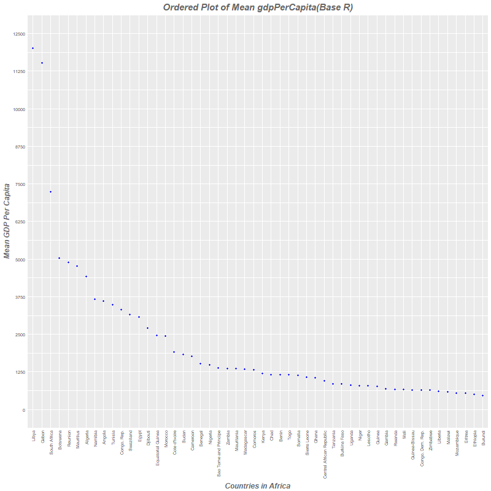
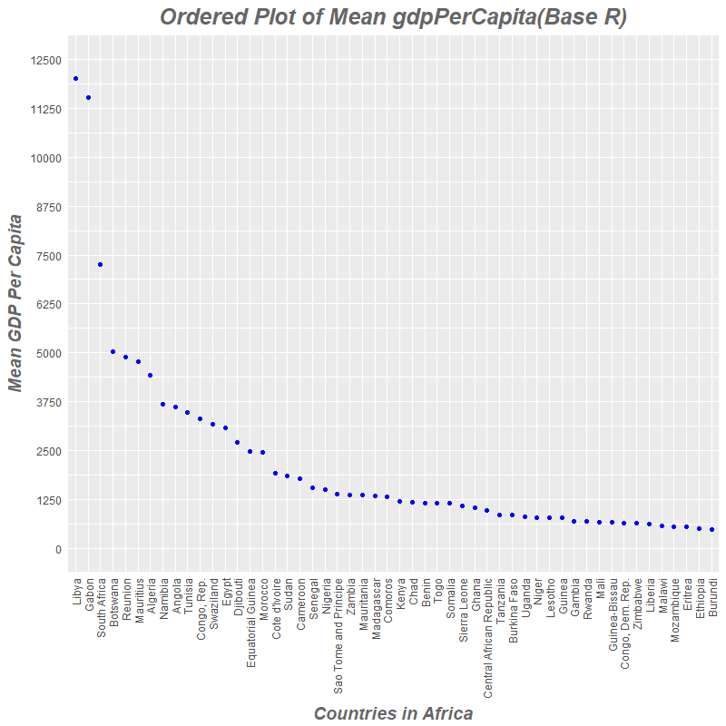

```{r}
suppressPackageStartupMessages(library(tidyverse))
suppressPackageStartupMessages(library(ggplot2))
suppressPackageStartupMessages(library(knitr))
suppressPackageStartupMessages(library(kableExtra))
suppressPackageStartupMessages(library(dplyr))
options(knitr.table.format = "html")
```


```{r}
tableFormat<-function(table,title=""){
  table %>%      
    kable("html",caption=title, align=c(rep('c', 5))) %>%
    kable_styling(bootstrap_options = 
                    c("striped", "hover",  "responsive"),
                  position="center",font_size=14)
}
```

Lets update the theme of ggplot to make title of all plots centered.
```{r}
theme_update(plot.title = element_text(hjust = 0.5))
```


##Task 1

###Factor Management 

###Gapminder version

First lets load the gapminder dataset

```{r}
suppressPackageStartupMessages(library(gapminder))
```

Now lets drop the continent oceania

```{r}
gap_dropped<-subset(gapminder,continent!="Oceania")
```

Now we have two datasets. The original gapminder dataset and the gap_dropped with "Oceania" dropped.

Lets check the dimensions of both the datasets

```{r}
dim(gapminder)
dim(gap_dropped)
```

So ,it shows that 24 entries belong to continent "Oceania". Lets check if this is indeed true.
```{r}
nrow(gapminder[gapminder$continent=="Oceania",])
```

Now lets check the levels of factor country in both the datasets.
```{r}
length(levels(gapminder$country))
length(levels(gap_dropped$country))
```

This shows that some factor levels are remaining even though they are unused in gap_dropped. Lets remove this using droplevels() function from base R.
```{r}
length(levels(droplevels(gap_dropped$country)))
```

Thus two levels of country corrosponding to Australia and New Zealand are dropped in the gap_dropped.

_This can be done in a couple of other ways._

1. **Base R** <br\>
We can factorize the column after subsetting the data frame.
```{r}
length(levels(gap_dropped$continent))

gap_dropped$continent<-factor(gap_dropped$continent)
#gap_dropped$continent<-as.factor(as.character(gap_dropped$continent))

length(levels(gap_dropped$continent))
```

Thus the levels for factor variable continent in gap_dropped is changed.

2. **gdata package** <br\>
Dropping of levels can be done for all the variables at once using drop.levels() function from gdata package.

```{r}
suppressPackageStartupMessages(library(gdata))

gapminder[gapminder$continent!="Oceania",]%>%
  drop.levels()%>%
  sapply(nlevels)
```

3. **forcats package**<br\>
Dropping of levels can be done using droplevels() function in forcats() package.
> The base function droplevels() operates on all the factors in a data frame or on a single factor. The function forcats::fct_drop() operates on a factor.

```{r}
suppressPackageStartupMessages(library(forcats))

gapminder[gapminder$continent!="Oceania",]$continent%>%
  fct_drop() %>%
  nlevels()

gapminder[gapminder$continent!="Oceania",]%>%
  droplevels()%>%
  sapply(nlevels)

```

###Reordering levels of factor variables

####Continent Variable

**First, lets reorder levels of continent variable by frequency.**

We order continent by frequency, forwards and backwards.
```{r}
fct_count(gapminder$continent)

## order by frequency (highest first)
gapminder$continent %>% 
  fct_infreq()%>% 
  levels()

## backwards!
gapminder$continent %>% 
  fct_infreq() %>%
  fct_rev() %>% 
  levels()
```

Now we order continent by another variable forwards and backwards. Lets use different summarizing function such as mean,median, minimum value.

```{r}
#order by median of lifeExp
fct_reorder(gapminder$continent, gapminder$lifeExp) %>% 
  levels()

#order by min of gdpPercap
fct_reorder(gapminder$continent, gapminder$gdpPercap, min) %>% 
  levels()

#backwards
fct_reorder(gapminder$continent, gapminder$lifeExp,.desc=TRUE) %>% 
  levels()
```

Now lets reorder country levels based on mean of population variable
```{r}
fct_reorder(gapminder$country, gapminder$pop, mean) %>% 
  levels()%>%
  head()
```

###Importance of reordering with plots

Lets understand the importance of reordering the factor variables by plotting mean population of each country in Americas continent with and without reordering the factor variable.

```{r}
h_gap <- gapminder%>%
           filter(continent=="Americas")%>%
           group_by(country)%>%
           summarize(mean_pop=mean(pop))%>%
           arrange(mean_pop)

tableFormat(h_gap,"Mean Population of Countries in America")

```

###Unordered Plot of Mean pop for Each Country

```{r}
ggplot(h_gap,aes(x=mean_pop,y=country))+
  geom_point(color="blue")+
  theme(
        plot.title = element_text(color="red", size=18, face="bold.italic"),
        axis.title.x = element_text(color="green", size=14,
                                    face="bold",hjust=0.5),
        axis.title.y = element_text(color="#993333", size=14,
                                    face="bold",vjust=0.5),
        axis.ticks.y = element_blank(),
        axis.text.x = element_text(angle = 90)
        )+
  scale_x_log10(breaks=c(10^6,5*10^6,10^7,20*10^6,40*10^6,
                         80*10^6,160*10^6,220*10^6),
                labels = function(x) format(x, scientific = FALSE))+
  xlab("Mean Population")+
  ylab("Countries in America")+
  ggtitle("Unordered Plot of Mean Population")

```

###Ordered Plot of Mean pop for Each Country

```{r}
ggplot(h_gap,aes(x=mean_pop,y=fct_reorder(country,mean_pop,.desc = TRUE)))+
  geom_point(color="blue")+
  theme(
        plot.title = element_text(color="red", size=18, face="bold.italic"),
        axis.title.x = element_text(color="green", size=14,
                                    face="bold",hjust=0.5),
        axis.title.y = element_text(color="#993333", size=14,
                                    face="bold",vjust=0.5),
        axis.ticks.y = element_blank(),
        axis.text.x = element_text(angle = 90)
        )+
  scale_x_log10(breaks=c(10^6,5*10^6,10^7,20*10^6,40*10^6,
                         80*10^6,160*10^6,220*10^6),
                labels = function(x) format(x, scientific = FALSE))+
  xlab("Mean Population")+
  ylab("Countries in America")+
  ggtitle("Ordered Plot of Mean Population")

```

Now lets take use of fct_reorder2() function. It is useful when one quantitative variable is plotted against another and the factor varible gives the color.
This way the legend appears in some order as the data! Contrast the legend on the two plots below.

```{r}
gg_gap <- gapminder%>%
                group_by(continent,year)%>%
                summarize(mean_gdpPercap=mean(gdpPercap))%>%
                arrange(continent, year, mean_gdpPercap)

tableFormat(gg_gap,"Mean GDP Per Capita Over Years")

```

###Unordered Plot of Mean gdpPerCap vs Year for Each Continent

```{r}
ggplot(gg_gap,aes(year,mean_gdpPercap,color=continent))+
  geom_line(size=1.25)+
  theme(
        plot.title = element_text(color="grey40", size=18, face="bold.italic"),
        axis.title.x = element_text(color="grey40", size=14, 
                                    face="bold",hjust=0.5),
        axis.title.y = element_text(color="grey40", size=14,
                                    face="bold",vjust=0.5),
        axis.ticks.y = element_blank(),
        axis.text.x = element_text(angle = 0)
        )+
  scale_y_continuous(breaks=seq(0,30000,5000),
                     limits = c(0,30000))+
  xlab("Year")+
  ylab("Mean GDP Per Capita")+
  ggtitle("Unordered Plot of Mean GDP Per Capita")

```

###Ordered Plot of Mean gdpPerCap vs Year for Each Continent

```{r}
ggplot(gg_gap, aes(x = year, y = mean_gdpPercap,
                  color = fct_reorder2(continent, year, mean_gdpPercap))) +
  geom_line(size=1.25)+
  theme(
        plot.title = element_text(color="grey40", size=18, face="bold.italic"),
        axis.title.x = element_text(color="grey40", size=14, 
                                    face="bold",hjust=0.5),
        axis.title.y = element_text(color="grey40", size=14,
                                    face="bold",vjust=0.5),
        axis.ticks.y = element_blank(),
        axis.text.x = element_text(angle = 0)
        )+
  scale_y_continuous(breaks=seq(0,30000,5000),
                     limits = c(0,30000))+
  labs(x="Year",y="Mean GDP Per Capita",color = "continent")+
  ggtitle("Ordered Plot of Mean GDP Per Capita")
```

###Factor Relevel

In order to just hoist one or more levels manually, we can use fct_relevel() function.

```{r}
gg_gap$continent %>% levels()
gg_gap$continent %>% fct_relevel("Asia") %>% levels()
gg_gap$continent %>% fct_relevel("Oceania","Americas") %>% levels()
```

###Factor Recode

Change the names of the levels..
```{r}
fct_recode(gg_gap$continent,North_America="Americas",Australia="Oceania")%>%
  levels()
```

Use NULL to remove a particular level.
```{r}
fct_recode(gg_gap$continent,NULL="Americas")%>%
  levels()
```


###Effects of arrange

Now lets take the dataset of mean values of gdpPercap,lifeExp and population for each country in Africa continent.

```{r}
gap_le <- gapminder%>%
                filter(continent=="Africa")%>%
                group_by(country)%>%
                summarize(mean_gdpPercap=mean(gdpPercap),
                          mean_pop=mean(pop),
                          mean_lifeExp=mean(lifeExp))
gap_le%>%
  arrange(desc(mean_gdpPercap))%>%
  tableFormat("Mean Values for Countries in Africa")
```

###Unordered Plot

Lets plot mean gdpPercap of each country in Africa without ordering the factor variable country.
```{r}
unordered_plot<- 
  gap_le%>%
    arrange(desc(mean_gdpPercap))%>%
    ggplot(aes(country,mean_gdpPercap))+
      geom_point(color="blue")+ 
      theme(
        plot.title = element_text(color="grey40", size=18, face="bold.italic"),
        axis.text.x = element_text(angle = 90,vjust = 0.5, hjust = 1),
        axis.title.x = element_text(color="grey40", size=14, face="bold.italic"),
        axis.title.y = element_text(color="grey40", size=14, face="bold.italic"),
        axis.ticks = element_blank()
        )+
      scale_y_continuous(breaks=seq(0,12500,1250),
                     limits = c(0,12500))+
      labs(x="Countries in Africa",y="Mean GDP Per Capita")+
      ggtitle("Unordered Plot of Mean gdpPerCapita in Africa")
unordered_plot
```

###Reordering with Base R function
<br\>
Lets reorder the country variable based on decreasing value of mean_gdpPercap
```{r}
#Base R function order()
gap_le$country<-factor(gap_le$country,
                         levels = gap_le$country[order(gap_le$mean_gdpPercap,
                                                         decreasing = TRUE)],
                         ordered=TRUE)
baseR_plot<-
  ggplot(gap_le,aes(country,mean_gdpPercap))+
    geom_point(color="blue")+ 
    theme(
        plot.title = element_text(color="grey40", size=18, face="bold.italic"),
        axis.text.x = element_text(angle = 90,vjust = 0.5, hjust = 1),
        axis.title.x = element_text(color="grey40", size=14, face="bold.italic"),
        axis.title.y = element_text(color="grey40", size=14, face="bold.italic"),
        axis.ticks = element_blank()
        )+
    scale_y_continuous(breaks=seq(0,12500,1250),
                     limits = c(0,12500))+
    labs(x="Countries in Africa",y="Mean GDP Per Capita")+
    ggtitle("Ordered Plot of Mean gdpPerCapita(Base R)")

baseR_plot
```

###Reordering with Forcats
<br\>
Lets reorder the country variable based on decreasing value of mean_gdpPercap using fct_reorder() from forcats package.
```{r}
#forcats function fct_reorder()
forcats_plot <-
  gap_le %>%
    ggplot(aes(x=fct_reorder(country,mean_gdpPercap,.desc=TRUE),
             y=mean_gdpPercap))+
      geom_point(color="blue")+ 
      theme(
        plot.title = element_text(color="grey40", size=18, face="bold.italic"),
        axis.text.x = element_text(angle = 90,vjust = 0.5, hjust = 1),
        axis.title.x = element_text(color="grey40", size=14, face="bold.italic"),
        axis.title.y = element_text(color="grey40", size=14, face="bold.italic"),
        axis.ticks = element_blank()
        )+
      scale_y_continuous(breaks=seq(0,12500,1250),
                     limits = c(0,12500))+
      labs(x="Countries in Africa",y="Mean GDP Per Capita")+
      ggtitle("Ordered Plot of Mean gdpPerCapita (Forcats)")
forcats_plot
```

**Explore the effects of arrange(). Does merely arranging the data have any effect on, say, a figure?**

Arrange() function is helpful to sort the numeric variables. But in case of factors it is not sufficient to reorder the data. As seen above with h_gap plot, the country variable was not reordered in the ggplot according to mean_pop even after using arrange(mean_pop). This shows that merely arranging the data is not sufficient for reordering the factors. For this purpose, functions from base R or forcats package need to be used.

**Explore the effects of reordering a factor and factor reordering coupled with arrange().Especially, what effect does this have on a figure?**

As mentioned above, arrange() works pretty well for sorting numeric variables. For re ordering factor variables we need to use other functions from base R or forcats package. When they are coupled the data from the table and plots go hand in hand and are easier to understand and interpret. 

> The above answer is supported by tables and plots above.

####Resources
+ [forcats manual](https://cran.r-project.org/web/packages/forcats/forcats.pdf) 
+ [Factors in R](https://www.stat.berkeley.edu/classes/s133/factors.html)
+ [Forcats Blog](https://blog.rstudio.com/2016/08/31/forcats-0-1-0/)
+ [R for Datascience](http://r4ds.had.co.nz/factors.html)


##Task 2
###File I/O

Lets filter the gapminder dataset for countries in Asia and for 2007 year .
```{r}
gap_asia<- gapminder%>%
              filter(continent=="Asia" & year ==2007)
```

Lets reorder the country variable by mean of population
```{r}
gap_asia$country<- fct_reorder(gap_asia$country, gap_asia$pop, mean) 

gap_asia$country%>%
  levels()%>%
  head()
```


###write.csv() and read.csv() 
Now lets write this dataset to a csv file and save it.
```{r}
write.csv(gap_asia,"hw05_gapminder_files\\gap_asia.csv")
```

Next up,Lets read this csv file into asia data frame
```{r}
asia<-read.csv("hw05_gapminder_files\\gap_asia.csv")
```

Lets check if the reordering of factors is still present.

_Note: rm() is used to free the memory space by removing the dataframe. The csv file is also deleted to avoid overwriting using unlink() function.
```{r}
asia$country%>%
  levels()%>%
  head()
gap_asia$country%>%
  levels()%>%
  head()
rm(asia)
unlink("gap_asia.csv")
```

The order of the factors is not same. This shows that the reordering doesnt survive the round trip of writing to csv and reading back.


###write_csv() and read_csv() 
```{r}
write_csv(gap_asia,"hw05_gapminder_files\\gap_asia.csv")
asia<-read_csv("hw05_gapminder_files\\gap_asia.csv")
class(asia$continent)
rm(asia)
```
This returns NULL for the levels because the class of continent is now character and not factor anymore. This happens because read_csv() doesnt convert strings to factors unlike read.csv(). Instead, it is guessing the column specification of each variable when reading which is printed as well.So in this case, the class of the variable is itself not factor let alone keep reordering intact.

###saveRDS() and readRDS() 
```{r}
saveRDS(gap_asia,"hw05_gapminder_files\\gap_asia.rds")
asia<-readRDS("hw05_gapminder_files\\gap_asia.rds")

asia$country%>%
  levels()%>%
  head()
gap_asia$country%>%
  levels()%>%
  head()
rm(asia)
```

The order of the factor variable is retained. This shows that saving as .rds file and reading it back keeps the ordering of factor variable intact.

###dput() and dget()

```{r}
dput(gap_asia,"hw05_gapminder_files\\random_name")
asia<-dget("hw05_gapminder_files\\random_name")
asia$country%>%
  levels()%>%
  head()
```

This works and it saves the data as in a text file with a representation that remembers the ordering of the factor levels.

####Resources
+ [Retrieving ordered factors](http://r.789695.n4.nabble.com/Retrieving-Factors-with-Levels-Ordered-td3169990.html)
+ [Saving & Loading objects](http://www.fromthebottomoftheheap.net/2012/04/01/saving-and-loading-r-objects/)
+ [Delete files](https://stat.ethz.ch/R-manual/R-devel/library/base/html/unlink.html)
+ [readr](https://blog.rstudio.com/2016/08/05/readr-1-0-0/)

##Task 3

###Visualization Design

Lets take the plot of lifeExp of countries over time facetted by continent. I had used this plot in the [third homework](http://htmlpreview.github.io/?https://github.com/abishekarun/STAT545-hw-rajendran-arun/blob/master/hw03/hw03_gapminder.html)

```{r}
ggplot(gapminder,aes(year,lifeExp,group=country))+
  geom_line()+
  facet_wrap(~continent)
  
```

The `RColorBrewer` is a nice R package, based on designs by Cynthia Brewer, a colour expert. Here are the palettes available:

```{r, fig.width=5, fig.height=10}
library(RColorBrewer)
#display.brewer.all()
```

Now lets modify this plot and report the changes made.

```{r}
colorder <- c(unique(gapminder$year))

gapminder %>%
  group_by(country) %>%
  mutate(mean_lifeExp=mean(lifeExp)) %>%
  ggplot(aes(year,lifeExp))+
    geom_line(aes(group=country,color=mean_lifeExp),alpha=0.5)+
    facet_wrap(~continent)+
    theme_bw()+
    ggtitle("Plot of lifeExp vs year for Continent")+
    theme(
      plot.title = element_text(hjust = 0.5,vjust=1,color = "red",
                                size="18",face="bold.italic"),
      axis.title.x = element_text(color="green", size=12, face="bold"),
      axis.title.y = element_text(color="grey", size=14, face="bold"),
      axis.text.x = element_text(angle = 90,vjust=0.5,hjust=1),
      legend.position = c(0.9,0.1)
    )+
    scale_x_discrete(limits=colorder,
                     breaks=colorder,
                     labels=as.character(colorder))+
    scale_colour_distiller(palette="Purples", direction=1)+
    expand_limits(x = c(1950,2010))
```

The changes made are
- Color each country lifeExp by the mean of lifeExp experienced by the country
- The value of alpha(transparency) is set to 0.5 for better visualization.
- The country grouping is embedded inside the geom_line aesthetic.
- theme_bw is applied for better graphics.
- The title is included using ggtitle and its theme is modified.
- Similary, the theme of x and y axis title is modified
- X axis labels are rotated by 90 and centered.
- The legend is placed inside the graph at the right bottom using legend.position
- The colorder contains the year values present in gapminder as a vector.
- The labels of x axis are modified using scale_x_discrete function.
- The expand_limits makes sure there is some space on either side of the graph.
- The legend color palette is taken from RColorBrewer package.

####Resources
+ [Color Reference](http://sape.inf.usi.ch/quick-reference/ggplot2/colour)
+ [Theme Components](http://ggplot2.tidyverse.org/reference/theme.html)
+ [Axis scales & Transformations](http://www.sthda.com/english/wiki/ggplot2-axis-scales-and-transformations)
+ [Axis manipulation & Themes](https://rstudio-pubs-static.s3.amazonaws.com/3364_d1a578f521174152b46b19d0c83cbe7e.html)
+ [expand_limits()](http://ggplot2.tidyverse.org/reference/expand_limits.html)
+ [ggplot2 Cheatsheet](https://www.rstudio.com/wp-content/uploads/2015/03/ggplot2-cheatsheet.pdf)


##Task 4

###Writing Figures to Files

Earlier we had saved three plots to variables namely, unordered_plot, baseR_plot and forcats_plot. Now lets try saving these to figures to files.

When we use ggsave() function without mentioning the plot name, it saves the last plot.
```{r}
ggsave('unordered.jpg',
      path='hw05_gapminder_files\\')
```


This clearly shows that it saves the last plot by default.Instead we can save the plots by mentioning their name as the next argument 'plot'. Thus this argument is extremely useful if you are saving a plot by mentioning its name and it will work perfectly even if it is not the last plot.


Vector Graphics Format('eps' and 'pdf') 
> Vector graphics formats, which store an image as a series of lines of specified shape, color, and size between relative points in a space. Thus the image is rendered by drawing each of those vectors from the instructions encoded in the file. Vector graphics look sharp at any size because the vectors are simply drawn larger or smaller, depending on the requested size of the image. 

```{r}
ggsave('unordered_plot.pdf',device='pdf',plot = unordered_plot,
      path='hw05_gapminder_files\\vector_format_files\\')
ggsave('baseR_plot.eps',plot = baseR_plot,
      path='hw05_gapminder_files\\vector_format_files\\')
ggsave('forcats_plot.pdf',plot = forcats_plot,
      path='hw05_gapminder_files\\vector_format_files\\')
```

The files are 
[unordered_plot.pdf](https://github.com/abishekarun/STAT545-hw-rajendran-arun/tree/master/hw05/hw05_gapminder_files/vector_format_files/unordered_plot.pdf),
[baseR_plot.eps](https://github.com/abishekarun/STAT545-hw-rajendran-arun/tree/master/hw05/hw05_gapminder_files/vector_format_files/baseR_plot.eps) and
[forcats_plot.pdf](https://github.com/abishekarun/STAT545-hw-rajendran-arun/tree/master/hw05/hw05_gapminder_files/vector_format_files/forcats_plot.pdf)


Raster Graphics Format()
>  Raster graphics, like TIFF, BMP, JPEG, and GIF. Unlike vector graphics, raster graphics are stored as a matrix of colored pixels.

The tiff format is the best raster format as it helps keep the high end graphics of image intact to some extent.

>  When a vector graphic format is not available or for some reason not accepted, graphics need to be saved as high-resolution TIFF files of an appropriate size in order to avoid the grainy or pixelated images sometimes found in journals.

```{r}
ggsave('unordered_plot.tiff',plot = unordered_plot,
      path='hw05_gapminder_files\\raster_format_files\\',
      dpi=600,height=5,width=10)
```


The height and width of the image in terms of pixels is product of the parameters with dpi value. And the value of dpi directly affects the size of non plot elements such as text. The higher the resolution the better the text is.

```{r}
res<-60
ggsave('baseR_plot1.png',plot = baseR_plot,
      path='hw05_gapminder_files\\raster_format_files\\',
       width=800/res, height=800/res,units = 'in', dpi = res)

res<-100
ggsave('baseR_plot2.png',plot = baseR_plot,
      path='hw05_gapminder_files\\raster_format_files\\',
       width=800/res, height=800/res,units = 'in', dpi = res)
```





####Resources
+ [Text Factor](https://stackoverflow.com/questions/26551359/r-ggsave-save-thumbnail-size-200-x-200-scaled-image)
+ [Write figure to file](https://www.stat.ubc.ca/~jenny/STAT545A/topic12_writeFigureToFile.html)
+ [High Resoultion graphics](https://thepoliticalmethodologist.com/2013/11/25/making-high-resolution-graphics-for-academic-publishing/)

##Task 5

###Cleaning up the Repo

For cleaning the repositories following actions were taken

1. All the homeworks were organized in a single repository and each one has its own folder.
2. Each homework has a readme file explainging the concepts covered in that particular homework. 
3. Each homework folder has a hw0x_gapminder_files folder containing the extra files such as images,table files,csv files etc.
4. The main readme file has the link to navigate to each of these homework folders.

##Task 6

###But I want to do more

Lets create a filtered dataset for this activity

```{r}
# !diagnostics off
country_list<- c("Austria","Germany","Mexico","Argentina","Spain","Portugal"
                 ,"Brazil","Australia","New Zealand","Canada")
languages<-c(rep("German",2),rep("Spanish",3),
             rep("Portugese",3),rep("English",3))
gap_six<-subset(gapminder,country%in%country_list)

suppressWarnings(suppressMessages(
  gap_six$language<-cbind(gap_six$language,
                        languages[match(gap_six$country,country_list)]
                        )
))
gap_six$language<-as.factor(gap_six$language)
levels(gap_six$language)
```

###Reordering levels of factor variables

We order language by frequency, forwards and backwards.
```{r}
fct_count(gap_six$language)

## order by frequency (highest first)
gap_six$language %>% 
  fct_infreq()%>% 
  levels()

## backwards!
gap_six$language %>% 
  fct_infreq() %>%
  fct_rev() %>% 
  levels()
```

Now we order language by another variable forwards and backwards. Lets use different summarizing function such as mean,median, minimum value.

```{r}
#order by median of lifeExp
fct_reorder(gap_six$language, gap_six$lifeExp) %>% 
  levels()

#order by min of gdpPercap
fct_reorder(gap_six$language , gap_six$gdpPercap, min) %>% 
  levels()

#backwards
fct_reorder(gap_six$language , gap_six$lifeExp,.desc=TRUE) %>% 
  levels()
```

###Factor Relevel

In order to just hoist one or more levels manually, we can use fct_relevel() function.

```{r}
gap_six$language  %>% levels()
gap_six$language  %>% fct_relevel("German") %>% levels()
gap_six$language %>% fct_relevel("Spanish","Portugese") %>% levels()
```

###Factor Reverse

If you just want to reverse the order, there’s the fct_rev function.

```{r}
levels(gap_six$language)
fct_rev(gap_six$language)%>%levels()
```


###Factor Recode

Change the names of the levels..
```{r}
fct_recode(gap_six$language,Eng="English",Spa="Spanish")%>%
  levels()
```

Use NULL to remove a particular level.
```{r}
fct_recode(gap_six$language,NULL="English")%>%
  levels()
```

###fct_unique()

Get the unique values of a factor 

```{r}
unique(gap_six$language)     # in order of appearance
fct_unique(gap_six$language) # in order of levels
```

###fct_expand()

Add additional levels to a factor

```{r}
fct_expand(gap_six$language,"Hindi") %>% levels()
```

###fct_explicit_na()

This gives missing value an explicit factor level, ensuring that they appear in summaries and on plots.
```{r}
f1 <- factor(c("a", "a", NA, NA, "a", "b", NA, "c", "a", "c", "b"))
f2<- fct_explicit_na(f1, na_level = " (Missing) ")
table(f2)
```

####Resources
+ [forcats manual](https://cran.r-project.org/web/packages/forcats/forcats.pdf) 
+ [cbind](http://stat.ethz.ch/R-manual/R-devel/library/base/html/cbind.html)
+ [language data](https://www.infoplease.com/languages-spoken-each-country-world)