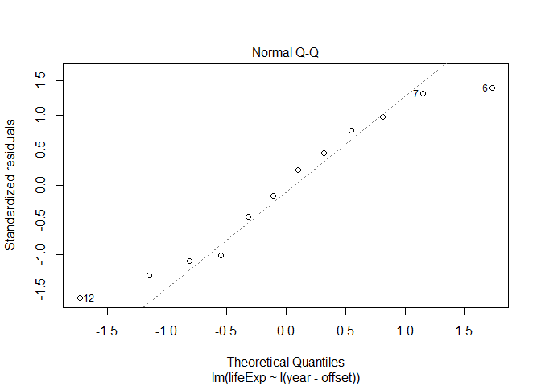
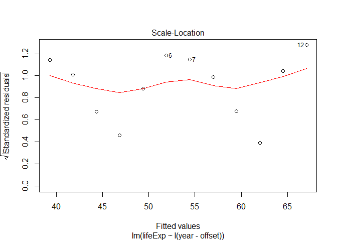

```r
suppressPackageStartupMessages(library(tidyr))
suppressPackageStartupMessages(library(gapminder))
suppressPackageStartupMessages(library(ggmap))
suppressPackageStartupMessages(library(tibble))
suppressPackageStartupMessages(library(leaflet))
suppressPackageStartupMessages(library(purrr))
suppressPackageStartupMessages(library(singer))
suppressPackageStartupMessages(library(stringr))
suppressPackageStartupMessages(library(robustbase))
suppressPackageStartupMessages(library(ggplot2))
suppressPackageStartupMessages(library(knitr))
suppressPackageStartupMessages(library(dplyr))
suppressPackageStartupMessages(library(MASS))
suppressPackageStartupMessages(library(tidyverse))
options(knitr.table.format = "html")
```

Lets update the theme of ggplot to make title of all plots centered.

```r
theme_update(plot.title = element_text(hjust = 0.5))
```


### Task 2 
### Writing functions

Lets define the functions for simple linear regression **le_lin_fit()** and robust regression such as **le_rlm_fit()** and **le_lmrob_fit()**. Lets plot the fitted linear model to check the kind of plots generated for fitted regression models.

```r
le_lin_fit <- function(data,offset = 1952){
the_fit <- lm(lifeExp ~ I(year - offset), data)
  output <- data.frame(t(coef(the_fit))) %>%
  setNames(c("intercept", "slope"))
  plot(the_fit)             #plot the fitted model
  output
}

le_rlm_fit <- function(data,offset = 1952){
  fit <- rlm(lifeExp ~ I(year - offset), data,method="M",maxit=40)
  #fitted(fit) # predicted values
  #residuals(fit) # residuals
  coef(fit)
  #vcov(fit) # covariance matrix for model parameters 
  #influence(fit) # regression diagnostics
}

le_lmrob_fit <- function(data,offset = 1952){
fit <- lmrob(lifeExp ~ I(year - offset), data,maxit=400)
  #fitted(fit) # predicted values
  #residuals(fit) # residuals
  #vcov(fit) # covariance matrix for model parameters 
  #influence(fit) # regression diagnostics
}
```

Lets check the function with some data for India.


```r
j_dat<-subset(gapminder,country=="India")
```

Lets get the cofficients of simple regression function using inbuilt function le_lin_fit()

```r
le_lin_fit(j_dat)
```

<!-- --><!-- --><!-- --><!-- -->

```
##   intercept    slope
## 1  39.26976 0.505321
```

* Upper left plot shows the residual errors plotted versus their fitted values. The residuals are randomly distributed around the horizontal line without any trends.
* Lower left plot is a standard Q-Q plot, which suggests that the residual errors are normally distributed. 
* Scale-location plot(upper right) shows the square root of the standardized residuals as a function of the fitted values with  no obvious trend in this plot.
* Finally, the plot in the lower right shows each points leverage, which is a measure of its
importance in determining the regression result. 
* Superimposed on the final plot are contour lines for the Cook’s distance, which is another measure of the importance of each observation to the regression. 
  + Smaller distances means that removing the observation has little affect on the regression results. 
  + Distances larger than 1 are suspicious and suggest the presence of a possible outlier or a poor model. 

Same thing cane be done with other two functions. Note that these two functions dont produce plot but if needed it can be obtained.

```r
le_rlm_fit(j_dat)
```

```
##      (Intercept) I(year - offset) 
##        39.269756         0.505321
```

```r
le_lmrob_fit(j_dat)
```

Note that we get lot of parameters such as covariance matrix for model parameters (cov() functino) and regression diagnostics (influence() function). We can also get residual values and predicted values using residuals() and fitted() functions respectively.

Let plot this data with the trendline. 
Note: lmrob method is not available in geom_smooth() package.

```r
ggplot(j_dat, aes(x = year, y = lifeExp))+ 
  geom_point() + 
  geom_smooth(method = "lm", se = FALSE)
```

<!-- -->

```r
ggplot(j_dat, aes(x = year, y = lifeExp))+ 
  geom_point() + 
  geom_smooth(method = "rlm", se = FALSE)
```

<!-- -->

#### References
+ [Using R for Linear Regression](http://www.montefiore.ulg.ac.be/~kvansteen/GBIO0009-1/ac20092010/Class8/Using%20R%20for%20linear%20regression.pdf)
+ [Stat Notes](http://stat545.com/block012_function-regress-lifeexp-on-year.html)
+ [Multiple linear regression - Quick R](https://www.statmethods.net/stats/regression.html)
+ [Simple Linear Regression - R Bloggers](https://www.r-bloggers.com/simple-linear-regression-2/)


### Task 4

### Working with Singer data

Lets get the singer data first.

```r
singer_data<- singer::singer_locations
```

Now lets define the possibly function to avoid the errors and produce NA when we get bad results from revgeocode().

```r
poss_revgeocode <- 
  possibly(
    function(x,y) revgeocode(c(x, y), output = "more"), 
    otherwise = NA_real_,
    quiet = TRUE
    )
```

Now lets get the details for a sample 20 rows from singer data without na values in either latitude nor longitude and then get the address,locality, postal code details for each row from **revgeocode()** function. This is returned in a data frame which is then unnested to get in the actual table.


```r
new_singer_data <- singer_data %>%
                      filter(!is.na(longitude))%>%
                      filter(!is.na(longitude))%>%
                      as.tibble()%>%
                      sample_n(20) %>%
                      mutate(mapdata=map2(longitude,latitude,
                         ~ poss_revgeocode(.x,.y)))%>%
                      unnest()
```

#### Results against singer city

Lets view locality obtained from mapdata with city 

```r
new_singer_data %>%
  dplyr::select(locality,city)%>%
  head(20)%>%
  kable()
```

<table>
 <thead>
  <tr>
   <th style="text-align:left;"> locality </th>
   <th style="text-align:left;"> city </th>
  </tr>
 </thead>
<tbody>
  <tr>
   <td style="text-align:left;"> Austin </td>
   <td style="text-align:left;"> Austin, TX </td>
  </tr>
  <tr>
   <td style="text-align:left;"> NA </td>
   <td style="text-align:left;"> RJ, BR </td>
  </tr>
  <tr>
   <td style="text-align:left;"> Omaha </td>
   <td style="text-align:left;"> Omaha, NE </td>
  </tr>
  <tr>
   <td style="text-align:left;"> Lorain </td>
   <td style="text-align:left;"> LORAIN, US </td>
  </tr>
  <tr>
   <td style="text-align:left;"> Birmingham </td>
   <td style="text-align:left;"> Birmingham, England </td>
  </tr>
  <tr>
   <td style="text-align:left;"> London </td>
   <td style="text-align:left;"> London, England </td>
  </tr>
  <tr>
   <td style="text-align:left;"> Philadelphia </td>
   <td style="text-align:left;"> Philadelphia, PA </td>
  </tr>
  <tr>
   <td style="text-align:left;"> Washington </td>
   <td style="text-align:left;"> Washington </td>
  </tr>
  <tr>
   <td style="text-align:left;"> Montevideo </td>
   <td style="text-align:left;"> Montevideo, Uruguay </td>
  </tr>
  <tr>
   <td style="text-align:left;"> San Francisco </td>
   <td style="text-align:left;"> San Francisco, CA </td>
  </tr>
  <tr>
   <td style="text-align:left;"> London </td>
   <td style="text-align:left;"> London, England </td>
  </tr>
  <tr>
   <td style="text-align:left;"> Easton </td>
   <td style="text-align:left;"> Maryland </td>
  </tr>
  <tr>
   <td style="text-align:left;"> Condover </td>
   <td style="text-align:left;"> Owestry, Shropshire, England </td>
  </tr>
  <tr>
   <td style="text-align:left;"> Galveston </td>
   <td style="text-align:left;"> Galveston, TX </td>
  </tr>
  <tr>
   <td style="text-align:left;"> Edinburgh </td>
   <td style="text-align:left;"> Edinburgh, Scotland </td>
  </tr>
  <tr>
   <td style="text-align:left;"> Belfast </td>
   <td style="text-align:left;"> Belfast, Northern Ireland </td>
  </tr>
  <tr>
   <td style="text-align:left;"> Montreal </td>
   <td style="text-align:left;"> Montreal, Quebec, Canada </td>
  </tr>
  <tr>
   <td style="text-align:left;"> Seattle </td>
   <td style="text-align:left;"> Seattle </td>
  </tr>
  <tr>
   <td style="text-align:left;"> Canton </td>
   <td style="text-align:left;"> Mississippi Gulf Coast </td>
  </tr>
  <tr>
   <td style="text-align:left;"> Washington </td>
   <td style="text-align:left;"> Washington, DC </td>
  </tr>
</tbody>
</table>

This shows that the city has to be adjusted just to give the actual name of the city ( the first part before comma).


```r
b <- new_singer_data%>%
                      separate(city, 
                               into = c("city1", "city2(code)"), 
                               sep = "\\,",
                               extra = "merge",
                               fill = "right")
```

Now lets compare the city1 with locality to obtain the number of rows matching

```r
b%>%
  filter(city1 == locality)%>%
  count()
```

```
## # A tibble: 1 x 1
##       n
##   <int>
## 1    15
```
This shows that 6 rows out of 20 are matching. More analysis can be done to improve this accuracy.


#### Reference:
+ [Separate](http://tidyr.tidyverse.org/reference/separate.html)
+ [ggmap](https://cran.r-project.org/web/packages/ggmap/ggmap.pdf)
+ [Stack Overflow](https://stackoverflow.com/questions/22911642/applying-revgeocode-to-a-list-of-longitude-latitude-coordinates)

### Task 5 Working with the list

#### Trump Android Tweets

Lets load the data from trump's official account

```r
load(url("http://varianceexplained.org/files/trump_tweets_df.rda"))
#load("trump_tweets_df.rda")
glimpse(trump_tweets_df)
```

```
## Observations: 1,512
## Variables: 16
## $ text          <chr> "My economic policy speech will be carried live ...
## $ favorited     <lgl> FALSE, FALSE, FALSE, FALSE, FALSE, FALSE, FALSE,...
## $ favoriteCount <dbl> 9214, 6981, 15724, 19837, 34051, 29831, 19223, 1...
## $ replyToSN     <chr> NA, NA, NA, NA, NA, NA, NA, NA, NA, NA, NA, NA, ...
## $ created       <dttm> 2016-08-08 15:20:44, 2016-08-08 13:28:20, 2016-...
## $ truncated     <lgl> FALSE, FALSE, FALSE, FALSE, FALSE, FALSE, FALSE,...
## $ replyToSID    <lgl> NA, NA, NA, NA, NA, NA, NA, NA, NA, NA, NA, NA, ...
## $ id            <chr> "762669882571980801", "762641595439190016", "762...
## $ replyToUID    <chr> NA, NA, NA, NA, NA, NA, NA, NA, NA, NA, NA, NA, ...
## $ statusSource  <chr> "<a href=\"http://twitter.com/download/android\"...
## $ screenName    <chr> "realDonaldTrump", "realDonaldTrump", "realDonal...
## $ retweetCount  <dbl> 3107, 2390, 6691, 6402, 11717, 9892, 5784, 7930,...
## $ isRetweet     <lgl> FALSE, FALSE, FALSE, FALSE, FALSE, FALSE, FALSE,...
## $ retweeted     <lgl> FALSE, FALSE, FALSE, FALSE, FALSE, FALSE, FALSE,...
## $ longitude     <chr> NA, NA, NA, NA, NA, NA, NA, NA, NA, NA, NA, NA, ...
## $ latitude      <chr> NA, NA, NA, NA, NA, NA, NA, NA, NA, NA, NA, NA, ...
```

```r
#Take just the text and store it in tweets
tweets <- trump_tweets_df$text
tweets %>% head() %>% strtrim(70) #trim the length to be 70
```

```
## [1] "My economic policy speech will be carried live at 12:15 P.M. Enjoy!"   
## [2] "Join me in Fayetteville, North Carolina tomorrow evening at 6pm. Ticke"
## [3] "#ICYMI: \"Will Media Apologize to Trump?\" https://t.co/ia7rKBmioA"    
## [4] "Michael Morell, the lightweight former Acting Director of C.I.A., and "
## [5] "The media is going crazy. They totally distort so many things on purpo"
## [6] "I see where Mayor Stephanie Rawlings-Blake of Baltimore is pushing Cro"
```

Create a regular expression of words that were commonly found in trump's tweets.

```r
regex <- "badly|crazy|weak|spent|strong|dumb|joke|guns|funny|dead"
```

Lets select preselect the rows that scale down the complexity of the problem.

```r
tweets <- tweets[c(1, 2, 5, 6, 198, 347, 919)]
tweets %>% strtrim(70)
```

```
## [1] "My economic policy speech will be carried live at 12:15 P.M. Enjoy!"   
## [2] "Join me in Fayetteville, North Carolina tomorrow evening at 6pm. Ticke"
## [3] "The media is going crazy. They totally distort so many things on purpo"
## [4] "I see where Mayor Stephanie Rawlings-Blake of Baltimore is pushing Cro"
## [5] "Bernie Sanders started off strong, but with the selection of Kaine for"
## [6] "Crooked Hillary Clinton is unfit to serve as President of the U.S. Her"
## [7] "The Cruz-Kasich pact is under great strain. This joke of a deal is fal"
```

Tweets with 0, 1, 2, and 3 occurences of Trump Android words were preselected .

#### gregexpr()

Use the base function gregexpr() to locate all the Trump Android words inside the tweets.

```r
matches <- gregexpr(regex, tweets)
#str(matches)
```

Lets take a look at one element of matches

```r
matches[[7]]
```

```
## [1]  50 112 123
## attr(,"match.length")
## [1] 4 4 4
## attr(,"useBytes")
## [1] TRUE
```

Matches is A list. 
1. One element per element of tweets.
2. Each element is an integer vector.
   - It's -1 if no matches found.
   - Holds the position(s) of the first character of each match, otherwise.
3. Each element has two attributes. Consider match.length. Let us not speak of the other one.
   - It's -1 if no matches found.
   - Holds the length(s) of each match, otherwise.
We can clearly extract the matched words with this information. But its not easy from this information.

Lets inspect matches to understand its nature


```r
lengths(matches)                      # just happens to exist for length
```

```
## [1] 1 1 1 1 2 2 3
```

```r
sapply(matches, length)               # NSFP = not safe for programming
```

```
## [1] 1 1 1 1 2 2 3
```

```r
vapply(matches, length, integer(1))   # preferred base approach
```

```
## [1] 1 1 1 1 2 2 3
```

```r
map_int(matches, length)
```

```
## [1] 1 1 1 1 2 2 3
```

**Get the list of the match lengths**

This is how it is got for the last element of matches

```r
m <- matches[[7]]
attr(m, which = "match.length")
```

```
## [1] 4 4 4
```

For entire matches, it can be done in few ways

* Pre-defined custom function. ( Most verbose.)

```r
ml <- function(x) attr(x, which = "match.length")
map(matches, ml)
```

```
## [[1]]
## [1] -1
## 
## [[2]]
## [1] -1
## 
## [[3]]
## [1] 5
## 
## [[4]]
## [1] 4
## 
## [[5]]
## [1] 6 4
## 
## [[6]]
## [1] 4 6
## 
## [[7]]
## [1] 4 4 4
```

* Anonymous function. ( Very compact.)

```r
map(matches, function(x) attr(x, which = "match.length"))
```

```
## [[1]]
## [1] -1
## 
## [[2]]
## [1] -1
## 
## [[3]]
## [1] 5
## 
## [[4]]
## [1] 4
## 
## [[5]]
## [1] 6 4
## 
## [[6]]
## [1] 4 6
## 
## [[7]]
## [1] 4 4 4
```

* Pre-existing function, additional arguments passed via ....

```r
(match_length <- map(matches, attr, which = "match.length"))
```

```
## [[1]]
## [1] -1
## 
## [[2]]
## [1] -1
## 
## [[3]]
## [1] 5
## 
## [[4]]
## [1] 4
## 
## [[5]]
## [1] 6 4
## 
## [[6]]
## [1] 4 6
## 
## [[7]]
## [1] 4 4 4
```

**Count the number of Trump Android words in each tweet.**

Code that works for extreme examples 0 matches and 3 matches:

```r
m <- matches[[1]]
sum(m > 0)
```

```
## [1] 0
```

```r
m <- matches[[7]]
sum(m > 0)
```

```
## [1] 3
```

**Only two of the above approaches work here**


```r
f <- function(x) sum(x > 0)
map(matches, f)
```

```
## [[1]]
## [1] 0
## 
## [[2]]
## [1] 0
## 
## [[3]]
## [1] 1
## 
## [[4]]
## [1] 1
## 
## [[5]]
## [1] 2
## 
## [[6]]
## [1] 2
## 
## [[7]]
## [1] 3
```

```r
map(matches, ~ sum(.x > 0))
```

```
## [[1]]
## [1] 0
## 
## [[2]]
## [1] 0
## 
## [[3]]
## [1] 1
## 
## [[4]]
## [1] 1
## 
## [[5]]
## [1] 2
## 
## [[6]]
## [1] 2
## 
## [[7]]
## [1] 3
```

Simpler version is to use map_int which returns an integer vector, with length equal to the number of tweets.

```r
map_int(matches, ~ sum(.x > 0))
```

```
## [1] 0 0 1 1 2 2 3
```

To confirm lets check it is indeed, different from just taking the lengths of the elements of matches:

```r
tibble(
  naive_length = lengths(matches),
  n_words = map_int(matches, ~ sum(.x > 0))
)
```

```
## # A tibble: 7 x 2
##   naive_length n_words
##          <int>   <int>
## 1            1       0
## 2            1       0
## 3            1       1
## 4            1       1
## 5            2       2
## 6            2       2
## 7            3       3
```

#### Strip the attributes from matches
Lets remove the attributes from matches to create matches_first


```r
(match_first <- map(matches, as.vector))
```

```
## [[1]]
## [1] -1
## 
## [[2]]
## [1] -1
## 
## [[3]]
## [1] 20
## 
## [[4]]
## [1] 134
## 
## [[5]]
## [1] 28 95
## 
## [[6]]
## [1]  87 114
## 
## [[7]]
## [1]  50 112 123
```

#### Assess progress in a small example
Lets extract trump words from single tweet. We will take tweets #1 and #7 as they represent extreme cases where matches are 0 and 3.

The relevant R objects:

```r
tweets %>% strtrim(70)
```

```
## [1] "My economic policy speech will be carried live at 12:15 P.M. Enjoy!"   
## [2] "Join me in Fayetteville, North Carolina tomorrow evening at 6pm. Ticke"
## [3] "The media is going crazy. They totally distort so many things on purpo"
## [4] "I see where Mayor Stephanie Rawlings-Blake of Baltimore is pushing Cro"
## [5] "Bernie Sanders started off strong, but with the selection of Kaine for"
## [6] "Crooked Hillary Clinton is unfit to serve as President of the U.S. Her"
## [7] "The Cruz-Kasich pact is under great strain. This joke of a deal is fal"
```

```r
match_first
```

```
## [[1]]
## [1] -1
## 
## [[2]]
## [1] -1
## 
## [[3]]
## [1] 20
## 
## [[4]]
## [1] 134
## 
## [[5]]
## [1] 28 95
## 
## [[6]]
## [1]  87 114
## 
## [[7]]
## [1]  50 112 123
```

```r
match_length
```

```
## [[1]]
## [1] -1
## 
## [[2]]
## [1] -1
## 
## [[3]]
## [1] 5
## 
## [[4]]
## [1] 4
## 
## [[5]]
## [1] 6 4
## 
## [[6]]
## [1] 4 6
## 
## [[7]]
## [1] 4 4 4
```

Lets first work with tweet #7, the one with 3 matched Trump words.

```r
(tweet <- tweets[7])
```

```
## [1] "The Cruz-Kasich pact is under great strain. This joke of a deal is falling apart, not being honored and almost dead. Very dumb!"
```

```r
(t_first <- match_first[[7]])      #starting of the matched words
```

```
## [1]  50 112 123
```

```r
(t_length <- match_length[[7]])    #length of the matched words
```

```
## [1] 4 4 4
```

```r
(t_last <- t_first + t_length - 1) #ending of the matched words
```

```
## [1]  53 115 126
```

```r
substring(tweet, t_first, t_last) #get the substrings to get the matched words
```

```
## [1] "joke" "dead" "dumb"
```

Use this code for tweet #1 with 0 trump words

```r
(tweet <- tweets[1])
```

```
## [1] "My economic policy speech will be carried live at 12:15 P.M. Enjoy!"
```

```r
(t_first <- match_first[[1]])
```

```
## [1] -1
```

```r
(t_length <- match_length[[1]])
```

```
## [1] -1
```

```r
(t_last <- t_first + t_length - 1)
```

```
## [1] -3
```

```r
substring(tweet, t_first, t_last)
```

```
## [1] ""
```

It works correctly for both the extremes. 

#### Store where Trump words end

Lets get where the matches end for all the tweets. We need to use map2 because we have to map over 2 lists in parallel namely, match_first and match_length .


```r
(match_last <- map2(match_first, match_length, ~ .x + .y - 1)) 
```

```
## [[1]]
## [1] -3
## 
## [[2]]
## [1] -3
## 
## [[3]]
## [1] 24
## 
## [[4]]
## [1] 137
## 
## [[5]]
## [1] 33 98
## 
## [[6]]
## [1]  90 119
## 
## [[7]]
## [1]  53 115 126
```

#### Extract the trump words

Now lets extract the trump words. Here we need to map over three lists simulataneously
matches,matches_first and matches_last. So we use pmap to perform this.

```r
pmap(list(text = tweets, first = match_first, last = match_last), substring)
```

```
## [[1]]
## [1] ""
## 
## [[2]]
## [1] ""
## 
## [[3]]
## [1] "crazy"
## 
## [[4]]
## [1] "joke"
## 
## [[5]]
## [1] "strong" "weak"  
## 
## [[6]]
## [1] "weak"   "strong"
## 
## [[7]]
## [1] "joke" "dead" "dumb"
```

#### March through the rows in a data frame

Lets use a dataframe as input to pmap to get our desired result.

```r
mdf <- tibble(
  text = tweets,
  first = match_first,
  last = match_last
)
pmap(mdf, substring)
```

```
## [[1]]
## [1] ""
## 
## [[2]]
## [1] ""
## 
## [[3]]
## [1] "crazy"
## 
## [[4]]
## [1] "joke"
## 
## [[5]]
## [1] "strong" "weak"  
## 
## [[6]]
## [1] "weak"   "strong"
## 
## [[7]]
## [1] "joke" "dead" "dumb"
```

Now lets see if we can reproduce everything using a  data frame approach.

```r
tibble(text = tweets,
      first = gregexpr(regex, tweets)) %>% 
      mutate(match_length = map(first, ~ attr(.x, which = "match.length")),
      last = map2(first, match_length, ~ .x + .y - 1))%>%
      dplyr::select(-match_length)%>% 
      pmap(substring)
```

```
## [[1]]
## [1] ""
## 
## [[2]]
## [1] ""
## 
## [[3]]
## [1] "crazy"
## 
## [[4]]
## [1] "joke"
## 
## [[5]]
## [1] "strong" "weak"  
## 
## [[6]]
## [1] "weak"   "strong"
## 
## [[7]]
## [1] "joke" "dead" "dumb"
```

We can directly solve this problem by post-processing the output of gregexpr() with regmatches()

```r
regmatches(tweets, gregexpr(regex, tweets))
```

```
## [[1]]
## character(0)
## 
## [[2]]
## character(0)
## 
## [[3]]
## [1] "crazy"
## 
## [[4]]
## [1] "joke"
## 
## [[5]]
## [1] "strong" "weak"  
## 
## [[6]]
## [1] "weak"   "strong"
## 
## [[7]]
## [1] "joke" "dead" "dumb"
```

We can check the base code of regmatches and find that it is similar to the way we have done this problem as it uses lot of calls to map(), attr() and substr() etc. But it has more error checking and consideration for encoding and locale. 


```r
regmatches
```

```
## function (x, m, invert = FALSE) 
## {
##     if (length(x) != length(m)) 
##         stop(gettextf("%s and %s must have the same length", 
##             sQuote("x"), sQuote("m")), domain = NA)
##     ili <- is.list(m)
##     useBytes <- if (ili) 
##         any(unlist(lapply(m, attr, "useBytes")))
##     else any(attr(m, "useBytes"))
##     if (useBytes) {
##         asc <- iconv(x, "latin1", "ASCII")
##         ind <- is.na(asc) | (asc != x)
##         if (any(ind)) 
##             Encoding(x[ind]) <- "bytes"
##     }
##     if (!ili && identical(invert, FALSE)) {
##         so <- m[ind <- (!is.na(m) & (m > -1L))]
##         eo <- so + attr(m, "match.length")[ind] - 1L
##         return(substring(x[ind], so, eo))
##     }
##     y <- if (is.na(invert)) {
##         Map(function(u, so, ml) {
##             if ((n <- length(so)) == 1L) {
##                 if (is.na(so)) 
##                   return(NA_character_)
##                 else if (so == -1L) 
##                   return(u)
##             }
##             eo <- so + ml - 1L
##             if (n > 1L) {
##                 if (any(eo[-n] >= so[-1L])) 
##                   stop(gettextf("need non-overlapping matches for %s", 
##                     sQuote("invert = NA")), domain = NA)
##             }
##             beg <- c(1L, c(rbind(so, eo + 1L)))
##             end <- c(c(rbind(so - 1L, eo)), nchar(u))
##             substring(u, beg, end)
##         }, x, m, if (ili) 
##             lapply(m, attr, "match.length")
##         else attr(m, "match.length"), USE.NAMES = FALSE)
##     }
##     else if (invert) {
##         Map(function(u, so, ml) {
##             if ((n <- length(so)) == 1L) {
##                 if (is.na(so)) 
##                   return(NA_character_)
##                 else if (so == -1L) 
##                   return(u)
##             }
##             beg <- if (n > 1L) {
##                 eo <- so + ml - 1L
##                 if (any(eo[-n] >= so[-1L])) 
##                   stop(gettextf("need non-overlapping matches for %s", 
##                     sQuote("invert = TRUE")), domain = NA)
##                 c(1L, eo + 1L)
##             }
##             else {
##                 c(1L, so + ml)
##             }
##             end <- c(so - 1L, nchar(u))
##             substring(u, beg, end)
##         }, x, m, if (ili) 
##             lapply(m, attr, "match.length")
##         else attr(m, "match.length"), USE.NAMES = FALSE)
##     }
##     else {
##         Map(function(u, so, ml) {
##             if (length(so) == 1L) {
##                 if (is.na(so) || (so == -1L)) 
##                   return(character())
##             }
##             substring(u, so, so + ml - 1L)
##         }, x, m, lapply(m, attr, "match.length"), USE.NAMES = FALSE)
##     }
##     names(y) <- names(x)
##     y
## }
## <bytecode: 0x000000001d77ade8>
## <environment: namespace:base>
```

#### Reference:
+ [Purrr Tutorial](https://jennybc.github.io/purrr-tutorial/index.html)

#### Task 6

Sixth task can be found as [markdown file](https://github.com/abishekarun/STAT545-hw-rajendran-arun/blob/master/hw06/hw06_task6.md) and [html file](http://htmlpreview.github.io/?https://github.com/abishekarun/STAT545-hw-rajendran-arun/blob/master/hw06/hw06_task6.html)
