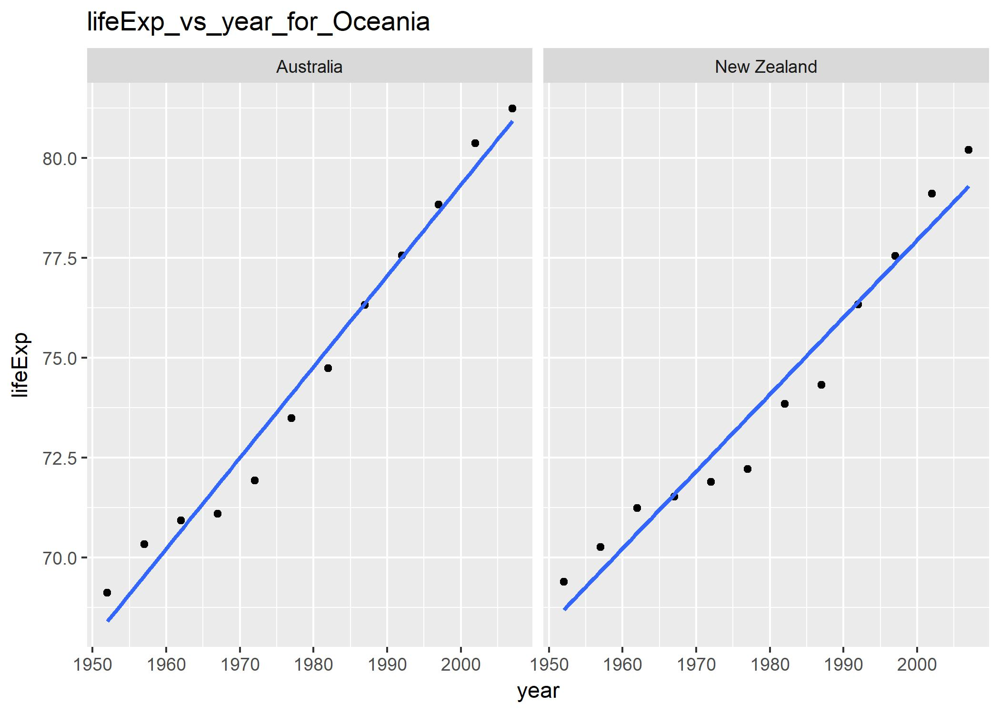

### Homework 7
### Automation Pipeline

First of all lets load all the required libraries.

```{r}
suppressPackageStartupMessages(library(tidyr))
suppressPackageStartupMessages(library(stringr))
suppressPackageStartupMessages(library(ggplot2))
suppressPackageStartupMessages(library(knitr))
suppressPackageStartupMessages(library(kableExtra))
suppressPackageStartupMessages(library(dplyr))
suppressPackageStartupMessages(library(tidyverse))

```

Lets also define a function for formatting the tables.
```{r}
tableFormat<-function(table,title=""){
  table %>%      
    kable("html",caption=title, align=c(rep('c', 5))) %>%
    kable_styling(bootstrap_options = 
                    c("striped", "hover",  "responsive"),
                  position="center",font_size=14)
}
```

Lets take a look at the gapminder data downloaded from online.
```{r}
input_data<- read.table(file = 'files/gapminder.tsv', sep = '\t', header = TRUE)
head(input_data)%>%
  tableFormat(title = "Downloaded Gapminder data")
```

This data has some problem. Lets take a look at that.
```{r}
input_data %>%
  filter(str_detect(country, "Cote"))
```

This shows that the data downloaded needs some cleaning up. This is done in the [exploratory analysis file](). Now lets source this file to check this dataset (gap_clean_data). 

```{r}
source('01_exploratory_analysis.R')

gap_clean_data %>%
  filter(str_detect(country, "Cote"))%>%
  tableFormat(title = "Cleaned Gapminder data")

```

It looks the data is cleaned and the problem is solved. Now, lets look at the boxplot of lifeExp vs year.

```{r}
boxplot
```

Now,lets look at few other plots of lifeExp such as histogram, density plot and frequency plot.
```{r}
hist_plot
density_plot
freq_plot
```

Now lets take a look at the levels of continent factor variable before and after reordering.
```{r}
#Before
gap_clean_data$continent%>%
  levels()
#After
gap_reordered$continent%>%
  levels()
```

Now, lets source the statistical analysis file.
```{r}
source('02_statistical_analysis.R')
```

Now, lets look at the fitted result table. 
```{r}
fitted_result
```

Here is a look at one of the saved figures containing lifeExp vs year for each country in Oceania continent with regression line laid.



For plots of other continents, check out [here]().

Now, lets check the best 5 countries that fit our model perfectly in each continent except Oceania.
```{r}
best_countries%>%
  select(country,continent,intercept,slope,R2_norm,std_norm)%>%
  tableFormat(title = "Best countries in Each Continent")
```


Now, lets check the worst 5 countries that didn't fit our model in each continent except Oceania.
```{r}
worst_countries%>%
  select(country,continent,intercept,slope,R2_norm,std_norm)%>%
  tableFormat(title = "Worst countries in Each Continent")
```


