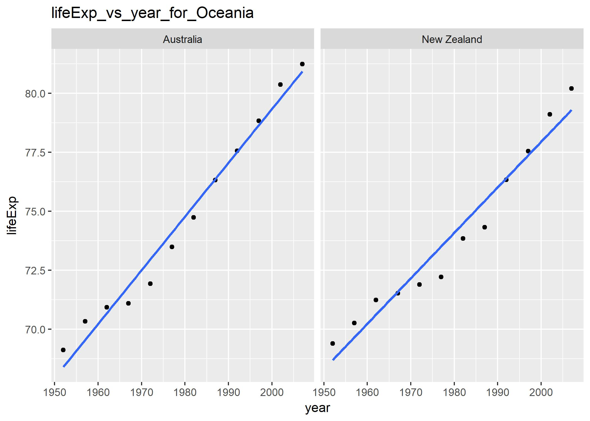

### Homework 7
### Automation Pipeline

First of all lets load all the required libraries.


```r
suppressPackageStartupMessages(library(tidyr))
suppressPackageStartupMessages(library(stringr))
suppressPackageStartupMessages(library(ggplot2))
suppressPackageStartupMessages(library(knitr))
suppressPackageStartupMessages(library(kableExtra))
suppressPackageStartupMessages(library(dplyr))
suppressPackageStartupMessages(library(tidyverse))
```

Lets also define a function for formatting the tables.

```r
tableFormat<-function(table,title=""){
  table %>%      
    kable("html",caption=title, align=c(rep('c', 5))) %>%
    kable_styling(bootstrap_options = 
                    c("striped", "hover",  "responsive"),
                  position="center",font_size=14)
}
```

Lets take a look at the gapminder data downloaded from online.

```r
input_data<- read.table(file = 'files/gapminder.tsv', sep = '\t', header = TRUE)
head(input_data)%>%
  tableFormat(title = "Downloaded Gapminder data")
```

<table class="table table-striped table-hover table-responsive" style="font-size: 14px; margin-left: auto; margin-right: auto;">
<caption style="font-size: initial !important;">Downloaded Gapminder data</caption>
 <thead><tr>
<th style="text-align:center;"> country </th>
   <th style="text-align:center;"> continent </th>
   <th style="text-align:center;"> year </th>
   <th style="text-align:center;"> lifeExp </th>
   <th style="text-align:center;"> pop </th>
   <th style="text-align:center;"> gdpPercap </th>
  </tr></thead>
<tbody>
<tr>
<td style="text-align:center;"> Afghanistan </td>
   <td style="text-align:center;"> Asia </td>
   <td style="text-align:center;"> 1952 </td>
   <td style="text-align:center;"> 28.801 </td>
   <td style="text-align:center;"> 8425333 </td>
   <td style="text-align:center;"> 779.4453 </td>
  </tr>
<tr>
<td style="text-align:center;"> Afghanistan </td>
   <td style="text-align:center;"> Asia </td>
   <td style="text-align:center;"> 1957 </td>
   <td style="text-align:center;"> 30.332 </td>
   <td style="text-align:center;"> 9240934 </td>
   <td style="text-align:center;"> 820.8530 </td>
  </tr>
<tr>
<td style="text-align:center;"> Afghanistan </td>
   <td style="text-align:center;"> Asia </td>
   <td style="text-align:center;"> 1962 </td>
   <td style="text-align:center;"> 31.997 </td>
   <td style="text-align:center;"> 10267083 </td>
   <td style="text-align:center;"> 853.1007 </td>
  </tr>
<tr>
<td style="text-align:center;"> Afghanistan </td>
   <td style="text-align:center;"> Asia </td>
   <td style="text-align:center;"> 1967 </td>
   <td style="text-align:center;"> 34.020 </td>
   <td style="text-align:center;"> 11537966 </td>
   <td style="text-align:center;"> 836.1971 </td>
  </tr>
<tr>
<td style="text-align:center;"> Afghanistan </td>
   <td style="text-align:center;"> Asia </td>
   <td style="text-align:center;"> 1972 </td>
   <td style="text-align:center;"> 36.088 </td>
   <td style="text-align:center;"> 13079460 </td>
   <td style="text-align:center;"> 739.9811 </td>
  </tr>
<tr>
<td style="text-align:center;"> Afghanistan </td>
   <td style="text-align:center;"> Asia </td>
   <td style="text-align:center;"> 1977 </td>
   <td style="text-align:center;"> 38.438 </td>
   <td style="text-align:center;"> 14880372 </td>
   <td style="text-align:center;"> 786.1134 </td>
  </tr>
</tbody>
</table>

This data has some problem. Lets take a look at that.

```r
input_data %>%
  filter(str_detect(country, "Cote"))
```

```
##                                                              country
## 1  Cote dIvoire\tAfrica\t1952\t40.477\t2977019\t1388.594732\nCote dIvoire
## 2   Cote dIvoire\tAfrica\t1962\t44.93\t3832408\t1728.869428\nCote dIvoire
## 3  Cote dIvoire\tAfrica\t1972\t49.801\t6071696\t2378.201111\nCote dIvoire
## 4  Cote dIvoire\tAfrica\t1982\t53.983\t9025951\t2602.710169\nCote dIvoire
## 5 Cote dIvoire\tAfrica\t1992\t52.044\t12772596\t1648.073791\nCote dIvoire
## 6 Cote dIvoire\tAfrica\t2002\t46.832\t16252726\t1648.800823\nCote dIvoire
##   continent year lifeExp      pop gdpPercap
## 1    Africa 1957  42.469  3300000  1500.896
## 2    Africa 1967  47.350  4744870  2052.050
## 3    Africa 1977  52.374  7459574  2517.737
## 4    Africa 1987  54.655 10761098  2156.956
## 5    Africa 1997  47.991 14625967  1786.265
## 6    Africa 2007  48.328 18013409  1544.750
```

This shows that the data downloaded needs some cleaning up. This is done in the [exploratory analysis file](). Now lets source this file to check this dataset (gap_clean_data). 


```r
source('01_exploratory_analysis.R')
```

```
## 'data.frame':	1698 obs. of  6 variables:
##  $ country  : Factor w/ 147 levels "Afghanistan",..: 1 1 1 1 1 1 1 1 1 1 ...
##  $ continent: Factor w/ 5 levels "Africa","Americas",..: 3 3 3 3 3 3 3 3 3 3 ...
##  $ year     : int  1952 1957 1962 1967 1972 1977 1982 1987 1992 1997 ...
##  $ lifeExp  : num  28.8 30.3 32 34 36.1 ...
##  $ pop      : int  8425333 9240934 10267083 11537966 13079460 14880372 12881816 13867957 16317921 22227415 ...
##  $ gdpPercap: num  779 821 853 836 740 ...
```

```r
gap_clean_data %>%
  filter(str_detect(country, "Cote"))%>%
  tableFormat(title = "Cleaned Gapminder data")
```

<table class="table table-striped table-hover table-responsive" style="font-size: 14px; margin-left: auto; margin-right: auto;">
<caption style="font-size: initial !important;">Cleaned Gapminder data</caption>
 <thead><tr>
<th style="text-align:center;"> country </th>
   <th style="text-align:center;"> continent </th>
   <th style="text-align:center;"> year </th>
   <th style="text-align:center;"> lifeExp </th>
   <th style="text-align:center;"> pop </th>
   <th style="text-align:center;"> gdpPercap </th>
  </tr></thead>
<tbody>
<tr>
<td style="text-align:center;"> Cote dIvoire </td>
   <td style="text-align:center;"> Africa </td>
   <td style="text-align:center;"> 1952 </td>
   <td style="text-align:center;"> 40.477 </td>
   <td style="text-align:center;"> 2977019 </td>
   <td style="text-align:center;"> 1388.595 </td>
  </tr>
<tr>
<td style="text-align:center;"> Cote dIvoire </td>
   <td style="text-align:center;"> Africa </td>
   <td style="text-align:center;"> 1957 </td>
   <td style="text-align:center;"> 42.469 </td>
   <td style="text-align:center;"> 3300000 </td>
   <td style="text-align:center;"> 1500.896 </td>
  </tr>
<tr>
<td style="text-align:center;"> Cote dIvoire </td>
   <td style="text-align:center;"> Africa </td>
   <td style="text-align:center;"> 1962 </td>
   <td style="text-align:center;"> 44.930 </td>
   <td style="text-align:center;"> 3832408 </td>
   <td style="text-align:center;"> 1728.869 </td>
  </tr>
<tr>
<td style="text-align:center;"> Cote dIvoire </td>
   <td style="text-align:center;"> Africa </td>
   <td style="text-align:center;"> 1967 </td>
   <td style="text-align:center;"> 47.350 </td>
   <td style="text-align:center;"> 4744870 </td>
   <td style="text-align:center;"> 2052.050 </td>
  </tr>
<tr>
<td style="text-align:center;"> Cote dIvoire </td>
   <td style="text-align:center;"> Africa </td>
   <td style="text-align:center;"> 1972 </td>
   <td style="text-align:center;"> 49.801 </td>
   <td style="text-align:center;"> 6071696 </td>
   <td style="text-align:center;"> 2378.201 </td>
  </tr>
<tr>
<td style="text-align:center;"> Cote dIvoire </td>
   <td style="text-align:center;"> Africa </td>
   <td style="text-align:center;"> 1977 </td>
   <td style="text-align:center;"> 52.374 </td>
   <td style="text-align:center;"> 7459574 </td>
   <td style="text-align:center;"> 2517.737 </td>
  </tr>
<tr>
<td style="text-align:center;"> Cote dIvoire </td>
   <td style="text-align:center;"> Africa </td>
   <td style="text-align:center;"> 1982 </td>
   <td style="text-align:center;"> 53.983 </td>
   <td style="text-align:center;"> 9025951 </td>
   <td style="text-align:center;"> 2602.710 </td>
  </tr>
<tr>
<td style="text-align:center;"> Cote dIvoire </td>
   <td style="text-align:center;"> Africa </td>
   <td style="text-align:center;"> 1987 </td>
   <td style="text-align:center;"> 54.655 </td>
   <td style="text-align:center;"> 10761098 </td>
   <td style="text-align:center;"> 2156.956 </td>
  </tr>
<tr>
<td style="text-align:center;"> Cote dIvoire </td>
   <td style="text-align:center;"> Africa </td>
   <td style="text-align:center;"> 1992 </td>
   <td style="text-align:center;"> 52.044 </td>
   <td style="text-align:center;"> 12772596 </td>
   <td style="text-align:center;"> 1648.074 </td>
  </tr>
<tr>
<td style="text-align:center;"> Cote dIvoire </td>
   <td style="text-align:center;"> Africa </td>
   <td style="text-align:center;"> 1997 </td>
   <td style="text-align:center;"> 47.991 </td>
   <td style="text-align:center;"> 14625967 </td>
   <td style="text-align:center;"> 1786.265 </td>
  </tr>
<tr>
<td style="text-align:center;"> Cote dIvoire </td>
   <td style="text-align:center;"> Africa </td>
   <td style="text-align:center;"> 2002 </td>
   <td style="text-align:center;"> 46.832 </td>
   <td style="text-align:center;"> 16252726 </td>
   <td style="text-align:center;"> 1648.801 </td>
  </tr>
<tr>
<td style="text-align:center;"> Cote dIvoire </td>
   <td style="text-align:center;"> Africa </td>
   <td style="text-align:center;"> 2007 </td>
   <td style="text-align:center;"> 48.328 </td>
   <td style="text-align:center;"> 18013409 </td>
   <td style="text-align:center;"> 1544.750 </td>
  </tr>
</tbody>
</table>

```r
levels(x$country)
```

```
## [1] "Cote dIvoire"
```

It looks the data is cleaned and the problem is solved. Now, lets look at the boxplot of lifeExp vs year.


```r
boxplot
```

<!-- -->

Now,lets look at few other plots of lifeExp such as histogram, density plot and frequency plot.

```r
hist_plot
```

<!-- -->

```r
density_plot
```

<!-- -->

```r
freq_plot
```

<!-- -->

Now lets take a look at the levels of continent factor variable before and after reordering.

```r
#Before
gap_clean_data$continent%>%
  levels()
```

```
## [1] "Africa"   "Americas" "Asia"     "Europe"   "Oceania"
```

```r
#After
gap_reordered$continent%>%
  levels()
```

```
## [1] "Oceania"  "Europe"   "Americas" "Asia"     "Africa"
```

Now, lets source the statistical analysis file.

```r
source('02_statistical_analysis.R')
```

```
## Saving 7 x 5 in image
## Saving 7 x 5 in image
## Saving 7 x 5 in image
## Saving 7 x 5 in image
## Saving 7 x 5 in image
```

Now, lets look at the fitted result table. 

```r
fitted_result
```

```
## # A tibble: 140 x 7
## # Groups:   country, continent [140]
##        country continent  intercept     slope Res_Err_Std Res_Err_Variance
##         <fctr>    <fctr>      <dbl>     <dbl>       <dbl>            <dbl>
##  1 Afghanistan      Asia  -507.5343 0.2753287   1.2227880       1.49521045
##  2     Albania    Europe  -594.0725 0.3346832   1.9830615       3.93253302
##  3     Algeria    Africa -1067.8590 0.5692797   1.3230064       1.75034589
##  4      Angola    Africa  -376.5048 0.2093399   1.4070091       1.97967471
##  5   Argentina  Americas  -389.6063 0.2317084   0.2923072       0.08544349
##  6     Austria    Europe  -405.9205 0.2419923   0.4074094       0.16598240
##  7     Bahrain      Asia  -859.8258 0.4675077   1.6395865       2.68824402
##  8  Bangladesh      Asia  -936.2158 0.4981308   0.9766908       0.95392498
##  9     Belgium    Europe  -340.2412 0.2090846   0.2929025       0.08579187
## 10       Benin    Africa  -612.8340 0.3342329   1.1746910       1.37989891
## # ... with 130 more rows, and 1 more variables: R_squared <dbl>
```

Here is a look at one of the saved figures containing lifeExp vs year for each country in Oceania continent with regression line laid.



For plots of other continents, check out [here]().

Now, lets check the best 5 countries that fit our model perfectly in each continent except Oceania.

```r
best_countries%>%
  select(country,continent,intercept,slope,R2_norm,std_norm)%>%
  tableFormat(title = "Best countries in Each Continent")
```

<table class="table table-striped table-hover table-responsive" style="font-size: 14px; margin-left: auto; margin-right: auto;">
<caption style="font-size: initial !important;">Best countries in Each Continent</caption>
 <thead><tr>
<th style="text-align:center;"> country </th>
   <th style="text-align:center;"> continent </th>
   <th style="text-align:center;"> intercept </th>
   <th style="text-align:center;"> slope </th>
   <th style="text-align:center;"> R2_norm </th>
   <th style="text-align:center;"> std_norm </th>
  </tr></thead>
<tbody>
<tr>
<td style="text-align:center;"> France </td>
   <td style="text-align:center;"> Europe </td>
   <td style="text-align:center;"> -397.7646 </td>
   <td style="text-align:center;"> 0.2385014 </td>
   <td style="text-align:center;"> 1.0000000 </td>
   <td style="text-align:center;"> 0.0799057 </td>
  </tr>
<tr>
<td style="text-align:center;"> Sweden </td>
   <td style="text-align:center;"> Europe </td>
   <td style="text-align:center;"> -252.9239 </td>
   <td style="text-align:center;"> 0.1662545 </td>
   <td style="text-align:center;"> 0.9978525 </td>
   <td style="text-align:center;"> 0.0768994 </td>
  </tr>
<tr>
<td style="text-align:center;"> Switzerland </td>
   <td style="text-align:center;"> Europe </td>
   <td style="text-align:center;"> -364.3421 </td>
   <td style="text-align:center;"> 0.2222315 </td>
   <td style="text-align:center;"> 0.9997657 </td>
   <td style="text-align:center;"> 0.0780409 </td>
  </tr>
<tr>
<td style="text-align:center;"> Argentina </td>
   <td style="text-align:center;"> Americas </td>
   <td style="text-align:center;"> -389.6063 </td>
   <td style="text-align:center;"> 0.2317084 </td>
   <td style="text-align:center;"> 0.9975158 </td>
   <td style="text-align:center;"> 0.1421767 </td>
  </tr>
<tr>
<td style="text-align:center;"> Brazil </td>
   <td style="text-align:center;"> Americas </td>
   <td style="text-align:center;"> -709.9427 </td>
   <td style="text-align:center;"> 0.3900895 </td>
   <td style="text-align:center;"> 1.0000000 </td>
   <td style="text-align:center;"> 0.1586794 </td>
  </tr>
<tr>
<td style="text-align:center;"> Canada </td>
   <td style="text-align:center;"> Americas </td>
   <td style="text-align:center;"> -358.3489 </td>
   <td style="text-align:center;"> 0.2188692 </td>
   <td style="text-align:center;"> 0.9983348 </td>
   <td style="text-align:center;"> 0.1212330 </td>
  </tr>
<tr>
<td style="text-align:center;"> Indonesia </td>
   <td style="text-align:center;"> Asia </td>
   <td style="text-align:center;"> -1201.9366 </td>
   <td style="text-align:center;"> 0.6346413 </td>
   <td style="text-align:center;"> 0.9998642 </td>
   <td style="text-align:center;"> 0.1146592 </td>
  </tr>
<tr>
<td style="text-align:center;"> Iran </td>
   <td style="text-align:center;"> Asia </td>
   <td style="text-align:center;"> -924.4620 </td>
   <td style="text-align:center;"> 0.4966399 </td>
   <td style="text-align:center;"> 0.9977595 </td>
   <td style="text-align:center;"> 0.1180490 </td>
  </tr>
<tr>
<td style="text-align:center;"> Israel </td>
   <td style="text-align:center;"> Asia </td>
   <td style="text-align:center;"> -455.0911 </td>
   <td style="text-align:center;"> 0.2671063 </td>
   <td style="text-align:center;"> 0.9975264 </td>
   <td style="text-align:center;"> 0.0649611 </td>
  </tr>
<tr>
<td style="text-align:center;"> Pakistan </td>
   <td style="text-align:center;"> Asia </td>
   <td style="text-align:center;"> -748.3836 </td>
   <td style="text-align:center;"> 0.4057923 </td>
   <td style="text-align:center;"> 1.0000000 </td>
   <td style="text-align:center;"> 0.0715672 </td>
  </tr>
<tr>
<td style="text-align:center;"> Comoros </td>
   <td style="text-align:center;"> Africa </td>
   <td style="text-align:center;"> -839.1671 </td>
   <td style="text-align:center;"> 0.4503909 </td>
   <td style="text-align:center;"> 0.9991745 </td>
   <td style="text-align:center;"> 0.0664286 </td>
  </tr>
<tr>
<td style="text-align:center;"> Equatorial Guinea </td>
   <td style="text-align:center;"> Africa </td>
   <td style="text-align:center;"> -571.0228 </td>
   <td style="text-align:center;"> 0.3101706 </td>
   <td style="text-align:center;"> 0.9991925 </td>
   <td style="text-align:center;"> 0.0456170 </td>
  </tr>
<tr>
<td style="text-align:center;"> Mali </td>
   <td style="text-align:center;"> Africa </td>
   <td style="text-align:center;"> -702.4815 </td>
   <td style="text-align:center;"> 0.3768098 </td>
   <td style="text-align:center;"> 0.9977719 </td>
   <td style="text-align:center;"> 0.0668388 </td>
  </tr>
<tr>
<td style="text-align:center;"> Mauritania </td>
   <td style="text-align:center;"> Africa </td>
   <td style="text-align:center;"> -831.3813 </td>
   <td style="text-align:center;"> 0.4464175 </td>
   <td style="text-align:center;"> 1.0000000 </td>
   <td style="text-align:center;"> 0.0565590 </td>
  </tr>
</tbody>
</table>


Now, lets check the worst 5 countries that didn't fit our model in each continent except Oceania.

```r
worst_countries%>%
  select(country,continent,intercept,slope,R2_norm,std_norm)%>%
  tableFormat(title = "Worst countries in Each Continent")
```

<table class="table table-striped table-hover table-responsive" style="font-size: 14px; margin-left: auto; margin-right: auto;">
<caption style="font-size: initial !important;">Worst countries in Each Continent</caption>
 <thead><tr>
<th style="text-align:center;"> country </th>
   <th style="text-align:center;"> continent </th>
   <th style="text-align:center;"> intercept </th>
   <th style="text-align:center;"> slope </th>
   <th style="text-align:center;"> R2_norm </th>
   <th style="text-align:center;"> std_norm </th>
  </tr></thead>
<tbody>
<tr>
<td style="text-align:center;"> Bulgaria </td>
   <td style="text-align:center;"> Europe </td>
   <td style="text-align:center;"> -218.64725 </td>
   <td style="text-align:center;"> 0.1456888 </td>
   <td style="text-align:center;"> 0.5478435 </td>
   <td style="text-align:center;"> 0.9111365 </td>
  </tr>
<tr>
<td style="text-align:center;"> Montenegro </td>
   <td style="text-align:center;"> Europe </td>
   <td style="text-align:center;"> -509.69710 </td>
   <td style="text-align:center;"> 0.2930014 </td>
   <td style="text-align:center;"> 0.8037745 </td>
   <td style="text-align:center;"> 1.0000000 </td>
  </tr>
<tr>
<td style="text-align:center;"> Poland </td>
   <td style="text-align:center;"> Europe </td>
   <td style="text-align:center;"> -318.23836 </td>
   <td style="text-align:center;"> 0.1962189 </td>
   <td style="text-align:center;"> 0.8416624 </td>
   <td style="text-align:center;"> 0.5887156 </td>
  </tr>
<tr>
<td style="text-align:center;"> Romania </td>
   <td style="text-align:center;"> Europe </td>
   <td style="text-align:center;"> -243.28540 </td>
   <td style="text-align:center;"> 0.1574014 </td>
   <td style="text-align:center;"> 0.8074848 </td>
   <td style="text-align:center;"> 0.5309380 </td>
  </tr>
<tr>
<td style="text-align:center;"> Jamaica </td>
   <td style="text-align:center;"> Americas </td>
   <td style="text-align:center;"> -369.50089 </td>
   <td style="text-align:center;"> 0.2213944 </td>
   <td style="text-align:center;"> 0.8072352 </td>
   <td style="text-align:center;"> 1.0000000 </td>
  </tr>
<tr>
<td style="text-align:center;"> Trinidad and Tobago </td>
   <td style="text-align:center;"> Americas </td>
   <td style="text-align:center;"> -276.93502 </td>
   <td style="text-align:center;"> 0.1736615 </td>
   <td style="text-align:center;"> 0.7995687 </td>
   <td style="text-align:center;"> 0.8035163 </td>
  </tr>
<tr>
<td style="text-align:center;"> Cambodia </td>
   <td style="text-align:center;"> Asia </td>
   <td style="text-align:center;"> -735.78684 </td>
   <td style="text-align:center;"> 0.3959028 </td>
   <td style="text-align:center;"> 0.6404537 </td>
   <td style="text-align:center;"> 1.0000000 </td>
  </tr>
<tr>
<td style="text-align:center;"> Iraq </td>
   <td style="text-align:center;"> Asia </td>
   <td style="text-align:center;"> -409.01741 </td>
   <td style="text-align:center;"> 0.2352105 </td>
   <td style="text-align:center;"> 0.5472894 </td>
   <td style="text-align:center;"> 0.7206027 </td>
  </tr>
<tr>
<td style="text-align:center;"> Korea, Dem. Rep. </td>
   <td style="text-align:center;"> Asia </td>
   <td style="text-align:center;"> -562.75907 </td>
   <td style="text-align:center;"> 0.3164266 </td>
   <td style="text-align:center;"> 0.7050021 </td>
   <td style="text-align:center;"> 0.6905999 </td>
  </tr>
<tr>
<td style="text-align:center;"> Botswana </td>
   <td style="text-align:center;"> Africa </td>
   <td style="text-align:center;"> -65.49586 </td>
   <td style="text-align:center;"> 0.0606685 </td>
   <td style="text-align:center;"> 0.0341027 </td>
   <td style="text-align:center;"> 0.8482737 </td>
  </tr>
<tr>
<td style="text-align:center;"> Rwanda </td>
   <td style="text-align:center;"> Africa </td>
   <td style="text-align:center;"> 132.20498 </td>
   <td style="text-align:center;"> -0.0458315 </td>
   <td style="text-align:center;"> 0.0171996 </td>
   <td style="text-align:center;"> 0.9101842 </td>
  </tr>
<tr>
<td style="text-align:center;"> Zambia </td>
   <td style="text-align:center;"> Africa </td>
   <td style="text-align:center;"> 165.60797 </td>
   <td style="text-align:center;"> -0.0604252 </td>
   <td style="text-align:center;"> 0.0599759 </td>
   <td style="text-align:center;"> 0.6285138 </td>
  </tr>
<tr>
<td style="text-align:center;"> Zimbabwe </td>
   <td style="text-align:center;"> Africa </td>
   <td style="text-align:center;"> 236.79819 </td>
   <td style="text-align:center;"> -0.0930210 </td>
   <td style="text-align:center;"> 0.0563630 </td>
   <td style="text-align:center;"> 1.0000000 </td>
  </tr>
</tbody>
</table>


