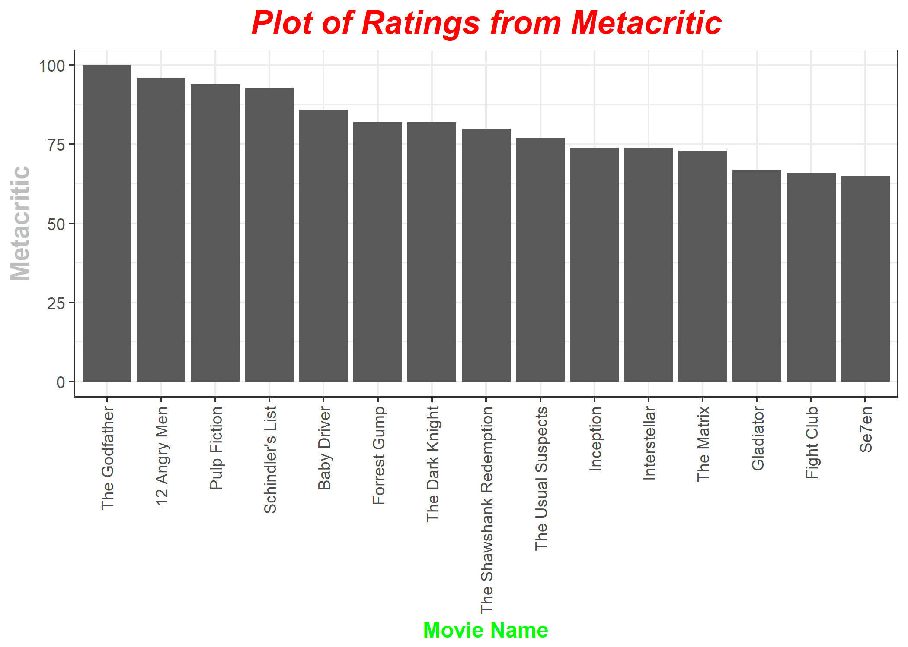
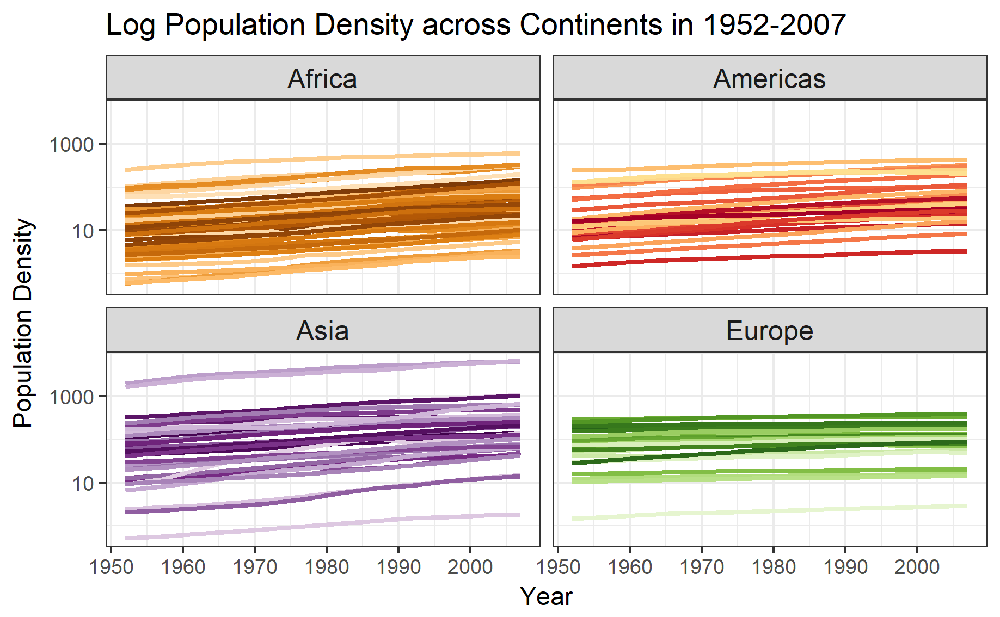

```{r setup, include=FALSE}
suppressPackageStartupMessages(library(knitr))
suppressPackageStartupMessages(library(kableExtra))
knitr::opts_chunk$set(echo = TRUE)
```

## Hw 10 Data from Web

### Make API queries “by hand” using httr

_For the code to this part, check out [here](https://github.com/abishekarun/STAT545-hw-rajendran-arun/blob/master/hw10/api_httr_prompts.R)._

For this part, I have taken Open Movie Database API discussed in class and made query for my favourite list of movies(15 of them) and tried finding the movie with best Imdb rating, metacritic score and rotten tomatoes score.

```{r message = FALSE}
source('api_httr_prompts.R')
```

The list of movies and their year
```{r}
list_of_movies
release_years
```

Plot of imdb rating of the movies 


Plot of metacritic rating of the movies 


Plot of rotten tomatoes rating of the movies 


### Scrape the web

_For the code to this part, check out [here](https://github.com/abishekarun/STAT545-hw-rajendran-arun/blob/master/hw10/scrape_data_prompts.R)._

For this part, I have taken few favorite bands(3 namely "Eminem","Katy Perry","Maroon 5") and tried to get the lyrics for most of their songs from musix match website. This is an extension to the work that was done in the class. 

Here is the final table obtained after scraping the musix match site.
```{r}
options(width = 50)
musix_results <- readRDS('data/musix_match_results.rds')
musix_results%>%
  head(10)
```

From this table, we can find the band which has most number of songs in this website among the three.

```{r}
table(musix_results$Band)
```

The same can be seen in a plot as shown below.


### Use an R package that wraps an API

_For the code to this part, check out [here](https://github.com/abishekarun/STAT545-hw-rajendran-arun/blob/master/hw10/wrap_api_prompts.R)._

### Prompt 1

#### Part 1

What is the relationship between per-capita GDP and the proportion of the population which lives in urban centers?

The relationship can be seen from the graph below.


#### Part 2

Plot a graph of population density against time for diffrent continents.

The graph can be seen as below.


### Prompt 2

rplos and rebird – how many articles are published on a bird species?

Here is the dataset showing the number of articles which contains the top 50 popular bird species in their title (highlighted title and abstract are shown)

```{r}
articles_bird <- readRDS('data/prompt2_wrap_api.rds')

articles_bird%>%
  head(20)%>%
  kable()
```

The plot of the number of articles on different birds can be seen below.


This plot clearly shows that the bird species Mallard has the most number of titular articles published on it.
