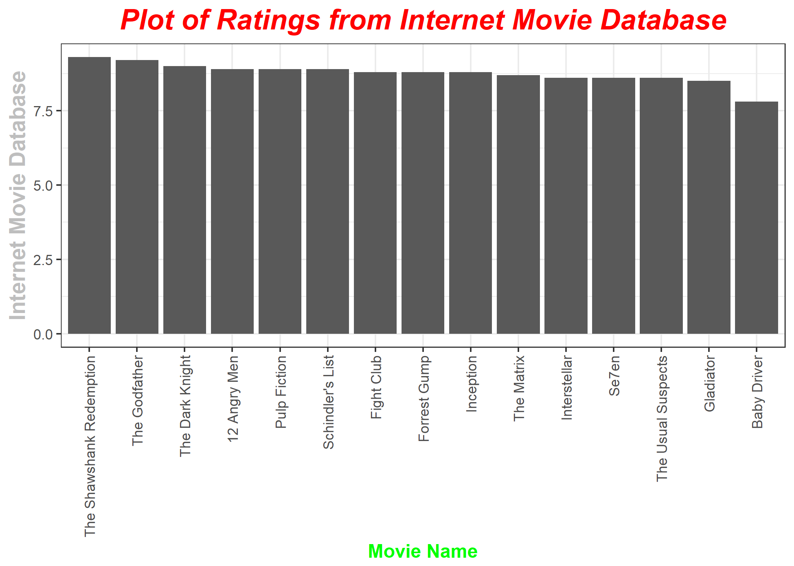
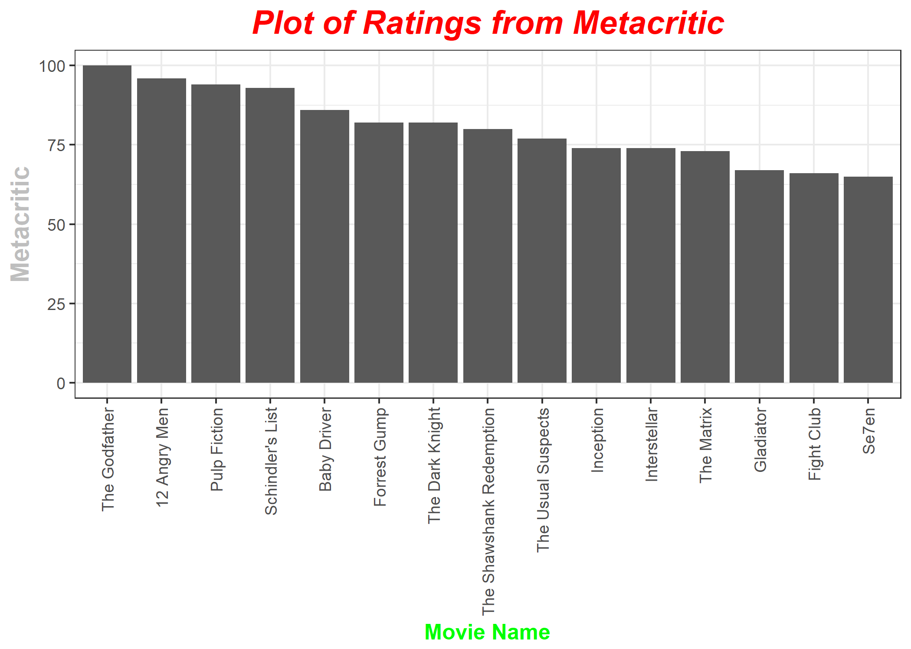
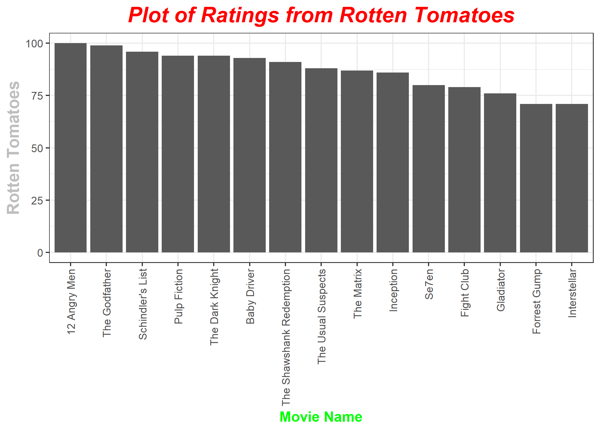
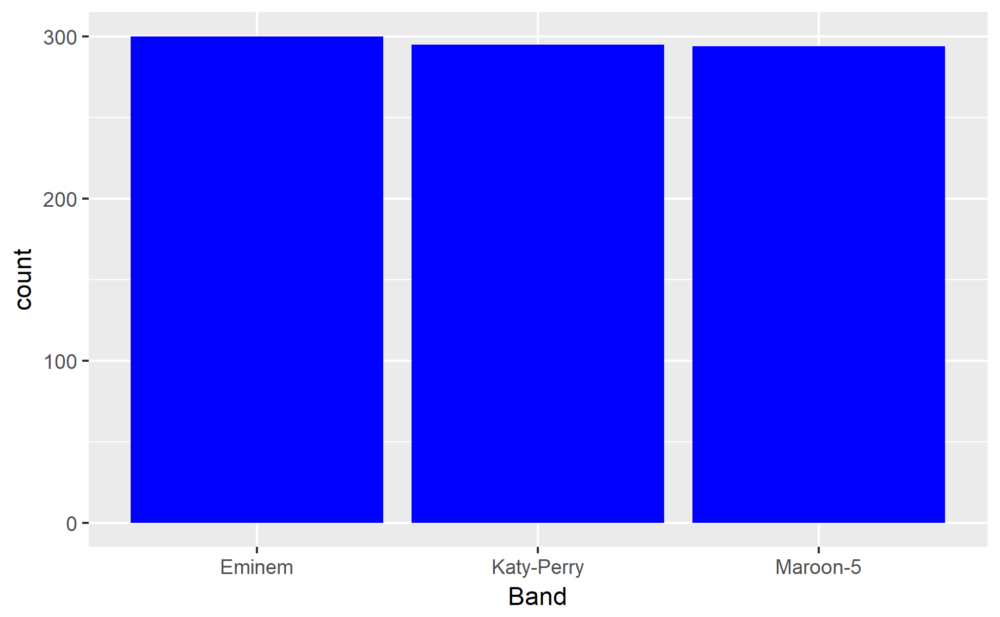
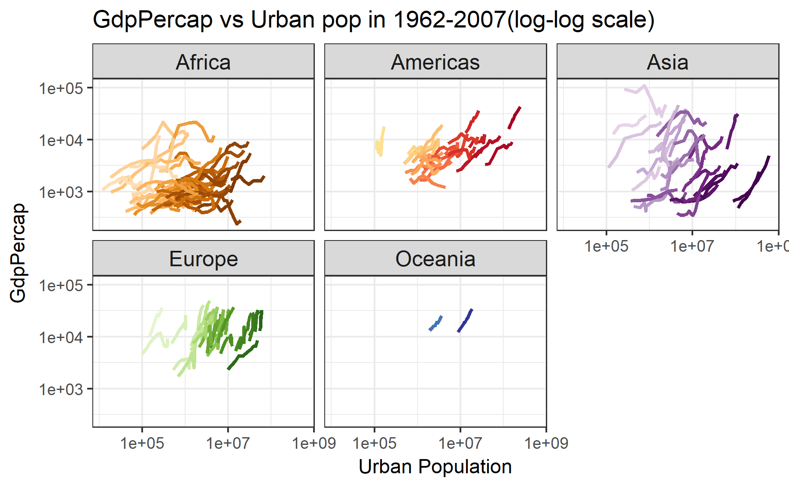
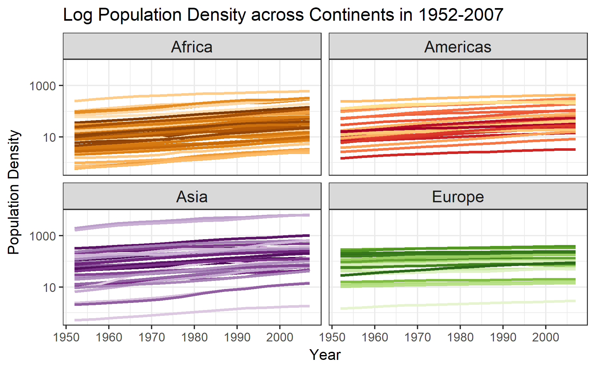
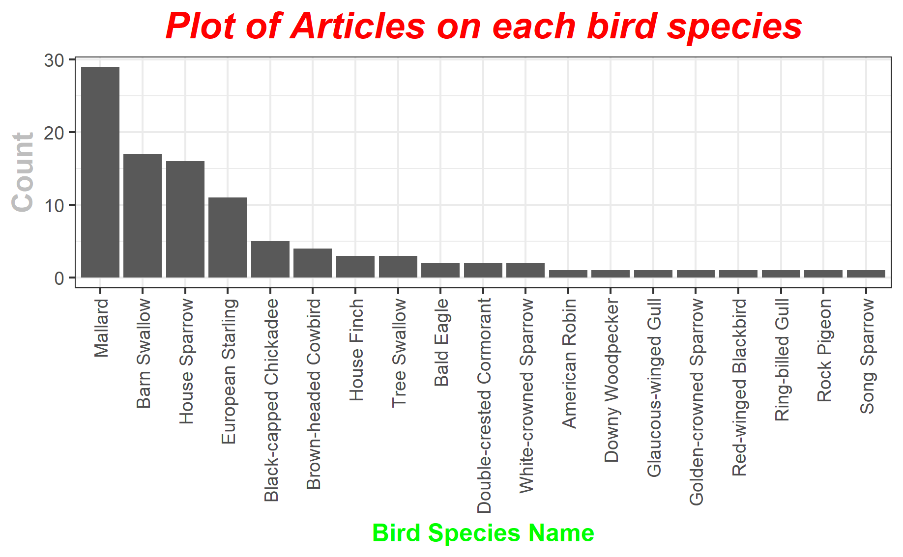

hw10.Rmd
================

Hw 10 Data from Web
-------------------

### Make API queries “by hand” using httr

*For the code to this part, check out [here](https://github.com/abishekarun/STAT545-hw-rajendran-arun/blob/master/hw10/api_httr_prompts.R).*

For this part, I have taken Open Movie Database API discussed in class and made query for my favourite list of movies(15 of them) and tried finding the movie with best Imdb rating, metacritic score and rotten tomatoes score.

``` r
source('api_httr_prompts.R')
```

The list of movies and their year

``` r
list_of_movies
```

    ## [[1]]
    ## [1] "Baby Driver"
    ## 
    ## [[2]]
    ## [1] "Interstellar"
    ## 
    ## [[3]]
    ## [1] "the shawshank redemption"
    ## 
    ## [[4]]
    ## [1] "Pulp Fiction"
    ## 
    ## [[5]]
    ## [1] "Se7en"
    ## 
    ## [[6]]
    ## [1] "Fight Club"
    ## 
    ## [[7]]
    ## [1] "The Matrix"
    ## 
    ## [[8]]
    ## [1] "Gladiator"
    ## 
    ## [[9]]
    ## [1] "The Godfather"
    ## 
    ## [[10]]
    ## [1] "The Dark Knight"
    ## 
    ## [[11]]
    ## [1] "12 Angry Men"
    ## 
    ## [[12]]
    ## [1] "Schindler's List "
    ## 
    ## [[13]]
    ## [1] "Forrest Gump"
    ## 
    ## [[14]]
    ## [1] "Inception"
    ## 
    ## [[15]]
    ## [1] "The Usual Suspects"

``` r
release_years
```

    ## [[1]]
    ## [1] "2017"
    ## 
    ## [[2]]
    ## [1] "2014"
    ## 
    ## [[3]]
    ## [1] "1994"
    ## 
    ## [[4]]
    ## [1] "1994"
    ## 
    ## [[5]]
    ## [1] "1995"
    ## 
    ## [[6]]
    ## [1] "1999"
    ## 
    ## [[7]]
    ## [1] "1999"
    ## 
    ## [[8]]
    ## [1] "2000"
    ## 
    ## [[9]]
    ## [1] "1972"
    ## 
    ## [[10]]
    ## [1] "2008"
    ## 
    ## [[11]]
    ## [1] "1957"
    ## 
    ## [[12]]
    ## [1] "1993"
    ## 
    ## [[13]]
    ## [1] "1994"
    ## 
    ## [[14]]
    ## [1] "2010"
    ## 
    ## [[15]]
    ## [1] "1995"

Plot of imdb rating of the movies 

Plot of metacritic rating of the movies 

Plot of rotten tomatoes rating of the movies 

From these plots,it is clear that **The Shawshank redemption(1994)** has highest imdb rating among selected movies. It can also be seen that **The Godfather(1972)** has highest Rotten Tomatoes rating among selected movies and **12 Angry Men(1957)** has highest Metacritic rating among selected movies.

### Scrape the web

*For the code to this part, check out [here](https://github.com/abishekarun/STAT545-hw-rajendran-arun/blob/master/hw10/scrape_data_prompts.R).*

For this part, I have taken few favorite bands(3 namely "Eminem","Katy Perry","Maroon 5") and tried to get the lyrics for most of their songs from musix match website. This is an extension to the work that was done in the class.

Here is the final table obtained after scraping the musix match site.

``` r
options(width = 50)
musix_results <- readRDS('data/musix_match_results.rds')
musix_results%>%
  head(10)
```

    ## # A tibble: 10 x 5
    ## # Groups:   Band [1]
    ##      Band                title
    ##    <fctr>                <chr>
    ##  1 Eminem        Walk On Water
    ##  2 Eminem        Lose Yourself
    ##  3 Eminem              Revenge
    ##  4 Eminem      I Need a Doctor
    ##  5 Eminem Love the Way You Lie
    ##  6 Eminem          The Monster
    ##  7 Eminem              Rap God
    ##  8 Eminem           Without Me
    ##  9 Eminem     'Till I Collapse
    ## 10 Eminem           Not Afraid
    ## # ... with 3 more variables: url_add <chr>,
    ## #   Link <chr>, Lyrics <chr>

From this table, we can find the band which has most number of songs in this website among the three.

``` r
table(musix_results$Band)
```

    ## 
    ##     Eminem Katy-Perry   Maroon-5 
    ##        300        295        294

The same can be seen in a plot as shown below. 

From this plot, it can be seen that **Eminem** had the most number of songs in the three bands chosen.

### Use an R package that wraps an API

*For the code to this part, check out [here](https://github.com/abishekarun/STAT545-hw-rajendran-arun/blob/master/hw10/wrap_api_prompts.R).*

### Prompt 1

#### Part 1

What is the relationship between per-capita GDP and the proportion of the population which lives in urban centers?

The relationship can be seen from the graph below. 

From the graph, it can be seen that though the relationship is **not uniform** across all the countries, generally, as population in urban centers **increases** gdpPercap increases as observed from the above plot.

#### Part 2

Plot a graph of population density against time for diffrent continents.

The graph can be seen as below. 

From the graph, it can be concluded that Population density **increases** for all the continents but it increases at a **greater rate** for countries in **Asia** which might be due to the large increase in population.

### Prompt 2

rplos and rebird – how many articles are published on a bird species?

Here is the dataset showing the number of articles which contains the top 50 popular bird species in their title (highlighted title and abstract are shown)

``` r
articles_bird <- readRDS('data/prompt2_wrap_api.rds')

articles_bird%>%
  head(20)%>%
  kable()
```

| species\_name          | title                                                                                               | abstract                                                                                                         |
|:-----------------------|:----------------------------------------------------------------------------------------------------|:-----------------------------------------------------------------------------------------------------------------|
| Song Sparrow           | Seasonal Differences of Gene Expression Profiles in Song Sparrow (Melospiza melodia) Hypothalamus   | Background: Male song sparrows (Melospiza melodia) are territorial year-round; however                           |
| American Robin         | West Nile Virus Infection in American Robins: New Insights on Dose Response                         | in their competency to transmit the virus. American robins are an abundant backyard species in the United States |
| Black-capped Chickadee | Response of Black-Capped Chickadees to House Finch Mycoplasma gallisepticum                         | using black-capped chickadees Poecile atricapillus, a species in which antibodies against                        |
| Black-capped Chickadee | ZENK Activation in the Nidopallium of Black-Capped Chickadees in Response to Both Conspecific       | the vocalizations. To compare differences in neural responses of black-capped chickadees, Poecile atricapillus   |
| Black-capped Chickadee | A Natural Experiment on the Condition-Dependence of Achromatic Plumage Reflectance in Black-Capped  | reduced expression of black and white, but not grey, color. UV-vis spectrometry of black-capped chickadees       |
| Black-capped Chickadee | -Capped Chickadees                                                                                  | 's life. In black-capped chickadees (Poecille atricapillus), habitat quality is known to affect song             |
| Black-capped Chickadee | Auditory Same/Different Concept Learning and Generalization in Black-Capped Chickadees (Poecile     | frequently. In the current experiment, using operant conditioning, we tested whether black-capped chickadees     |
| Glaucous-winged Gull   | Egg Production in a Coastal Seabird, the Glaucous-Winged Gull (Larus glaucescens), Declines during  | (1959–1986). This study demonstrates that glaucous-winged gull investment in egg production has declined         |
| Mallard                | Wild Mallards Have More “Goose-Like” Bills Than Their Ancestors: A Case of Anthropogenic Influence? | Wild populations of the world’s most common dabbling duck, the mallard (Anas platyrhynchos), run                 |
| Mallard                | Influence of Body Condition on Influenza A Virus Infection in Mallard Ducks: Experimental Infection | ), and mallards (Anas platyrhynchos) are considered a particularly important IAV reservoir. Prevalence of IAV    |
| Mallard                | Maintenance of influenza A viruses and antibody response in mallards (Anas platyrhynchos) sampled   | winter. We captured mallards (Anas platyrhynchos) throughout the non-breeding season (August–April               |
| Mallard                | Movements, Home-Range Size and Habitat Selection of Mallards during Autumn Migration                | The mallard (Anas platyrhynchos) is a focal species in game management, epidemiology                             |
| Mallard                | 2016 outbreak in chickens, turkeys and mallards                                                     | , transmission and pathogenicity studies were conducted in chickens, turkeys, and mallards. Among the three      |
| Mallard                | Disease Dynamics and Bird Migration—Linking Mallards Anas platyrhynchos and Subtype Diversity       | The mallard Anas platyrhynchos is a reservoir species for influenza A virus                                      |
| Mallard                | Infectivity in Mallards (Anas platyrhynchos)                                                        | viruses in New World waterfowl and conducted an experimental challenge study in mallards (Anas                   |
| Mallard                | Impact of body condition on influenza A virus infection dynamics in mallards following a secondary  | (IAVs), with mallards (Anas platyrhynchos) implicated as particularly important reservoir hosts                  |
| Mallard                | Influenza Virus in a Natural Host, the Mallard: Experimental Infection Data                         | Wild waterfowl, particularly dabbling ducks such as mallards (Anas platyrhynchos), are considered                |
| Mallard                | Infected Mallards                                                                                   | Mallards are widely recognized as reservoirs for Influenza A viruses (IAV); however, host factors                |
| Mallard                | Is Not Maintained in Mallards without Drug Pressure                                                 | studied. Aim and Methods: In a previous in vivo Mallard experiment, an influenza A(H6N2) virus developed         |
| Mallard                | High Influenza A Virus Infection Rates in Mallards Bred for Hunting in the Camargue, South          | France) to investigate the influence of hand-reared Mallard releases on avian influenza virus dynamics           |

The plot of the number of articles on different birds can be seen below. 

This plot clearly shows that the bird species **Mallard** has the most number of titular articles published on it.
